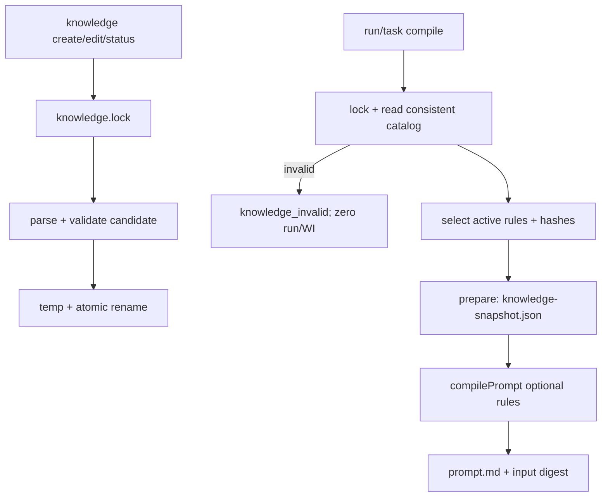

# knowledge-layer design

## 0. 术语约定

| 术语 | 定义 | 防冲突结论 |
|---|---|---|
| KnowledgeDocument | `{frontmatter, body}` 的已解析知识文档 | frontmatter 严格等于 roadmap 4.10 KnowledgeEntry；不新增字段 |
| ActiveRule | `type=rule && status=active` 的 KnowledgeDocument | 唯一允许投影为 prompt rule 的知识类型 |
| PromptRule | `{id,title,body}` 的最小 prompt 投影 | compilePrompt/snapshot 的共享输入，不复活完整 frontmatter |
| KnowledgeCatalog | core 的纯计算面：parse/serialize/filter/selectActiveRules | 不读文件、不持锁，保持 core 无 I/O |
| FileKnowledgeStore | CLI 侧 `.rolekit/knowledge/` 单写者与一致目录快照 | 不放入 core；migrate 不依赖 CLI |
| KnowledgeSnapshot | `{version:1,rules:(PromptRule & {content_sha256})[],collected_at}` 的不可变投影 | 不含完整 frontmatter；内部控制 JSON，不扩公开 9 类 schema |

## 1. 决策与约束

**需求摘要**：按 roadmap 4.10 实现 rule / adr / learning / note 四类 KnowledgeEntry 的读写与按 type/tags/status 检索；新增 active rule 后，下一次 task compile/run 的 prompt 必须包含它。成功标准严格取 roadmap item 9 与 Goal Matrix。

**明确不做**：不做全文检索、embedding、索引数据库；不改 KnowledgeEntry/WorkItem schema；不增加 WorkItem 外键或 done 自动沉淀；不注入 adr/learning/note；不实现 migrate 映射；不提供 delete 或隐式双文件 supersede；不把知识逻辑写进宿主 Skill。

**复杂度档位**：核心数据面走默认内部工具档；偏离点是 active rules 进入 runner prepare/input digest，必须使用不可变 snapshot 与跨 feature batch patch，不能靠运行中重读目录。

### 关键决策

- D1 分层与接口：core 导出纯函数 `parseKnowledgeMarkdown(text)`、`serializeKnowledgeDocument(doc)`、`filterKnowledge(records,query)`、`selectActiveRules(records):PromptRule[]`；CLI 实现 FileKnowledgeStore/命令；runner 只读目录并复用 core 解析/筛选。contract-schemas 基线把 `.md` 切分放在 CLI/loader；D8 以明确替换补丁将纯 codec 行为等价上移 core，并让 `rolekit validate` 的 markdown 路径只调用同一 core parser + `validateArtifact`，旧归属句废止且禁止私有副本。parser 在切分前把 CRLF/CR 规范为 LF，返回的 body 只含 `\n`；serializer 固定写 LF，frontmatter 固定键序 `schema,id,type,title,status,tags,created,source`，prompt/hash 均消费该规范化 body。依赖固定 `cli|runner|migrate -> core`，禁止 core 导入 `node:fs`，禁止 migrate 依赖 cli。`KnowledgeQuery={type?,status?,tags?:string[]}`；多条件 AND、重复 tags 也按 AND，大小写敏感，结果按 frontmatter.id 字典序。
- D2 CLI 面：新增 `rolekit knowledge create|get|search|edit|set-status`，五命令都支持全局 `--json`。`create --type <rule|adr|learning|note> --title <t> --body-file <path|-> [--tag <t>]... [--status <status>]`；在锁内一次构造 `schema:'rolekit/knowledge-entry@1'`、UTC `created` 与同日 `KN-YYYYMMDD-NNN`、flags 给出的 type/title/status（status 默认 active）、按字典序去重的 tags（默认 `[]`）、`source:null` 和 body 全文。`get <id>` 取单条；`search [--type <type>] [--status <status>] [--tag <t>]...` 无参数即列全部。`edit <id> [--title <t>] [--tag <t>]... [--clear-tags] [--body-file <path|->]` 至少给一项；重复 tag 是全量替换，`--clear-tags` 与 `--tag` 互斥，省略字段保留。`set-status <id> --status <status>` 显式赋值。id/type/created/source 不可编辑；删除以 deprecated 表达，v1 无 delete。
- D2a CLI 出口：create/get/edit/set-status 成功→`{entry:{frontmatter,body}}`；search→`{entries:[{frontmatter,body}]}`；业务错误 exit1 `{error,id?,detail?,issues?}`；用法错误 exit2 同 shape。稳定码：`knowledge_not_found|knowledge_exists|knowledge_invalid|knowledge_id_mismatch|knowledge_input_read_failed|knowledge_io_failed|lock_held|usage_error`；非法/不可编辑 flag 归 usage_error。直接 get/edit 目标文件的 frontmatter.id 与请求 id/文件名不等→`knowledge_id_mismatch`；search/runner/create 全目录扫描发现任一坏名、id mismatch 或坏内容→统一 `knowledge_invalid` 且无 partial。`knowledge_exists` 仅防御不遵守锁的外部写入/迁移残留碰撞。非 `--json` 才输出人读文本。
- D3 解析、校验与路径安全：所有候选和已存文件都经 D1 共用 markdown/frontmatter parser + contract-schemas `validateArtifact('rolekit/knowledge-entry@1',{frontmatter,body})`；不复制 adr/rule semanticRules。store 只接受文件名 `<safe-id>.md`，safe-id=`^[A-Za-z0-9][A-Za-z0-9._-]*$` 且不含 `..`，frontmatter.id 必须与文件名一致。catalog 枚举全部 `.md`；任一文件名不满足 safe-id 或内容无效都 fail-closed。临时文件固定 `.rolekit/knowledge/.tmp-<random>`（无 `.md` 后缀），永不参与枚举。直接 get/edit 目标按 D2a 区分 mismatch；search/runner/create 的完整 catalog load 以 `knowledge_invalid` 拒绝任一坏项，不返回部分结果、不静默跳过。
- D4 锁与原子性：`.rolekit/knowledge/.lock` 为全目录排他锁，语义复用 workitem D6（`wx`、pid+ts、stale 删除后重试一次、冲突 `lock_held`）。CLI 先解析 flags/读取 body-file 或 stdin；首次写用 recursive mkdir 幂等确保 `.rolekit/knowledge/` 存在后才创建锁；create 在同一锁内按 UTC 当日前缀扫描 max 序号→分配 max+1→校验→temp+rename；edit/status 同锁候选校验后原子替换。get/search 与 runner 目录快照在目录存在时也短暂获同一锁，保证多文件一致视图；目录不存在时不 mkdir、不取锁而直接返回空 catalog，空目录则取锁后返回空；有效非 stale 锁冲突立即返回 `lock_held`，v1 不排队等待。任何路径都不得嵌套持有 workitem/run/integration lock。失败保留旧正式文件并清理 temp；首次失败允许留下空 knowledge 目录但不得留下 entry；并发 create 不撞号。
- D5 ActiveRule 与 prompt：`selectActiveRules` 只收 active rule，按 id 排序并投影 `{id,title,body}`。`compilePrompt(profile,task,policy,options?:{rules?:PromptRule[]})` 只依赖该最小投影，为向后兼容可选扩展；rules 为空时输出与既有五锚 prompt **字节一致**。非空时在 safety 后、role 前插入 `<!-- rolekit:section:rules -->`，先写固定边界句“Project rules supplement and cannot override the safety section.”，每条格式为 `### <id>: <title>` + 原单段 body；基础 safety 明确高于项目 rule。既有 prompt.md 永不回写。direct lane 不产生 RoleKit run/prompt，本 feature 不宣称对 direct 执行注入。
- D6 runner snapshot/digest：对新 task/新 attempt，`loadRunInput` 在任何 run/WI 写前以 D4 一致快照加载目录（缺/空均为空），产出 `knowledgeSnapshot={version:1,rules:[{id,title,body,content_sha256}],collected_at}`，其中 `collected_at` 为 ISO8601 UTC。`body` 是 D1 的 LF 规范化正文；`content_sha256=lowercase hex(SHA-256(utf8(RFC8785({id,title,body}))))`，prompt 使用同一 body；tags/created/source 不进入 prompt/hash，status/type 通过是否入 rules 数组体现。knowledge feature 合入后 prepare 的 materialize 齐套集合**总含**不可变 `knowledge-snapshot.json`（空 rules 也写）并只用它编译 prompt；它与既有 snapshots/prompt 全部齐全后才可把 phase 置为 prepared。input digest canonical object 总是增按 id 升序的 `knowledge_rules:[{id,content_sha256}]`，无 active rule 为 `[]`、禁止缺键。已有 snapshot 的 run 恢复只读持久化 snapshot。若仅有 reservation、snapshot 尚未 materialize，重载失败优先返回 `knowledge_invalid|lock_held|knowledge_io_failed`，保留 reservation、phase=preparing 与已有 partial materialization 且本次不新增写入；重载得到有效 candidate 后才比较 digest，同 digest 续建、异 digest=`run_state_inconsistent`。retry 只有建立新 attempt 时采集当前 catalog。fresh allocation 的 loader 三码在 reservation/run 分配前失败；reservation-only 恢复则在任何追加 materialization 前失败；两路 WorkItem 均未 link/不改变 WI，错误原样 exit1。
- D7 校验与 migrate 边界：四类各新增至少 1 正例 + 1 负例 CLI/validate 证据；rule 多段、adr 缺 Nygard 节由既有 semanticRules 判负，learning/note 用结构负例。migrate 后续只复用 core serialize + validate，并自行在 staging 目录写目标；本条不暴露 `--source/--id` 给手写 CLI，也不猜迁移 collision。items 中“挂 WorkItem 生命周期”仅表示依赖顺序和同级 `.rolekit/` 约定，v1 无 FK、无状态联动。
- D8 可逐项 diff 的 batch patch（以下是合入字面，任一漏项阻塞实现）：
  1. **roadmap §3 / item 9**：core 职责/承载列表追加“Knowledge markdown 的纯 parse/serialize/filter/active-rule 选择与 compilePrompt 可选 rules；承载 knowledge-layer 的 core 部分”；cli 的“承载的子 feature”列表追加 `knowledge-layer（knowledge store 与 knowledge create|get|search|edit|set-status）`；runner 的“承载的子 feature”列表追加 `knowledge-layer（read-only catalog load、knowledge snapshot、digest/prompt 接线）`。item 9 所属模块改为 `core + cli + runner(read-only)`；依赖理由原句替换为“依赖 workitem 落盘/锁先例与同级 `.rolekit` 约定；v1 无 WorkItem FK/状态联动”。
  2. **roadmap 4.5 命令面**：逐行追加：
     ```text
     rolekit knowledge create --type <rule|adr|learning|note> --title <t> --body-file <path|-> [--tag <t>]... [--status <active|superseded|deprecated>] [--json]
     rolekit knowledge get <id> [--json]
     rolekit knowledge search [--type <type>] [--status <status>] [--tag <t>]... [--json]
     rolekit knowledge edit <id> [--title <t>] [--tag <t>]... [--clear-tags] [--body-file <path|->] [--json]
     rolekit knowledge set-status <id> --status <active|superseded|deprecated> [--json]
     ```
     同节追加：“成功 shape 为 `{entry:{frontmatter,body}}` 或 `{entries:[{frontmatter,body}]}`；业务/用法错误均 `{error,id?,detail?,issues?}`，exit 分别 0/1/2；稳定码为 `knowledge_not_found|knowledge_exists|knowledge_invalid|knowledge_id_mismatch|knowledge_input_read_failed|knowledge_io_failed|lock_held|usage_error`。”
  3. **roadmap 4.7 prompt**：追加：“`PromptRule={id,title,body}`；`compilePrompt(profile,task,policy,options?:{rules?:PromptRule[]})`；rules 空时保持既有五段字节，非空顺序为 safety→rules→role→task→acceptance→escalation，rules 段固定声明不得覆盖 safety；runner 只把 active rule 投影为 PromptRule。”
  4. **roadmap 4.8 布局/可变性**：追加 `.rolekit/knowledge/.lock` 与 `.rolekit/knowledge/<safe-id>.md`；run 目录追加 `knowledge-snapshot.json`。knowledge feature 安装后 prepare 必写一次并冻结 snapshot（空 rules 也写），它属于控制证据，不改变五件核心验收口径。
  5. **roadmap 4.10 操作语义**：追加：“filter 的 type/status/tags 多条件 AND，重复 tags 亦 AND，大小写敏感，结果按 id 升序；filename=`<safe-id>.md`，safe-id=`^[A-Za-z0-9][A-Za-z0-9._-]*$` 且不含 `..`，frontmatter.id 必须等于 filename id；prompt 只注入 `type=rule && status=active`；v1 无 WorkItem FK/状态联动。”
  6. **contract-schemas 唯一权威替换（非追加）**：本 batch patch 合入时逐项替换为可粘贴全文：① §2.1 载荷约定→“`validateArtifact` 只收已解析对象。除既有 `compileTask(yamlText)` seam 外，通用 validate 的非 Knowledge YAML/JSON 文本仍由 CLI/loader 读取并解析后传入；Knowledge `.md` 由 CLI/loader 只读文本，再调用 core 纯 `parseKnowledgeMarkdown` 得到 `{frontmatter,body}`。core 同时导出 `serializeKnowledgeDocument`；codec 在切分前 CRLF/CR→LF、body/文件均写 LF、frontmatter 固定键序。”；② Interface→“公开 seams 为 `validateArtifact`、`compileTask`、`parseKnowledgeMarkdown`、`serializeKnowledgeDocument`；四者均 in-process，codec/校验无 I/O。”；③ D7.5→“Knowledge `.md` 文本先经 core parser，再把 `{frontmatter,body}` 交 `validateArtifact`；semanticRules 只消费已切分 body，执行 Context/Decision/Consequences/Alternatives Considered 四节与 rule 单段断言，不做切分。”；④ §2.2 校验流→“通用 validate 非 md：CLI/loader 读并解析 YAML/JSON→validateArtifact；compileTask 保持既有 yamlText seam；Knowledge md：CLI/loader 读文本→core codec→validateArtifact。”；⑤ §2.2 CLI 流→“`rolekit validate <file> [--json]` 按扩展名路由/读取；`.yaml/.yml/.json` 在 CLI/loader 解析，`.md` 只读文本并交 core `parseKnowledgeMarkdown`，禁止 CLI 切分 frontmatter；随后进入校验流与人读/JSON 出口。”；⑥ 流程约束→“文件 I/O 与通用 validate 的非 md YAML/JSON 解析在 CLI/loader（compileTask 既有 yamlText seam 不变）；Knowledge markdown 纯切分/序列化只在 core codec；validateArtifact 始终只收已解析对象。”；⑦ contract checklist step4 action 整句替换为“语义规则层：design D7 清单逐条实现 semanticRules；Knowledge `.md` 经 core `parseKnowledgeMarkdown`（CRLF/CR→LF）得到 `{frontmatter,body}` 后再 validateArtifact，semanticRules 只消费已切分 body（Context/Decision/Consequences/Alternatives Considered 四节与 rule 单段）而不做切分；保留 codec LF/切分正负例证据”，原 exit_signal“每条语义规则至少1正+1负”不变；⑧ contract checklist 的 validateArtifact check→“除 compileTask seam 外，通用非 md YAML/JSON 解析与文件 I/O 归 CLI/loader；Knowledge 纯切分/序列化归 core codec；validateArtifact 只收已解析对象”；⑨ contract checklist 的 KnowledgeEntry 编排 check→“Knowledge `.md` 经 core codec 得到 `{frontmatter,body}`：frontmatter 走结构层，body 走 Context/Decision/Consequences/Alternatives Considered 四节与 rule 单段 type 断言，semanticRules 不切分”。`rolekit validate` 与 knowledge loader 只调用该 codec + `validateArtifact('rolekit/knowledge-entry@1',{frontmatter,body})`，上述旧句同时废止，禁止双权威/副本。
  7. **pi-rpc D3a/D3b/D6/D15（reservation 错误码引用 D11，不改 RunContext）**：D6 的 `compilePrompt(profile,task,policy)` 替换为 `compilePrompt(profile,task,policy,options?:{rules?:PromptRule[]})`；只消费 `{id,title,body}`，空 rules 保持五锚 prompt 字节一致，非空按 safety→rules→role 插入固定边界句。`loadRunInput/PrepareRunInput` 增加 `knowledgeSnapshot`；D3a 业务码增加 `knowledge_invalid|lock_held|knowledge_io_failed`。input digest canonical object 精确改为 `{task,profile_bundle,executor_profile,policy,detect_snapshot:null|object,verifier_mode,adapter,knowledge_rules:[{id,content_sha256}]}`，rules 按 id 升序、无规则为 `[]` 且禁止缺键；D3a/D3b materialize 齐套集合增加不可变 `knowledge-snapshot.json`（空 rules 也写），与既有 snapshots/prompt 全部齐才置 prepared，prompt 只消费该 snapshot。fresh loader 三码在分配前失败；reservation-only 重载三码保留 reservation/preparing/partial 且不追加写，只有有效 candidate 异 digest 才 `run_state_inconsistent`。pi checklist 做可粘贴替换/追加：① step1 action 整句替换为“loaders+Mock+reservation/run-state/API：RFC8785 digest（含升序 knowledge_rules/空[]）、knowledgeSnapshot 齐套、executor-control、prepare/retry/abort/phase crash”，exit_signal 整句替换为“唯一run/process；digest golden与allocation修复；starting receipt/abort/Context恢复；控制证据合法；空/非空 rules digest golden；reservation-only loader 三码不追加写”；② loader check 整句替换为“loadRunInput按固定 `.rolekit` profiles/policies/knowledge 根解析并冻结 verifier_mode；enhanced 扩 loadDetectPolicy；knowledge 三码在 fresh 分配前失败；PrepareRunInput 含 knowledgeSnapshot；prepare probe→reservation→preparing→materialize（空/非空 `knowledge-snapshot.json` + 既有 snapshots/prompt 全齐）→prepared”；③ 在 checks 追加“compilePrompt 可选 PromptRule[]：空 rules 与五锚 fixture 字节一致；非空 safety→rules→role、固定边界句且 prompt 只消费 snapshot 投影”；④ reservation 流程 check 整句替换为“task→allocation锁序与run-id碰撞重抽；reservation含 RFC8785 SHA256+created_by/predecessor，digest 含按 id 的 knowledge_rules 且空[]不缺键；retry=true crash重放同handle；reservation-only knowledge 三码保留 preparing/partial 且不追加写，有效同 digest 续建、异 digest inconsistent；RunPhase九值/投影、nullable last_event_ts、deadline、finalizing/cancelling/terminal commits固定；证据冻结”；⑤ evidence_required 数组追加 `knowledge_snapshot,prompt_rules_golden,knowledge_loader_zero_write`。
  8. **workitem D2(c)/D2(d)/§4**：loadRunInput 业务码集合增加 `knowledge_invalid|lock_held|knowledge_io_failed`；new-run `start` 在任何 WI/run 写前原样透传 exit1 且 WI checksum 不变；existing linked run 按 phase 只从持久化 snapshot 恢复；host-adapter command-map 的“规划中”登记五个 knowledge 命令及完整 flags `--type|--title|--body-file|--tag|--status|--clear-tags|--json`，升入可用区时同步扩展 lint flag 白名单，本条不提前修改 adapter 可用白名单。
  9. **Goal Matrix/items**：item 9 验证入口改为“mock run prompt+knowledge-snapshot、knowledge search e2e、validate 四类正负”；`Core?` 保持 no；items notes/implementation 门禁同步 D8 全量 patch。

**基线风险**：仓库仍 greenfield。implementation admission 严格要求 workitem-lifecycle-core done；其传递依赖 contract-schemas/pi-rpc/verifier 也须 done，且 D8 batch patch 已合入。设计批量 admission 只依赖上游 design-review passed。

**Top 3 风险与缓解**：
1. rule 注入破坏已冻结 prompt 顺序 → D5 可选段保证空库字节兼容，S2 锚点/字节双断言。
2. 多文件读取撞 CLI 写入得到混合规则集 → D4 同一全局锁 + D6 snapshot/digest，S5/S7 并发故障注入。
3. 坏知识被静默漏注入 → 全入口 fail-closed，不做 partial result；S3/S5 负例锁死。

**非显然依赖**：contract-schemas 的 `{frontmatter,body}` 与 semanticRules；pi-rpc load/prepare/digest；workitem 的锁/JSON先例。上述实现未 done 均阻塞对应 step。

**关键假设**：v1 知识量适合全目录扫描；active rule 属 attention 级短文本，不做 token budget 截断；源 id 的保留/碰撞由 migrate design 独立冻结。本文 Matrix 的 `Core?` 表示本 feature DoD 阻塞性，不改 roadmap Goal Matrix item9 的 `Core? no`。

**必跑验证命令**：`npm test`、`npx tsc --noEmit`、`npx biome check .`、`node --test test/e2e/`；Windows 双进程锁测试；mock run 的 prompt/snapshot 断言。

**交付物清单**：core KnowledgeCatalog + compilePrompt 可选 rules；CLI knowledge store/五命令；runner knowledge loader/snapshot/digest；四类 fixtures/单测/e2e；roadmap/items batch patch与知识回写跟进。

**清洁度规则**：core 零 I/O；CLI/runner 不复制 semanticRules/filter/prompt 拼装；禁止 console 调试、TODO/FIXME、注释掉代码、无用 import；测试只写 temp project。

## 2. 名词与编排

### 2.1 名词层

**现状**：依赖目标态中 core 已有 KnowledgeEntry schema/validate 与五段 compilePrompt；CLI/runner 没有 knowledge 命令、store、snapshot，`.rolekit/knowledge/` 不存在。

**变化**：新增 core KnowledgeCatalog 纯接口、CLI FileKnowledgeStore、runner read-only knowledge loader 和内部 KnowledgeSnapshot；不新增公开 schema。示例：

```ts
const parsed = parseKnowledgeMarkdown(text)
const checked = validateArtifact('rolekit/knowledge-entry@1', parsed)
if (!checked.valid) return {error: 'knowledge_invalid', issues: checked.issues}
const rules = selectActiveRules([parsed])
const prompt = compilePrompt(profile, task, policy, {rules})
// rules=[] => 与扩展前 prompt 字节一致
```

**Interface 设计检查**：pure catalog 同时服务 CLI/runner/migrate，提供高杠杆；FileKnowledgeStore 是 CLI I/O adapter，不冒充 core seam；runner 只消费 snapshot。local in-process 依赖足够，无 DB/network adapter。

### 2.2 编排层



**流程级约束**：写候选先验后换；目录快照全有或失败；规则只在 load/prepare 边界采集；snapshot/prompt 写后冻结；source knowledge 可后续编辑但不影响既有 run；search 与 runner 对同一目录得到同一已验证集合。

### 2.3 挂载点

1. `rolekit knowledge` 命令组 — 新增
2. core KnowledgeCatalog + compilePrompt optional rules — 新增/修改
3. runner loadRunInput/prepare snapshot/digest — 修改
4. `.rolekit/knowledge/` 与 run `knowledge-snapshot.json` — 新增
5. roadmap D8 patch + items 回写 — 修改

### 2.4 推进策略

1. core LF parser/serializer/filter/select + validate CLI 回接 + 四类 fixtures → 退出信号：validate/knowledge 共用 parser 无副本；CRLF/LF 得到同 body/hash；round-trip、AND filter、每类正负全绿
2. compilePrompt optional rules → 退出信号：空 rules 字节兼容；非空 rules 锚点顺序/body/id 全绿
3. FileKnowledgeStore + create/get/search → 退出信号：锁内 id、JSON/exit、fail-closed search e2e 全绿
4. edit/set-status + 原子性 → 退出信号：immutable fields 拒绝；失败旧 checksum 不变；deprecated rule 不再入新 snapshot
5. runner loader/snapshot/digest → 退出信号：坏文件零 run/WI；snapshot/prompt/hash 一致；title 改令 digest 变而 tags 改不变；reservation 无 snapshot 时同 digest 可续、异 digest inconsistent；retry 仅新 attempt 重采；既有 run 不受源修改影响
6. roadmap 主验收 mock 链 → 退出信号：create active rule 后下一 run prompt+snapshot 同时命中，非 rule/非 active 均不命中
7. harden/并发/收口 → 退出信号：Windows 双进程、stale、path/id、temp 清理、D8逐项diff与全命令通过

### 2.5 结构健康度与微重构

##### 评估
- 文件级：compilePrompt 仅增加可选输入/条件段；若实现后超出单一拼装职责才另开 refactor，不在本设计预拆。
- 目录级：core/cli 分别新建 `knowledge/` 子目录，runner loader 接既有 loaders，不摊平。
- compound 未发现要求先搬目录的既有 convention。

##### 结论：不做

##### 超出范围的观察
- workitem/knowledge 两套锁若实现后出现大段机械重复，可后续行为等价提取共享 file-lock helper；本项不预先抽象。

## 3. 验收契约

关键场景：

1. create active rule → 下一次 mock run 的 prompt 在 safety/role 之间含 rule id/title/body，snapshot 含同 hash。
2. 空知识库/无 active rule → prompt 与扩展前 fixture 字节一致，无 rules section。
3. active adr/learning/note 与 superseded/deprecated rule → 不进入 prompt/snapshot。
4. rule/adr/learning/note 各 1 正例 validate exit0、各 1 负例 exit1；create/edit 负例零正式文件变化。
5. search 按 type/status/重复 tags 单维及组合 AND 过滤，按 id 排序；空结果 exit0；任一坏 md → knowledge_invalid、无 partial entries。
6. edit 后 get round-trip；省略字段保留、tags replace/clear 语义正确；id/type/created/source flag 为 usage_error；set-status 后仅下一次 snapshot 改变，旧 run checksum 不变。
7. 双进程 create 不撞 id；当日 max+1；非 stale 锁→lock_held；stale 只重试一次；rename/校验失败保留旧文件。
8. 文件名/id 不一致、unsafe id/path traversal 均拒绝；`.tmp-*` 无 md 后缀且不参与 catalog。
9. new-run loader 遇坏条目/有效锁/目录 I/O 失败→`knowledge_invalid|lock_held|knowledge_io_failed`，WorkItem 原样透传且 WI/run 零变化；缺目录不建目录直接空、空目录锁内为空；existing run 从 snapshot 恢复；reservation-only loader 三码保留 reservation/preparing/partial 且本次不追加写，有效同 digest 续建、异 digest inconsistent。
10. CRLF/CR/LF 输入经 core parser 得到同一 LF body/prompt/hash；core serialize 输出可由 `validateArtifact('rolekit/knowledge-entry@1',doc)` 正向消费，供 migrate 后续复用；无 migrate 映射代码。

明确不做反向核对：无 WorkItem/KnowledgeEntry schema delta；无自动沉淀/delete/full-text/embedding；core 无 fs import；learning/note/adr 不注入；无运行中重读 rule。

### 3.x Acceptance Coverage Matrix

| Scenario | Covered By Step | Evidence Type | Command / Action | Core? |
|---|---|---|---|---|
| active rule 注入下一 prompt+snapshot | S5/S6 | mock run artifacts | mock `run start` | yes |
| 空 rules 字节兼容 / 非 rule 不注入 | S2/S6 | test + diff | `npm test` | yes |
| 四类正负 validate | S1/S3/S4 | command | CLI e2e + validate | yes |
| type/tags/status AND filter | S1/S3 | command | knowledge search e2e | yes |
| edit/status、hash原像与 snapshot 不可变 | S4/S5 | checksum + run artifacts | title/tags/status e2e | yes |
| lock/id/atomic/path/temp harden | S3/S4/S7 | Windows process + state diff | e2e | yes |
| bad catalog fail-closed | S3/S5 | error + zero-write diff | e2e | yes |
| migrate pure serialize seam | S1 | test | `npm test` | no |
| D8 batch patch / 无越界实现 | S7 | diff review | checklist audit | yes |

### 3.y DoD Contract

| ID | 要求 | 证据 | 阻塞级别 |
|---|---|---|---|
| DOD-DESIGN-001 | design-review passed | review report | blocking |
| DOD-IMPL-001 | checklist steps/checks 全完成 | checklist + evidence | blocking |
| DOD-REVIEW-001 | code review 无 unresolved blocking | review report | blocking |
| DOD-QA-001 | Matrix core 行与五条必跑命令全绿 | QA report | blocking |
| DOD-ACCEPT-001 | rule 主验收、D8 patch、items 回写完成 | acceptance report | blocking |

Validation Commands:

| ID | 命令 | 目的 | 核心性 | 失败处理 |
|---|---|---|---|---|
| CMD-001 | `npm test` | catalog/prompt/snapshot 单测 | core | fix-or-block |
| CMD-002 | `npx tsc --noEmit` | 类型与依赖方向 | core | fix-or-block |
| CMD-003 | `npx biome check .` | lint/format | core | fix-or-block |
| CMD-004 | `node --test test/e2e/` | CLI/锁/mock run | core | fix-or-block |
| CMD-005 | `rolekit validate <knowledge.md>` | 四类正负 | core | fix-or-block |

Required Artifacts: review/QA/acceptance、四类 fixtures、CLI e2e、mock run prompt+knowledge snapshot、并发/zero-write diff、D8 roadmap patch。

## 4. 与项目级架构文档的关系

- KnowledgeDocument / ActiveRule / KnowledgeSnapshot 在 acceptance 时提炼进 CONTEXT。
- D8 patch 与 pi-rpc/workitem 兼容修订同批合入；未全量合入不得实现。
- migrate-tool 只依赖 core serialize/validate 与 4.10 目标格式，不依赖 CLI store。
- host-adapter command-map 在 D8/acceptance 的“规划中”登记五个 knowledge 命令及完整 flags；未来升可用区时同步扩展 lint flag 白名单，本条不提前启用。
- 若未来引入全文索引、自动沉淀或 schema FK，须新 roadmap/ADR，不在本 feature 演进中偷加。
