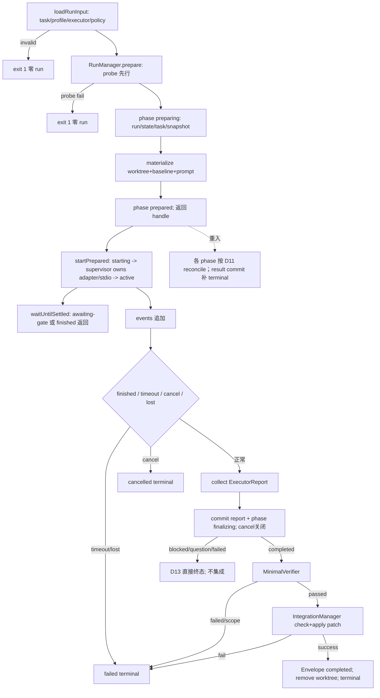

# pi-rpc-vertical-slice design

## 0. 术语约定

| 术语 | 定义 | 防冲突结论 |
|---|---|---|
| RunManager | runner 内负责 run-id/attempt、prepare→startPrepared、run-state 原子控制面、runs 落盘与生命周期编排的模块 | workitem/verifier 跨进程恢复需要的唯一 run 状态所有者；区别于领域 Run |
| WorktreeManager | 创建 / 移除隔离 git worktree、做主工作区基线快照的模块 | 新词，无冲突 |
| MinimalVerifier | 第一版 Verifier 实现：acceptance 命令 exit code + scope diff + 主工作区基线检查（roadmap 4.6） | roadmap 已锁定 |
| adapter 注册表 | runner 持有的 `Map<string, ExecutorAdapterFactory>`，内置 `pi-rpc` / `mock`；未注册名抛 UnknownAdapterError（roadmap 4.7） | roadmap 已锁定归属 runner |
| Pi RPC 模式 | 以子进程 spawn `pi` 并经 stdio JSONL 协议驱动的 headless 运行方式 | 细节全部藏在 PiRpcExecutor 内（4.3 Interface 检查） |
| ManagedRunStatus | `Omit<RunStatus,'last_event_ts'> & {last_event_ts:string|null,phase:RunPhase,terminal_status?,reason?}` | adapter RunStatus 不改；prepare 尚无事件时允许 null |

RunHandle / RunStatus / RunContext / ExecutorReport / RunEvent / ResultEnvelope 等一律以 roadmap 4.2-4.4 冻结定义为准，不重抄。

## 1. 决策与约束

**需求摘要**：打通"契约进 → 证据出"的第一条真实链路。做什么：PiRpcExecutor（capabilities 声明 start/status/cancel/collect，steer 不声明）+ 隔离 worktree + MinimalVerifier + `rolekit task/run/verify` 命令 + runs 落盘。为谁：整个体系价值假设的验证点（最小闭环）。成功标准 = roadmap 冻结的四阶段验收：(1) MockExecutor 全链路单测；(2) Pi RPC smoke（probe + 最小 prompt 往返）；(3) 越界写入被 scope diff 拦截、主区注入被基线检查捕获，Envelope 均判 failed；(4) 真实 dogfood 项目同一契约连续 2 次成功 run + 1 次人工 cancel，五件产物（task.json/prompt.md/events.jsonl/result.json/verification.json）齐全。明确不做：steer；GatePolicy trigger→action（归 verifier）；用户级 mid-run resume/换 executor 与多 run 调度（归 hardening；D3/D11 只做控制进程重入、存活 executor 等待与 lost 收口）；`execution.worktree='in-place'` 支持（runner 拒绝，D4）；网络 sandbox（4.6 诚实边界）；openai-responses adapter（归 research-module）。

**复杂度档位**：走"核心基础设施"档，两处显式偏离默认：错误路径按穷举处理（4.3 五类错误逐一落语义）；Windows 为第一验证环境（全部验收在 Windows 真机执行）。

**关键决策**：

- D1 Pi 驱动通道：子进程 spawn `pi` 的 stdio JSONL RPC（参考 pi-delivery-rolekit 的 role_agent spawn 经验与 sdk-first 备份的 RPC 结论，均只读参考）。换 SDK 进程内调用则编排层的进程管理 / cancel 语义完全不同——故这是设计决策且带 fallback（D2）。
- D2 timebox 与 fallback 触发条件（roadmap 要求 design 冻结）：阶段 2（Pi RPC smoke，范围 = probe + 最小 prompt 往返 + 一次 cancel 终止验证）timebox = **5 个工作日**。触发 fallback 的机械条件（任一即触发）：(a) 同一配置下 spawn / JSONL 往返连续失败 ≥5 次（其中至少 1 次为干净环境重试）；(b) 阶段 2 内 cancel 连续 ≥3 次无法终止子进程树；(c) **timebox 到期且阶段 2 smoke 未通过**（兜底，消除判定死区）。长任务 stdio 死锁 / 事件流静默丢失属 S5 范围，S5 中复现同样走本条 fallback 流程。**fallback 是 blocking gate 而非替代验收**：触发后必须完成——roadmap update（修订条目 2 阶段 2 表述为 SDK 路线）+ 新 ADR + 本 design S5-S7 与 Matrix 的证据口径修订 + design 复审 passed——之后才能继续实现；在此之前 S4 不得标 done。切换目标为 **PiSdkExecutor**（Pi SDK 进程内 adapter），ExecutorAdapter seam 不变；切换后 cancel / 超时 / 事件语义须按 §6 风险 2 重新评估，不得假设风险清零。
- D3 RunManager 完整应用面：`loadGatePolicy(projectRoot)`、`loadRunInput(taskPath,{policy?})`、`prepare(input)`、`abortPrepared(runId)`、`ensureAuditEvent(runId,event,dedupeKey)`、`startPrepared(runId)`、`waitUntilSettled(runId)->ManagedRunStatus`、`status(runId)->ManagedRunStatus`、`steer(runId,text)`、`cancel(runId)`、`collect(runId)`；CLI `run start <task> [--detach] [--retry]`/其余 `run *` 与 WorkItem 禁止直调 adapter；`--retry` 是显式新 attempt 入口。status只reconcile durable commits/supervisor liveness/deadline后投影；adapter active期五方法仅由RunSupervisor拥有（CLI/WI不并发直调）。steer经supervisor控制通道且Pi v1 unsupported；cancel先写D10 intent并唤醒supervisor；collect在report未提交的active期返回run_not_settled，由supervisor adapter.collect后再幂等进入finalizer，在 per-run coordinator lock 内先原子写不可变 executor-report，再置 phase=finalizing（崩在两者间由 report 补 phase），作为不可取消的 finalization commit，再跑 verification/gate/integration；崩溃重入从该 report 续跑而不再 collect，awaiting 返回 run_awaiting_gate、未 settled 返回 run_not_settled、finished 返回已验证 ResultEnvelope。waitUntilSettled 对 preparing/prepared 返回 run_not_started；其余循环 status/collect，在 awaiting-gate 或 finished 首次出现时返回；startPrepared确认supervisor后返回；detach不再wait。公共业务码再含 `run_not_found|run_audit_failed|run_not_started|run_not_settled|run_awaiting_gate|run_not_cancellable|supervisor_start_failed|retry_not_allowed|prepared_abort_failed`。ensureAuditEvent仅允许prepared/starting下`type=gate,gate=lane-override,action=observe,decision=auto-pass`的已验证RunEvent，持run lock扫描dedupeKey后追加，供WorkItem lane镜像恢复；其他phase→invalid_transition。run CLI `--json` 最小 shape：start→`{id,state,phase}`；status→`{id,state,phase,last_event_ts,terminal_status?,reason?}`；cancel/steer→`{id,state,no_op}`；collect→`{id,state,result}`；错误→`{error,id?,detail?}`，用法 exit2、业务 exit1。
- D3a 共用 loaders 与快照：loadRunInput compile/validate task；从 `.rolekit/profiles/roles/{task.role}.yaml`、`.rolekit/profiles/executors/{task.executor}.yaml` 解析 profile并解析fragment为`profile_bundle={profile,resolved_fragments:[{path,content_sha256,content}]}`（路径相对`.rolekit/profiles/`），读取/复用`.rolekit/policies/gates.yaml`并冻结rolekit.yaml的verifier_mode=minimal|enhanced，校验adapter；`loadRunInput/PrepareRunInput` 增加 `knowledgeSnapshot`。错误 `task_invalid|profile_not_found|executor_profile_not_found|policy_invalid|unknown_adapter|knowledge_invalid|lock_held|knowledge_io_failed` 在任何 run/WI 写前返回（fresh loader 三码在分配前失败）。verifier 安装后 enhanced 模式扩展同一 loader 调 `loadDetectPolicy`，非法为 detect_policy_invalid，minimal 不载入。prepare materialize`task.json`、policy-snapshot、`profile-snapshot.json`（写完整bundle，start/compile不再读源fragment）、`executor-profile-snapshot.json`、不可变 `knowledge-snapshot.json`（空 rules 也写）及可选 detect snapshot；与既有 snapshots/prompt 全部齐才置 prepared，prompt 只消费该 snapshot。RunContext 只从这些不可变快照 + run-state 的 attempt/worktree_path 重建，caller 不传半成品。`minimal-implementer` 只安装在测试/dogfood fixture 的上述项目路径，不作为生产隐式 fallback。
- D3b reservation/prepare/retry：幂等键=`task.id+attempt`；内部索引 `.rolekit/runs/.index/{sha256(task.id)}/attempt-{n}.json={task_id,attempt,run_id,input_digest,created_by:'initial'|'retry',predecessor_run_id?,abort_requested}`，以同目录 `.lock` 串行化并校验原 task_id。input_digest=lowercase SHA-256(RFC8785 canonical JSON of `{task,profile_bundle,executor_profile,policy,detect_snapshot:null|object,verifier_mode,adapter,knowledge_rules:[{id,content_sha256}]}`)，rules 按 id 升序、无规则为 `[]` 且禁止缺键；对象键排序/数组保序、不含绝对路径或源文件mtime；同对象也直接写对应 snapshots。run-state 才是 phase 权威。无reservation时先probe；持task lock再按固定顺序取`.rolekit/runs/.allocation.lock`，以现有reservation+runDir查重，run-id=`run-{YYYYMMDD}-{HHmmss}-{4hex}`，碰撞即重抽；先原子写reservation 作为 allocation commit，再建runDir/phase=preparing后释放allocation lock；若崩在两者间，同 digest 的下次 prepare 以 reservation 修复，digest 不同则 run_state_inconsistent。reservation-only 重载 knowledge 三码保留 reservation/preparing/partial 且不追加写，只有有效 candidate 异 digest 才 `run_state_inconsistent`。随后 per-run lock 下幂等创建 worktree、`baseline.json`、snapshots（含 knowledge-snapshot）、prompt，全部齐才置 prepared。retry真值表：无历史+false→attempt1(initial)；任意已有reservation+false→既有handle；true且最新terminal∈failed|cancelled|question→新attempt(created_by=retry, predecessor=该run)；true且最新nonterminal reservation.created_by=retry、predecessor仍是上个eligible终态、input_digest相同→既有handle（retry crash重放）；其余true→retry_not_allowed。每 task/attempt 恰一 run-id；terminal reservation 保留作历史索引。
- D3c start/abort 双幂等：startPrepared 在phase=starting写`executor-control` deterministic token（SHA-256 task.id+attempt+run-id）intent并spawn唯一RunSupervisor（生命周期.supervisor.lock+supervisor.json ack）；**supervisor进程**从snapshots重建Context、独占Pi stdio并调用adapter.start/status/cancel/collect，adapter只做intent→started receipt。startPrepared等到active/terminal才返回；parent崩溃不影响owner。starting且仅intent/无live supervisor可重建supervisor；active若owner消失，Pi v1不重调start/不接管stdio，按D11收口lost（未来adapter显式reconnect capability才可接管）。finalizing/cancelling/gate-pending/resuming/terminal返回既有handle。故障注入覆盖 intent前/后、spawn后/receipt前、active前。abortPrepared **只校验 preparing/prepared 且未 start**；“尚未 link WorkItem”是 caller precondition，runner 不扫描/依赖 WI。WorkItem 仅在 CAS/link 失败且确认自身未含该 run-id 时调用；成功移除 worktree/runDir/reservation，不写 Envelope且不增 attempt，下一次 retry=false 可用同 attempt 新建 run。清理失败原子置 reservation.abort_requested=true、保留索引并返回 prepared_abort_failed；下次 prepare 先重试回收，成功后再分配。starting/active/finalizing/cancelling/gate-pending/resuming/terminal abort 均返回 invalid_transition。
- D4 隔离 worktree：`.rolekit/worktrees/{run-id}`。prepare 的 materialize 阶段创建；integration 成功后 remove，failed/blocked/question/cancelled/违规/集成失败均不改主工作区并保留供审计。remove 失败记 orphan、不改变已组装终态。本条仅支持 isolated，in-place 拒绝 `unsupported_worktree_mode`。
- D5 主区基线检查实现：prepare 写不可变 `runs/<id>/baseline.json={head,status:[{code,path,digest?,mode?}],captured_at}`；快照 = HEAD + `git status --porcelain=v1 -z` 排序集合 + 脏文件内容 digest/mode（脏文件 >100 个时仅路径集合并记 warning）；run 后重算对比，任何差异 → `scope_violations` 记 `concurrent-change:` 前缀类别，Envelope 判 failed（措辞"检测到并发变更"，不归因 worker——roadmap 4.6）。
- D6 最小 prompt 编译器归属：core 提供 `compilePrompt(profile,task,policy,options?:{rules?:PromptRule[]})`；只消费 `{id,title,body}`，空 rules 保持五锚 prompt 字节一致，非空按 safety→rules→role 插入固定边界句。本条交付最小实现 + `packages/runner/test/fixtures/project/.rolekit/profiles/{roles/minimal-implementer.yaml,executors/mock.yaml}`（Pi smoke fixture另有 pi.yaml）；fixture 仅复制到 dogfood 项目，不作生产 fallback；role-profiles-migration 在其上扩展。
- D7 timeout/detach：starting commit 时把 started_at/deadline_at 写 run-state。RunSupervisor从starting起对adapter.start做deadline Promise.race并持续检查；non-detach CLI/WorkItem只wait durable state，`--detach`只是不wait。所有 nonterminal reconcile 也先检查 deadline：executor-report commit 前到期则 CAS 到 cancelling+failed/timeout intent并 cancel；report/finalizing 已提交则完成优先。supervisor未在启动窗口取得lock+ack则写failed/supervisor-start intent并cancel，CLI返回supervisor_start_failed；supervisor到awaiting/finished退出；其崩溃后下一 status/wait/collect 仍补 deadline，测试 kill supervisor 后跨 deadline 再 status。
- D8 gate 最小化：垂直链路不实现 trigger→action 引擎；RunContext.policy 在 prepare 时写不可变 `policy-snapshot.json`。minimal 模式唯一硬阻断仍是 scope_violations，恰写一条 block 事件；verifier-gate-engine 的 enhanced 模式实现后必须禁用本特化，改由 GateEvaluationPipeline 恰写一次，防双事件。
- D9 Pi 兼容窗口：不钉死版本；runner 内置默认窗口常量（初值 `>=0.80 <0.90`，仿 veritack peerDependencies 先例），`rolekit.yaml` 以冻结键 `executors.pi.compat_range` 覆盖；probe 不满足窗口抛 ExecutorIncompatibleError 不进 start。
- D10 cancel 路径：preparing/finalizing/resuming 返回 run_not_cancellable；prepared/starting/active/awaiting 先原子置 phase=cancelling + `termination_intent={status:'cancelled',reason:'user-cancel'}`（timeout 用 status=failed/reason=timeout），prepared直接收口；starting/active唤醒live supervisor由其adapter.cancel，owner缺失则按executor-control尽力杀孤儿后收口；awaiting批量取消gate；cancel调用写intent后等待supervisor/本地reconcile落terminal；重入cancelling续同intent，terminal同请求no-op。report前取消/timeout写固定空verification；gate-pending取消保留已冻结verification/candidate、只把pending resolutions全置cancelled再写cancelled Envelope；两路均不覆写已有verification并按result→event→terminal收口；本条 minimal 阶段不创建 gates.json，安装 verifier feature 后 coordinator 补 `{schema:'rolekit/gate-record@1',records:[]}`。`rolekit verify` 对 cancelled 拒绝复跑 `run_not_verifiable`。五件核心证据仍齐全，run-state/snapshot 属控制证据不改变该验收口径。

- D11 run-state 权威与恢复：`run-state.json={run_id,task_id,attempt,adapter,verifier_mode,worktree_path,state,phase,started_at?,deadline_at?,termination_intent?,terminal_status?,reason?,updated_at}`；不设未定义 resume_from。`RunPhase='preparing'|'prepared'|'starting'|'active'|'finalizing'|'cancelling'|'gate-pending'|'resuming'|'terminal'`。投影：除 gate-pending→awaiting-gate、terminal→finished 外其余→running；started_at/deadline_at 自 starting 起必填且冻结；termination_intent 仅 cancelling 必填；terminal_status 仅 terminal 必填且等 ResultEnvelope.status，非 terminal 禁止。每 run `.lock` 下候选校验+原子替换；`last_event_ts` 不入 schema，由 events.jsonl 最后一条 ts（空则 null）派生。status/wait/collect 是 nonterminal reconcile 唯一入口：若 executor-report 已存在：active→补 finalizing，finalizing/resuming→续 finalizer，gate-pending→交 verifier 返回 awaiting；否则只读supervisor/executor-control：live owner则等待其提交report；starting+intent且无started receipt可重建supervisor；started/active但owner消失时Pi v1先按control尽力终止孤儿，再恰一次lost/failed（deadline已过则timeout优先），绝不由CLI重调adapter。preparing只由同digest prepare(input)续materialize，status仅投影；prepared可启动；finalizing从report恢复且拒绝cancel；cancelling从intent恢复；gate-pending由verifier等待；resuming由已注册 gate coordinator 接管，status/wait/collect 均调用同一 collect finalizer 续 IntegrationManager/D13；所有终态以 result.json 为 durable commit，顺序固定 result→按 run-id+status 扫描去重补 finished event→state terminal；result 已存在而 state 非 terminal则按此补齐，terminal 缺 result则 inconsistent；terminal 只读返回。events 追加；所有 snapshots/baseline/result/verification 写一次后冻结；`rolekit verify`不覆写：completed在baseline.head创建临时audit worktree并应用冻结integration.patch（非completed若审计worktree仍在则直接用），重跑acceptance/scope后写`artifacts/reverify-{timestamp}.json={run_id,source_patch_sha256,verification}`并删除临时区；不触碰主区。cancelled或baseline/patch不可用→run_not_verifiable。形态冲突返回 run_state_inconsistent。控制面不计五件核心产物。
- D12 IntegrationManager（验证候选冻结 + 成功语义）：VerificationReport passed 后、任何 policy branch/awaiting 前，RunManager 在隔离 worktree执行 `git add -A` + `git diff --cached --binary --full-index HEAD --`，生成patch后按冻结verifier_mode分支：enhanced必须已有manifest并重算hash一致，否则failed；minimal必须无manifest且跳过该字段；再原子写不可变patch与`candidate.json={patch_sha256,change_manifest_sha256?,worktree_digest}`；不一致/生成失败即 Envelope failed。GateContinuation 成立后 IntegrationManager 先重做临时 patch/digest，若与 candidate 不同则 `worktree_changed_after_verification`/failed且零写主区，禁止把 gate 等待期改动带入。相同才获得 `.rolekit/integration.lock`、重验 baseline；若不匹配则记录 concurrent-change 并零写主区退出，不回滚/覆盖外部变更。匹配后写 `artifacts/integration-plan.json`（候选路径 pre/post bytes+mode digest）与持久 backup，再 `git apply --check --binary` / `git apply --binary`。无 `git commit/merge`，成功只把验证过的 diff 落为主工作区未提交变更；apply/check 任一失败必须保持/恢复主区基线、Envelope failed、worktree 保留并记 integration-failed。apply 异常按 backup 恢复并复核 pre digest。apply 后先核对 post digest、原子写 `artifacts/integration-result.json={status:'applied',post_digest}` 再删 backup；若崩在 apply/receipt 间，重入在 lock 下见全 post 即补 receipt、见全 pre 即重放、混合态则按 backup 恢复后判 integration-failed。测试覆盖三 checkpoint，失败前后候选路径 bytes+mode digest 相等；IntegrationManager 是 verifier block 与成功落地共享的唯一门闩，只有verification passed + GateContinuation才可调用；GateContinuation封闭为minimal自动继续、enhanced overall∈ignore|observe、或全部confirm已approved。
- D13 ResultEnvelope 组装所有权表（RunManager 唯一事实源）：per-run lock下：report前intent与report先提交者胜（user-cancel→cancelled，timeout→failed）；gate-pending是唯一report后可cancel例外（取消pending、保留verification、永不集成）；finalizing/resuming拒绝新intent，terminal no-op。无intent时，pre-report ExecutorStartError/ExecutorLostError/supervisor-start→failed+固定空verification；否则ExecutorReport blocked→Envelope blocked、question→question、failed→failed、cancelled→cancelled，四者均不跑 verifier/不集成并写固定 `{passed:false,results:[],scope_violations:[]}`；completed 才进入 verifier/gate/integration。机械 verification/scope/integration failure→failed；非 scope policy overall block 或 human reject→blocked；verification passed + GateContinuation + integration success→completed（minimal自动、enhanced ignore|observe自动或confirm全approved）（ExecutorReport.unresolved 可保留为 owner 已接受风险，schema 未禁止 completed+unresolved，resolution 是审计证据）。所有非 completed 保证 unresolved 非空；scope violations 非空必 failed。verifier/workitem 只消费本表，不重写 status。
- D14 policy/snapshot 扩展点：内置默认 GatePolicy 严格取 roadmap 4.6（default ignore；new-dependency/public-api-change/delete/ambiguous/design-artifact/final-acceptance confirm；migration/scope block）；`loadGatePolicy` 额外拒绝 `scope-violation != block` 为 policy_invalid，因为 scope 是不可弱化的机械失败。prepare 输入可带已校验 detectSnapshot；minimal 不写 detect snapshot，enhanced 由后续 feature 扩展共用 loadRunInput 调 loadDetectPolicy，经同一 PrepareRunInput 提供并在 prepare 原子 materialize；enhanced 缺 snapshot fail-closed detect_policy_invalid。policy/detect 都按规范化 JSON 写固定顺序，供 checksum 断言。
- D15 可逐项 diff 的 batch patch（任一漏项阻塞实现）：
  | Roadmap 位置 | 拟写入字面 |
  |---|---|
  | 4.3 | ExecutorAdapter五方法不变；RunManager完整API（ensureAuditEvent仅lane-override/observe gate）+loaders；ManagedRunStatus.last_event_ts=string|null；RunContext由snapshots重建；adapter附属executor-control协议={deterministic token,intent→started,pid/session receipt}，RunManager写intent/commands，RunSupervisor独占adapter与stdio、adapter回receipt，双层跨进程幂等 |
  | 4.5 | `run start <task> [--detach] [--retry]`；verify从baseline+冻结patch重建audit worktree、不碰主区、不覆写原证据，写reverify artifact；cancelled/源不可用→run_not_verifiable；所有run子命令经RunManager |
  | 4.6 | MinimalVerifier 后固定 D13 顺序：非 completed report直终态→机械 verify/scope→policy扩展点→IntegrationManager；scope不可配置弱化；report前cancel固定空verification、gate-pending cancel保留原verification；GateContinuation=minimal|ignore|observe|all-confirm-approved；passed+continuation+binary integration success才completed |
  | 4.8 | `.rolekit/integration.lock`、`worktrees/<run-id>`、`runs/.allocation.lock`、`runs/.index/<task-hash>/{.lock,attempt-n.json}`；每run增`.lock/.supervisor.lock/run-state.json/baseline.json/policy-snapshot.json/profile-snapshot.json/executor-profile-snapshot.json`，run-state冻结verifier_mode；enhanced必有detect snapshot，minimal无；artifacts含executor-control.json/supervisor.json/executor-report.json/change-manifest.json（enhanced）/integration.patch/candidate.json/integration-plan.json/integration-result.json；五核心文件不变 |
  | 4.8 可变性 | RunPhase封闭九值preparing/prepared/starting/active/finalizing/cancelling/gate-pending/resuming/terminal及phase→state表；run-state含deadline/intent；supervisor生命周期lock+ack；events追加；executor-control仅intent→started；finalizing不可cancel；其余snapshot/baseline/result/verification冻结；prepared可回收、terminal reservation留历史 |
  | Goal Matrix/items | 四阶段证据外补 reservation/abort/crash、D13、binary apply回滚、finalizer×cancel、detach×timeout；items notes/依赖同步 |

**基线风险**：contract-schemas 交付的四命令矩阵为绿色基线；本条新增包后 `tsc --noEmit` / lint 范围扩大，预检先跑。

**Top 3 风险与缓解**：
1. Windows spawn/stdio → 阶段2 + D2 fallback
2. prepare/materialize/start 与 caller crash → D3/D11 单一顺序、权威 phase、preparing/starting/active/finalizing/cancelling 故障注入；gate resuming 明确归下游
3. 主区 integration 冲突/部分应用 → D12 integration lock + baseline recheck + apply check + digest 回滚断言；失败不宣称集成

**非显然依赖**：Pi CLI/RPC、git worktree、dogfood 项目、contract-schemas；下游 verifier/workitem 正式依赖本条的 prepare/startPrepared、run-state 与 policy snapshot。实现前需本 design 实质复审 passed + D15 的 4.3/4.5/4.6/4.8 patch 全量合入。

**关键假设**：Pi RPC 可稳定 spawn；git apply 在 `--check` 通过后的正常失败模型可由备份/digest 验证并回滚到原基线；主工作区初始脏状态若 patch 冲突会 fail-closed 而非覆盖。任一实证失败回 design。

**必跑验证命令**：`npm test`、`npx tsc --noEmit`、`npx biome check .`、CLI e2e（mock adapter）；阶段 2/3/4 的 Pi 真机验收以 run artifacts + `rolekit verify` 复跑为证据，全部在 Windows 本机执行。

**交付物清单**：runner loaders、adapter/registry/executors、完整 RunManager API+reservation/run-state/RunSupervisor/lock、WorktreeManager、MinimalVerifier、IntegrationManager；CLI task/run/verify；core compilePrompt；run-state + policy snapshot 控制证据；worktree ignore；e2e/单测/dogfood run；D15 4.3/4.5/4.6/4.8 patch 与 items 回写。

**清洁度规则**：禁止调试输出（事件流走 events.jsonl，CLI 输出走统一 output 模块）；禁止 TODO/FIXME 落盘；PiRpcExecutor 内不得出现绕过 adapter 接口的直连调用；测试用 fixture 不得写入仓库根。

## 2. 名词与编排

### 2.1 名词层

**现状**：contract-schemas 交付 `packages/core`（9 类 schema、validateArtifact、compileTask、错误基类 RolekitError）与 `packages/cli`（validate 子命令）。runner 无现状，全新。

**变化**（全部新增，接口签名以 roadmap 4.3 冻结为准）：

- `packages/runner/src/adapter.ts`：ExecutorAdapter 接口 + 五类错误（ExecutorIncompatibleError / ExecutorStartError / ExecutorLostError / ExecutorTimeoutError / ExecutorUnsupportedOperationError，均继承 core 的 RolekitError）+ UnknownAdapterError
- `packages/runner/src/registry.ts`：adapter 注册表（内置 `pi-rpc` / `mock`）
- `packages/runner/src/executors/pi-rpc.ts` / `mock.ts`：两个 adapter 实现（非假 seam，4.3）
- `packages/runner/src/loaders.ts`：共用 task/profile/executor/policy loader（enhanced 后由 verifier 扩 detect loader）
- `packages/runner/src/run-manager.ts`：D3 完整应用 API、finalizer、timeout/lost 与跨进程恢复
- `packages/runner/src/run-state-store.ts` / `reservation-store.ts`：per-run/per-task locks、原子 state 与 attempt index
- `packages/runner/src/run-supervisor.ts`：detach 后独立轮询/timeout enforcement，awaiting|finished 自退
- `packages/runner/src/worktree.ts`：WorktreeManager（worktree 生命周期 + baseline.json）
- `packages/runner/src/integration-manager.ts`：binary patch/check/apply/备份回滚的唯一集成门闩
- `packages/runner/src/verifier.ts`：Verifier 接口 + MinimalVerifier（4.6 冻结签名 `verify(runDir, task) -> VerificationReport`）
- `packages/core`：新增 `compilePrompt`（D6）

接口示例（错误路径为主，正常路径见 4.3）：

```ts
// 两阶段幂等：prepare 不启动 executor；startPrepared 可重入
const input = await loadRunInput(taskPath) // task/profile/executorProfile/policy
const h = await runManager.prepare({...input, retry:false})
await runManager.prepare({...input, retry:false}) // -> 同一 h
await runManager.startPrepared(h.run_id)
await runManager.startPrepared(h.run_id)           // active 时不启动第二进程

// steer 未声明：
await runManager.steer(runId, 'x')  // -> throw ExecutorUnsupportedOperationError
// CLI: rolekit run steer <id> -> exit 1, --json 输出 { "error": "unsupported_operation" }（4.3）

// 未注册 adapter：
registry.create('openai-responses')  // -> throw UnknownAdapterError
// CLI 透传 unknown_adapter, exit 1（4.7）
```

**Interface 设计检查**：ExecutorAdapter 是可替换性唯一执行 seam，PiRpc/Mock 两真实实现；Verifier 只产机械报告，MinimalVerifier 为首实现，后续 gate feature 在其外组合 GateEvaluationPipeline，不把 IO 塞进 Verifier。RunManager D3 全集是唯一 application interface，隐藏 adapter、reservation、run-state 与 finalizer；workitem 只见 handle/status/envelope。依赖保持 cli→runner→core。

### 2.2 编排层

**现状**：无现状，全新。

**变化**：`rolekit run start` 主流程（分支 + 异常路径多，画图）：



**流程级约束**：loadRunInput/prepare 是所有 caller 的共同入口，probe/task/profile/policy 失败零 run；events 追加，snapshots 不可变，run-state 短锁迁移并在 finished 冻结。CLI non-detach=startPrepared+waitUntilSettled，awaiting-gate 以 `{run_id,state}` 返回；startPrepared总启动RunSupervisor；detach直接返回、non-detach继续wait；deadline 由 supervisor/wait/reconcile 共用检查。adapter.status 仅供 nonterminal reconcile，CLI/WorkItem 只读 RunManager status 投影。IntegrationManager 不提交、不绕过基线/verification/gate。所谓 run 不可变指事件/快照/终态证据，不否认 active control state 与受限 gate resolution。

### 2.3 挂载点清单

1. `rolekit task create|compile`、`rolekit run start|status|steer|cancel|collect`、`rolekit verify` 子命令注册（packages/cli）— 新增
2. `packages/runner` 加入 workspace（根 package.json）— 修改
3. `.rolekit/runs/.index/` reservation、每 run D15 控制/证据、`.rolekit/worktrees/`、`.rolekit/integration.lock` + `.gitignore` — 新增，并入 D15 patch
4. adapter 注册表内置项 `pi-rpc` / `mock` — 新增
5. `rolekit.yaml` 的 Pi 兼容窗口覆盖键 `executors.pi.compat_range`（D9）— 新增
6. loaders/reservation-store/run-supervisor/integration-manager 挂载与 roadmap items.yaml 回写 — 新增/修改

### 2.4 推进策略

1. loaders+Mock+reservation/run-state/API：RFC8785 digest golden、executor-control跨进程、prepare/retry/abort/phase crash → 唯一run/process、Context可重建
2. WorktreeManager + MinimalVerifier + IntegrationManager（binary patch/apply gate）→ 退出信号：越界/主区注入不集成；成功 diff 落主区未提交；apply-check/应用失败主区 digest 零变化、Envelope failed；remove orphan 不改终态
3. CLI+RunSupervisor+reverify e2e：detach spawn/deadline/kill懒补、九phase投影、错误/JSON/inconsistent → 全断言过
4. PiRpcExecutor：probe + spawn + 最小 prompt 往返 + 一次 cancel 终止 smoke → 退出信号：**阶段验收 2** 在 Windows 真机通过；若触发 D2 机械条件则走 fallback blocking gate（roadmap update + ADR + S5-S7/Matrix 修订 + design 复审 passed），gate 完成前本步不得标 done（timebox 5 工作日）
5. 事件/collect/finalizing/cancel/timeout/lost：commit顺序竞态+checkpoint → intent或report唯一胜者、一次finished、无cancelled+已集成
6. 越界与主区注入端到端（真实 Pi）→ 退出信号：**阶段验收 3**——两注入场景 Envelope failed、events 含 gate block 审计
7. dogfood 收口 → 退出信号：**阶段验收 4**——真实项目同一契约连续 2 次成功 + 1 次人工 cancel，五件产物齐全，`rolekit verify` 复跑一致（复跑仅针对 2 次成功 run；cancelled run 按 D10 拒绝复跑）

### 2.5 结构健康度与微重构

##### 评估
- 文件级——被改文件仅 `packages/cli` 入口（新增子命令路由）与根 package.json/.gitignore：行数小、职责单一、改动点 ≤2 处
- 目录级——runner 按 adapter/registry/executors/run-manager/run-state-store/worktree/verifier 分责；run-state store 不塞进 CLI；commands 按 task/run/verify 分文件

##### 结论：不做

##### 超出范围的观察
- sdk-first 备份的 RPC 恢复语义结论尚未沉淀为 compound——S4 前走 `cs-keep` 提炼（roadmap 观察项，不阻塞本 feature）

## 3. 验收契约

关键场景清单：

1. 阶段 1：MockExecutor 全链路单测——run 结束后 runs/<id>/ 五件产物齐全且逐一过 `rolekit validate`
2. 阶段 2：Pi RPC smoke——probe 返回 adapter/protocol_version/capabilities（无 steer），最小 prompt 往返取回 ≥1 条 message 事件，一次 cancel 成功终止子进程树（Windows 真机，与 D2 阶段 2 范围一致）
3. 阶段 3a：契约 forbidden 路径被写入 → verification.json scope_violations 非空、result.json status=failed、events 含 gate(block) 事件
4. 阶段 3b：run 期间主工作区注入变更 → scope_violations 含 `concurrent-change:` 条目、status=failed，报告措辞不归因 worker
5. 阶段 4：dogfood 同一契约连续 2 次成功（status=completed、verification 全 0 exit）+ 1 次人工 cancel（finished `payload.status='cancelled'`、Envelope status=cancelled、产物形态按 D10）
6. steer 调用 → ExecutorUnsupportedOperationError，CLI exit 1 且 `--json` 输出 `{"error":"unsupported_operation"}`，不落 finished 事件
7. 未注册 adapter 名 → UnknownAdapterError，CLI exit 1 `unknown_adapter`
8. probe 版本窗口不满足 → ExecutorIncompatibleError，不进入 start
9. timeout：foreground wait与detach supervisor均在deadline触发failed/timeout；kill supervisor后跨deadline的status懒补；report/finalizing先提交则完成优先
10. prepare/startPrepared/wait 幂等与恢复：同 task.id+attempt prepare 返回同 handle；prepared 启动一次、active startPrepared 返回既有 handle且 wait 继续观察、finished wait 返回终态；显式retry才+1，retry reservation同digest重放同handle；cancel/collect幂等
11. ExecutorLostError（杀死 Pi 子进程模拟）→ finished(reason) + failed Envelope，不静默吞错
12. worktree remove 失败（mock 模拟文件占用）→ events 记 orphan 标记、Envelope 正常产出不受阻
13. `execution.worktree='in-place'` 的契约 → run start 拒绝，exit 1 + code `unsupported_worktree_mode`
14. 用法错误：`rolekit run start`（缺参）、未知 flag → exit 2（4.5，本条全部新增子命令适用）
15. `--detach`：active+deadline落盘、supervisor成功spawn后返回；spawn失败cancel为failed/supervisor-start；status投影至终态
16. run-state 不变量：九值RunPhase投影；各自可达checkpoint（含gate-pending/resuming由verifier fixture）kill后重入；phase→state/terminal_status/last_event_ts 投影固定；冲突→run_state_inconsistent
17. verify：completed从baseline+patch重建临时worktree并清理，只增reverify且主区digest不变；cancelled/源缺失→run_not_verifiable
18. integration：verification后candidate/patch冻结；awaiting期间篡改worktree→digest mismatch/failed/主区零写；正常binary patch落主区；check/apply故障备份恢复、无commit
19. abortPrepared：preparing/prepared 未启动成功回收且同 attempt 可再 prepare；starting/active/cancelling/gate/terminal 拒绝；清理故障留 abort_requested，下一 prepare 先恢复；runner 不读 WI
20. loaders/context：profile根与四snapshots固定；重启Context checksum相同；enhanced detect非法零run，minimal无detect
21. finalizer×cancel：cancel intent先提交→不集成并按intent终态；executor-report/finalizing先提交→cancel为run_not_cancellable或terminal no-op且唯一集成/终态；apply/receipt checkpoint重入不产生cancelled+已落地主区
22. allocation/start协议：RFC8785 digest；reservation crash修复；supervisor独占stdio；control故障始终单executor，active owner丢失→lost
23. ensureAuditEvent：prepared/starting同dedupeKey重复仅一条；其他phase拒绝；mirror失败run仍prepared可重入

明确不做的反向核对项：无 steer/GatePolicy 引擎/网络拦截；无用户级 mid-run resume（仅preparing/prepared/starting/active/finalizing/cancelling/terminal控制重入，gate-pending/resuming 由 verifier 后续实现）；无 adapters/profiles/migrate/evals 包。

### 3.x Acceptance Coverage Matrix

| Scenario | Covered By Step | Evidence Type | Command / Action | Core? |
|---|---|---|---|---|
| 阶段 1 mock 全链路五件产物 | S1 | test + command | `npm test` + validate 断言 | yes |
| 阶段 2 Pi RPC smoke（Windows，probe + 往返 + cancel 终止） | S4 | run artifacts | 真机 smoke + probe 输出 + cancel 终止留存 | yes |
| 阶段 3 越界拦截 + 主区注入捕获 | S2(单测)/S6(端到端) | test + run artifacts + events | 注入场景 run | yes |
| 阶段 4 dogfood 2 成功 + 1 cancel 五件产物 | S7 | run artifacts | dogfood run + `rolekit verify` 复跑 | yes |
| steer/unknown adapter/probe 不兼容/in-place 拒绝/exit 2 用法错误 | S3 | command | CLI e2e | yes |
| reservation/prepare/retry/start/wait/cancel/collect 幂等 | S1/S5 | test | `npm test` | yes |
| abortPrepared 回收/拒绝/故障恢复 + caller precondition | S1 | state diff | 并发与 crash fixture | yes |
| loaders/snapshots/Context 重建 + enhanced detect fail-closed | S1/S3 | test + state diff | loader/restart fixtures | yes |
| ExecutorLostError 断连语义 | S5 | test | 杀进程模拟单测 | yes |
| candidate冻结/awaiting篡改拦截 + Integration成功/回滚 | S2 | test + diff | mock patch/apply/digest | yes |
| worktree remove 失败 orphan 标记 | S2 | test | mock remove 失败单测 | yes |
| detach supervisor + deadline（含kill后status懒补） | S3/S5 | command + clock | CLI e2e（mock） | yes |
| finalizer×cancel commit顺序 + 集成唯一终态 | S2/S5 | race + state diff | fault-injection e2e | yes |
| RFC8785 digest + executor-control/supervisor协议 | S1 | golden + crash | unit/fault fixture | yes |
| ensureAuditEvent phase/dedupe/recovery | S1/S3 | test | mock run fixture | yes |
| phase→state 投影 + preparing/prepared/starting/active/cancelling/terminal crash + inconsistent | S1/S3/S5 | state diff + command | 故障注入 e2e | yes |
| verify 对 cancelled 拒绝复跑 | S3 | command | CLI e2e | yes |
| 明确不做反向核对 | S7 | diff review | grep + capabilities 断言 | no |

### 3.y DoD Contract

| ID | 要求 | 证据 | 阻塞级别 |
|---|---|---|---|
| DOD-DESIGN-001 | design 完整且四阶段验收可执行 | design review | blocking |
| DOD-IMPL-001 | checklist steps 全完成且证据落盘 | checklist / evidence | blocking |
| DOD-REVIEW-001 | code review passed 无 unresolved blocking | review report | blocking |
| DOD-QA-001 | QA 覆盖四阶段验收与错误路径 | QA report | blocking |
| DOD-ACCEPT-001 | acceptance 回写与审计完成 | acceptance report | blocking |

Validation Commands:

| ID | 命令 | 目的 | 核心性 | 失败处理 |
|---|---|---|---|---|
| CMD-001 | `npm test` | 单测（阶段 1 + 语义场景） | core | fix-or-block |
| CMD-002 | `npx tsc --noEmit` | 类型检查 | core | fix-or-block |
| CMD-003 | `npx biome check .` | lint/format | core | fix-or-block |
| CMD-004 | `node --test test/e2e/` | CLI e2e（mock adapter） | core | fix-or-block |
| CMD-005 | `rolekit verify <run-id>` | dogfood 验收复跑 | core | fix-or-block |

Required Artifacts: review/QA/acceptance、四阶段证据、run-state/snapshots/reservation 与 preparing/prepared/starting/active/finalizing/cancelling/gate-pending/resuming/terminal/abort 故障注入 diff、D15 4.3/4.5/4.6/4.8 patch；fallback 若触发仍需 roadmap+ADR+复审。

## 4. 与项目级架构文档的关系

- 名词：RunManager / run-state phase / WorktreeManager / adapter 注册表 → acceptance 时提炼进 CONTEXT
- 动词骨架：prepare/startPrepared/waitUntilSettled、D13 Envelope 表与 IntegrationManager 是 4.3/4.5/4.6/4.8 的兼容扩展，需与 verifier/workitem batch patch 同批合入并完整复审；CLI 命令名不变，仅 run start 增 `--retry`。若 RPC fallback 触发仍须 ADR + roadmap update
- Pi 兼容窗口实测结论与 Windows spawn 坑 → compound（roadmap 知识回写点）；Node/Pi 版本硬约束 → attention
