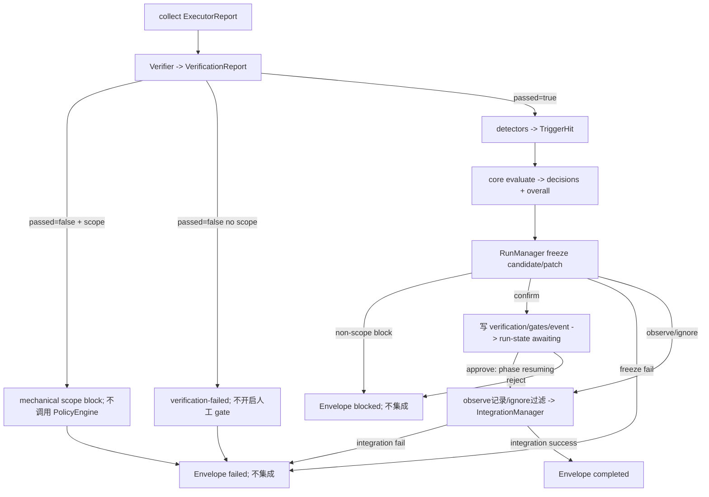

# verifier-gate-engine design

## 0. 术语约定

| 术语 | 定义 | 防冲突结论 |
|---|---|---|
| PolicyEngine | trigger 命中集 + GatePolicy → 各命中的最终 action 决策的纯函数模块（无 IO） | 新词，无冲突；区别于 4.6 的 GatePolicy（数据） |
| 检测器（detector） | 从 run 产物（worktree diff / Envelope / 契约声明）机械提取 trigger 命中的函数集合 | 新词，无冲突 |
| GateEvaluationPipeline | runner 不写 run 产物/不迁状态的计算编排：接收 RunManager 已取得的 VerificationReport/manifest，仅读 snapshots/产物，运行 detectors 与 core PolicyEngine，返回 branch plan；RunManager 才持久化 | 替代混合 EnhancedVerifier；“无 IO”收窄为无持久化副作用 |
| gate 决策记录 | run 目录内 `gates.json`：每次 trigger 命中的 hit / action / decision / 证据引用，append 语义 | 新增第六件产物（详见 D6），不改既有五件产物 schema |
| 吸收清单 | 借 / 不借 / 改良点三列的 veritack 判据设计吸收结论（本 design §1a），ADR 003 设计类人工 gate 交付物 | roadmap 条目 5 与 ADR 006 显式要求 |

GatePolicy / Verifier / VerificationReport / RunStatus 以 roadmap 4.2 / 4.6 冻结定义为准，不重抄。

## 1. 决策与约束

**需求摘要**：吸收 veritack（skeg 仓库，只读参考）的判据设计，改良为 RoleKit 原生 verifier + gate 引擎，含 GatePolicy trigger→action 引擎（roadmap 条目 5，ADR 006）。为谁：ADR 003 自动流转的机械放行判据层。成功标准（roadmap 冻结）：(1) 1 次合规 run 全程 0 人工 gate 且 events 含 observe 审计记录；(2) 1 次注入越界写入的 run 在集成前被 block。明确不做：依赖 `@veritack/pi-veritack` 包或 fork 其代码（ADR 006）；worker 进程内 tool_call 级实时拦截（执行器内部事，4.6 诚实边界——本条全部判据为执行后检测 + 集成前阻断）；网络 sandbox；design-artifact / final-acceptance 两类流程 trigger 的**触发点接入**（引擎 API 支持任意 trigger 评估，触发点由 workitem-lifecycle-core 接入）；waiver 独立机制（gate 决策的 approve 理由字段承载，不单建概念）。

**复杂度档位**：核心基础设施档——PolicyEngine 语义按穷举单测（四级 action × 优先级冲突全组合）；检测器判据逐一冻结。

### 1a. 吸收清单（ADR 006 交付物，owner 批量确认时单列过目）

事实来源：skeg 源码只读探索（src/types.ts、risk.ts、closure.ts、reducer.ts、config.ts 等）。

五原语对照：Run→run 目录 + run-state 控制面；Context→TaskContract + policy/detect 快照；Check→Verifier 的机械报告 + 六类检测器；Gate→core PolicyEngine + GateEvaluationPipeline branch plan + awaiting-gate；Record→gates.json + events.jsonl。

**借（吸收进 RoleKit 原生实现）**：

| # | veritack 设计 | RoleKit 吸收形态 |
|---|---|---|
| 借1 | TriggerPolicy 四级语义（ignore/observe/confirm/block）与 trigger 声明式配置 | GatePolicy（4.6 已冻结 schema）+ PolicyEngine；trigger 集用 roadmap 4.6 的 8 类，不照搬 veritack 的 7 个 TriggerId |
| 借2 | 路径 glob 类风险检测（protectedPaths / migrationPaths / dependencyFiles / apiPaths）| 检测器的 new-dependency / migration / public-api-change / delete 判据（路径集配置在 `.rolekit/policies/detect.yaml`，内置默认集见 D3）|
| 借3 | Check / Signal / Gate 三分——半确定性启发不直接 fail，进 signal 升级审计 | 半确定性检测（public-api-change）命中不写入 VerificationReport（shape 冻结），以 gate 命中承载 signal 语义交 PolicyEngine 按 policy 裁定；**默认档遵守 4.6 冻结表（public-api-change: confirm）**，项目可按需配 observe 获得纯审计行为 |
| 借4 | RunContract 冻结 checks 防 run 中自我弱化 | policy + detect 双快照固化：RunContext.policy 于 run start 落 run 记录（pi-rpc D8 已落），detect 配置同样于 run start 快照进 run 记录——中途改 `.rolekit/policies/gates.yaml` 或 `.rolekit/policies/detect.yaml` 均不影响已启动 run（防清空 api_paths 类自我弱化）|
| 借5 | revision 绑定证据 + closure 只认当前 revision（stale 失效）| 吸收为模型级不变量：RoleKit run 不可变、重跑生成新 run-id（4.8），验证只对最终 worktree 状态执行、验证后再修改必须新 run——不引入 run 内 revision 计数器 |

**不借（明确排除）**：

| # | veritack 设计 | 排除理由 |
|---|---|---|
| 不借1 | Pi hook 强绑（tool_call 同步 ui.confirm、session custom entry、in-memory acknowledgedGates）| ADR 001 宿主无关；RoleKit confirm 走 run 状态 + CLI 决策（D5）|
| 不借2 | run 内 mutation revision 计数器与 phase 状态机（orient/change/prove/close）| RoleKit run 模型是"契约进证据出"单次执行，借5 已以不变量承载其意图 |
| 不借3 | dangerous command 实时拦截（rm -f / sudo 等命令扫描）| 依赖 tool_call hook（不借1）；第一版以 scope 检测 + escalation 声明覆盖，残余风险注明 |
| 不借4 | 证据仅存 session RunState | 审计弱、跨宿主不可移植——改良1 |
| 不借5 | veritack 默认档"全 trigger confirm" | 与 ADR 003 默认放行档冲突；RoleKit 默认档按 4.6 冻结表 |

**改良点（RoleKit 优于参考实现之处）**：

| # | 改良 | 内容 |
|---|---|---|
| 改良1 | 证据独立落盘 | gate 决策记录 `gates.json` + events.jsonl gate 事件双写，可审计可移植（veritack 证据活在 session）|
| 改良2 | observe / ignore 真分叉 | veritack 实现缺口（二者在 mutation 路径等价）；RoleKit 按 4.6 语义严格实现：observe 记 gate 事件自动过、ignore 不记录 |
| 改良3 | 引擎纯函数化与宿主解耦 | PolicyEngine 输入 = 命中集 + policy，无 IO 无宿主 API；检测器输入 = run 产物文件，可离线重放 |
| 改良4 | 优先级语义封闭 | "最具体者胜"在扁平 trigger 模型下具体化为：trigger 显式配置 > default_action 兜底（第一版不引入路径级特异性，此具体化写入单测契约）；多命中冲突裁定 block > confirm > observe > ignore（4.6 冻结），穷举单测锁死 |

**关键决策**：

- D1 core PolicyEngine 公开契约（round 4 FDR-001/009 修订）：core 正式导出 `GateAction='ignore'|'observe'|'confirm'|'block'`、`TriggerHit={trigger:string; paths?:string[]; evidence?:string}`、`PolicyDecision={trigger; action; reason}`、`PolicyEvaluation={decisions:PolicyDecision[]; overall:GateAction}` 与 `evaluate(hits, policy)`。`decisions` 与输入一一对应、保持顺序且**包含 ignore**；显式 trigger 配置优先，否则用 default_action；未知开放字符串 trigger 同样走 default；无 hit 时 overall=`ignore`；overall 唯一按 block>confirm>observe>ignore 折叠。runner/WorkItem 只读 overall，不得再实现优先级。ignore 零记录是 IO 调用方策略，不是 PolicyEngine 丢 hit。依赖固定 `runner/cli -> core`。
- D2 六类 detector 算法：RunManager 在 Verifier 返回后、detectors 前以 worktree HEAD 为 base 执行 `git diff --name-status -z HEAD --`，并用 `git ls-files --others --exclude-standard -z` 把未跟踪文件归一为 A，生成排序去重的 `artifacts/change-manifest.json`；detectors 只读该 manifest、VerificationReport、ExecutorReport 与 snapshot，输出 TriggerHit；scope evidence=`verification.json#/scope_violations`，路径类 evidence=`artifacts/change-manifest.json`，ambiguous evidence=`artifacts/executor-report.json#/unresolved`。scope-violation=report.scope_violations 非空（机械硬失败，不经 PE）；manifest不可变并将R/C解析为old_path+path；delete=status D或R.old_path；其余三种路径 detector 对R/C同时匹配old_path与path，任一命中即hit（paths保留命中者去重）；new-dependency=v1路径启发式（变更路径命中 dependency_files，不解析依赖图，允许误报）；migration=命中 migration_paths；public-api-change=命中 api_paths；ambiguous-requirement=ExecutorReport.unresolved 非空。命中路径去重排序。TaskContract escalation v1 仅审计，不自动转 hit；detector+GatePolicy 是唯一放行裁定。design-artifact/final-acceptance 由 WorkItem 构造 allowlist trigger hit。
- D3 detect loader/默认字面：verifier feature 在 runner loader 层新增 `loadDetectPolicy(projectRoot)`；当 rolekit.yaml verifier=enhanced 时，公共 loadRunInput 必调用它并把结果放 PrepareRunInput.detectSnapshot，缺文件用默认、非法时在任何 run/WI 写前返回 detect_policy_invalid；minimal 不调用。默认：dependency_files=`['package.json','package-lock.json','pnpm-lock.yaml','requirements.txt','pyproject.toml','go.mod','Cargo.toml']`；migration_paths=`['**/migrations/**','**/migrate/**']`；api_paths=`[]`；空集且进入detectors时每run恰追加一次 `message{role:'system',text:'[warning:empty_api_paths] public-api-change detector disabled'}`（扫描同 text 去重，不新增事件类型）。detect.yaml 只可覆盖三键，未知键/非法 glob→detect_policy_invalid。prepare 写规范化 snapshot；共用 loadGatePolicy 语义校验强制 `scope-violation:block`，其他 action 为 policy_invalid。PolicyEngine 保持开放 trigger，但 detector/WorkItem 调用前校验各自 allowlist；显式扩展的未知 trigger 才走 default，PolicyDecision.reason 标 fallback warning，防 typo 静默。
- D4 计算、机械失败与 Envelope：GateEvaluationPipeline 不写 run 产物/状态。verification.passed=false 时**不调用 PolicyEngine**：scope 非空固定 mechanical-scope-block，否则 verification-failed；人工 gate 不可洗成成功。passed=true才调用pipeline做detectors+evaluate并返回branch；RunManager在执行任何branch/awaiting前按pi-rpc D12冻结candidate/patch，失败则覆盖为failed。branch→Envelope 唯一引用 pi-rpc D13：mechanical/scope/integration fail=`failed`；非-scope overall block 或 human reject=`blocked`；approve/observe/ignore + integration success=`completed`（unresolved 可作为 owner 已接受风险保留）；ExecutorReport question/blocked 在 pipeline 前直接终态。overall=block 时 confirm records 立即 resolution=cancelled/by=system/reason=higher-priority-block，不 pending；observe 可记，ignore 不落。overall=confirm 时所有 confirm records pending。RunManager 唯一写 gates/events/result/state；安装本 feature 后每个终态（包括 ExecutorReport blocked/question/failed/cancelled 的 pipeline 前短路）均先 materialize gates wrapper；短路与普通 verification-failed 为 records=[]、mechanical scope 为一条 block。minimal scope 保留 pi-rpc D8；enhanced 禁用该特化，机械 scope 恰写一次 block record/event。
- D4a awaiting durable protocol + reconcile：持 run lock 写 verification→gates pending wrapper→每 record 对应 human-required event（`gate=trigger`,`evidence='gates.json#records/N'`，扫描同 evidence 去重），最后原子置 run-state awaiting/gate-pending；result 必不存在。**verification+change-manifest+candidate/integration.patch+pending gates 是 pre-await commit evidence**：若崩在最后一步前，`status`、`waitUntilSettled`、`collect`、`gate list|approve|reject` 任一入口发现 `state=running && phase=finalizing` + candidate/patch/verification存在 + result不存在 + pending，即幂等补缺 event并置 awaiting，再返回/决策；其他不一致才 run_state_inconsistent。approve/reject 在 reconciled 形态下一次 resolve 全部 pending；先写resolution commit、置running/resuming并释放run lock，再统一调用RunManager.collect 续 D12/D13 finalizer；gate CLI、status、waitUntilSettled、collect 任一入口见 resuming 都走同一幂等收尾。若崩在两写间或 resuming，重复同决策或任一 reconcile 入口继续；仅 finished no-op。user cancel在awaiting保留verification/candidate、把全部pending resolution=cancelled后终态且不集成。
- D5 CLI router/批量决策：稳定错误表为 `run_not_found|no_pending_gate|gate_decision_conflict|gate_target_unavailable|run_state_inconsistent`（业务 exit1）与 `invalid_gate_target|invalid_usage`（exit2），JSON 统一 `{error,id?,detail?}`。前缀规则不变。`gate list run-x --json`→`{id,state,phase,pending:[{index,trigger,action,evidence}]}`；approve/reject→`{id,state,decision,no_op}`。一次 run 级决策在同一 lock 内 resolve **全部**未 resolved human-required records，禁止部分 resolve；reason/by/ts 同批。WI shape 有意由下游定义（按前缀分 shape）。无 pending非resuming→no_pending_gate；finished/resuming 同决策 no-op或续收尾；与 durable resolution 相反（含 cancelled 后 approve/reject）→gate_decision_conflict。`WI-` handler 未安装→gate_target_unavailable；其他前缀→invalid_gate_target/exit2。
- D6 gates.json 根契约：文件是 `{schema:'rolekit/gate-record@1', records: GateRecord[]}`，可由现有 validate 按根 schema 识别。GateRecord=`{trigger, action:'observe'|'confirm'|'block', decision:'auto-pass'|'human-required'|'blocked', hit_paths?, evidence?, resolution?, ts}`；ignore 不落 record。仅 action=confirm/decision=human-required 可无 resolution（pending）或补 `{result:'approved'|'rejected'|'cancelled',by,reason?,ts}`；observe/block 禁 resolution。命中只追加，resolution 是唯一就地字段更新，run finished 后冻结。events 双写映射固定为 payload.gate=record.trigger、action/decision 同值、evidence=`gates.json#records/N`；resolution 只留 gates.json，不追加“改写历史”的事件。core 新增第10类 schema+semanticRules，1正/2负；4.1 patch 明确是整份 gates 文件 schema。
- D7 快照/控制文件归属：run prepare 由 RunManager 写 policy-snapshot.json 与 run-state.json；enhanced 配置再写 detect-snapshot.json（若 prepare 时 verifier=enhanced 必须存在）。快照不可变；run-state 是唯一运行中可变控制文件，gates resolution 是第二个受限可变点；events 只追加，其余产物写成后不改。双快照测试分别在 run 启动后改源配置，断言 pipeline 仍读 snapshot。
- D8 模式与接口：Verifier seam 本身保持 `verify()->VerificationReport`，MinimalVerifier 保留。原“EnhancedVerifier 第二实现”改为 `GateEvaluationPipeline` composite，避免把 gate IO/状态迁移藏进 Verifier；rolekit.yaml 键仍 `verifier:minimal|enhanced`：minimal=MinimalVerifier+D8 特化，安装本 feature 后也写 gates wrapper（scope 时一条 block record、无命中/cancel 时 records=[]）；enhanced=RunManager先调MinimalVerifier（或兼容Verifier）再把report/manifest交detectors+core PolicyEngine pipeline，默认 enhanced。roadmap 4.6 的“两 Verifier adapter”措辞同步改为“Verifier + GateEvaluationPipeline 两层 seam”。
- D9 可逐项 diff 的 batch patch（同时**替换 ADR 003 Decision 的 class-(1) 触发句**为“v1 由机械 detector+GatePolicy 触发；contract escalation 仅审计”，并在 consequences 记归一化升级后置）：§2 协议清单 9→10；§3 core+=PolicyEngine+gate-record、runner+=detectors/pipeline/coordinator、cli+=gate router；§5 item5 所属模块改 core+runner+cli；4.1 第10类整份 gates schema（实现归本 feature 扩 core registry，不改旧9类行为）；4.5 gate `<id>`；4.6 PolicyEvaluation、scope机械硬失败、Pipeline/RunManager两层 seam（删“双 Verifier adapter”）；4.8 run-state/gates/policy/detect snapshots + immutable `artifacts/change-manifest.json` + 可变性；Goal Coverage Matrix、items description/notes 与 schema 口径同步。任一漏合入阻塞 implementation。

**基线风险**：实现前置 pi-rpc-vertical-slice 严格 done（真实链路 + MinimalVerifier + events 基线）；design 先行合规（epic 批量 admission）。

**Top 3 风险与缓解**：
1. public-api-change 路径检测误报/漏报（半确定性）→ 默认档按 4.6 冻结表为 confirm（误报代价 = 一次人工决策，不静默放行）；api_paths 默认空 + 项目自配，未配置则不触发；项目可配 observe 获得纯审计
2. awaiting-gate 多文件崩溃窗口 → D4a pre-await reconcile + resolution commit + resuming；e2e 在 pre-await/pending/resolution/resuming 四 checkpoint kill 后恢复
3. 无 tool_call 实时拦截导致危险命令只能事后审计 → 诚实边界照 4.6 口径写文档，不称"拦截"；残余风险列 hardening 观察项

**非显然依赖**：pi-rpc-vertical-slice 同步修订的 prepare/startPrepared、run-state/per-run lock/policy snapshot、run 链路/events/worktree diff；contract-schemas 的 GatePolicy/validate 与本条新增 gates 根 schema；skeg 只读；真实 Pi 环境。pi-rpc 修订未复审 passed 前本条不得实现。

**关键假设**：4.6 GatePolicy schema 的 triggers 映射足以表达 D2 六类检测（键为 trigger 名、值为 action）；检测路径集配置定为 `.rolekit/policies/detect.yaml`（D3），不改 GatePolicy schema 本体，无 strict/additionalProperties 争议。

**必跑验证命令**：`npm test`（PolicyEngine 穷举 + 检测器判据 + 快照固化单测）、`node --test test/e2e/`（gate 命令组 + confirm 恢复 + observe/ignore 分叉，mock adapter）、`npx tsc --noEmit`、`npx biome check .`、两验收 run 的产物 validate（含 gates.json）；全部 Windows 本机。

**交付物清单**：core PolicyEngine 类型/API + gate-record 根 schema；runner detectors + gate-evaluation-pipeline + RunManager gate coordinator；run-state/gates/policy-snapshot/detect-snapshot；CLI gate `<id>` router；detect/policy 示例；语义/恢复/e2e 与两真实 run；§3/4.1/4.5/4.6/4.8 patch、items/compound 回写。

**清洁度规则**：禁止 import 或复制 skeg 源码（license 与 ADR 006——review 抽检 + 无 veritack 字样出现在 API 面）；PolicyEngine 无 IO；禁止调试输出；TODO/FIXME 禁止落盘。

## 2. 名词与编排

### 2.1 名词层

**现状**：仓库无实现代码；pi-rpc / contract-schemas design 规划上述模块。本条及其上游修订全部须在实现前复审 passed。

**变化**：

- `packages/core/src/gate/policy-engine.ts`：正式导出 D1 的 GateAction/TriggerHit/PolicyDecision/PolicyEvaluation/evaluate
- `packages/core`：`rolekit/gate-record@1` 根 schema + semanticRules + validate
- `packages/runner/src/gate/detectors.ts`：六类检测器，输入 run 产物/task/detect snapshot，输出 core TriggerHit[]
- `packages/runner/src/gate/gate-evaluation-pipeline.ts`：无 run 产物写/状态迁移的 composite，返回 report/hits/evaluation/branch
- RunManager gate coordinator：唯一 gates/events/result/run-state 写入与恢复者
- `packages/cli`：gate `<id>` router；run handler 本条交付，WI handler 后续注册
- run 目录：gates.json + policy/detect snapshot；run-state 由 pi-rpc 修订交付

接口示例（错误与幂等路径）：

```ts
const e1 = evaluate([{trigger:'public-api-change'}], observePolicy)
// { decisions:[{trigger:'public-api-change',action:'observe',...}], overall:'observe' }
const e2 = evaluate([{trigger:'migration'},{trigger:'new-dependency'}], mixedPolicy)
// decisions 保留两 hit；overall='block'。调用方不再折叠。
const e3 = evaluate([{trigger:'unknown-future-trigger'}], policy)
// action=policy.default_action；开放 trigger 支持 WorkItem 流程 hit。

rolekit gate approve run-x --reason "ok"  // awaiting -> phase resuming -> finished
rolekit gate approve run-x                // finished 后 no-op；resuming 时继续收尾
rolekit gate approve run-y                // 无 pending -> exit 1 no_pending_gate
```

**Interface 设计检查**：Verifier seam 只负责机械 VerificationReport；GateEvaluationPipeline 是相邻 composite seam，隐藏 detector+PolicyEngine 顺序但无持久化副作用；RunManager coordinator 显式持有副作用。PolicyEngine/WorkItem 两类调用方证明 core seam 非假，且 per-hit/overall 给 caller 足够信息。gate-record 是新增第 10 类根 schema，不修改旧 9 类。依赖方向 `cli/runner -> core`。

### 2.2 编排层

**现状**：run start 主流程（pi-rpc design 流程图）在 collect 后进 MinimalVerifier。

**变化**：GateEvaluationPipeline 计算 branch，RunManager 显式执行副作用：



PolicyEngine 决定 overall；pipeline 只把 verification 前置规则与 overall 映射成 branch；RunManager 不重算优先级。

**流程级约束**：pipeline 只读 snapshot；gates 根 records 追加 + confirm resolution 受限更新；run-state 经 per-run lock 原子替换，finished 后冻结；events 只追加。cancel 在 gate 前写空 records wrapper；awaiting cancel保留verification/candidate、把pending resolution=cancelled后终止且不集成。enhanced scope 只写一次，minimal D8 保留。exit 0/1/2 与 D5 错误码固定；events 字段按 4.4。

### 2.3 挂载点清单

1. `rolekit gate <id>` router + run handler（packages/cli）— 新增
2. core PolicyEngine 导出与 gate-record 根 schema/validate — 新增
3. runner GateEvaluationPipeline + RunManager gate coordinator + `verifier:minimal|enhanced` — 新增/修改
4. run-state/gates/policy-snapshot/detect-snapshot 布局与 per-run lock — 修改 4.8
5. detect.yaml/policy 示例与 roadmap/items batch patch — 新增/修改

### 2.4 推进策略

1. core PolicyEngine API + per-hit/overall 穷举（含 ignore、未知 trigger、无 hit）→ 退出信号：真值矩阵全绿；fixture caller 模拟 runner/WorkItem 双消费，无重复折叠
2. 六类 detectors + D3 默认字面/snapshot 单测（每类正负、name-status/path evidence、api_paths 空 warning）→ 退出信号：算法与快照全绿
3. gate-record 根 schema + snapshots/run-state + GateEvaluationPipeline/RunManager（mechanical fail、Envelope 表、minimal/enhanced 单路径）→ 退出信号：wrapper/双快照/无持久化副作用 pipeline/终态矩阵/单次 scope event 全绿
4. gate router + pre-await/awaiting/resuming/finished恢复e2e（pre-await/resuming均覆盖status/wait/collect/gate list|decision，四checkpoint）→ 退出信号：reconcile/恢复不重跑 verifier或重复集成，list/decision JSON、取消与错误码全绿
5. 验收 run 1——合规 run（真实 Pi）：使用入库验收 policy 样例 `.rolekit/policies/examples/acceptance-observe.yaml`（默认档基础上仅 `public-api-change: observe`，detect.yaml 配置项目 api_paths），任务故意触达一个 api_paths 内文件 → 产生确定的 observe 命中；0 人工 gate、events 含 ≥1 条 observe 记录、正常集成 → 退出信号：roadmap 验收 (1) 证据齐（policy 样例随 run 快照留档）
6. 验收 run 2——越界注入 run（真实 Pi）：scope-violation → block，集成前拦截，Envelope failed → 退出信号：roadmap 验收 (2) 证据齐
7. 收口：逐项核对 D9（含 §2/§3/§5/4.1/4.5/4.6/4.8/Matrix/items）+ compound → 退出信号：每项有 diff；两验收证据齐备

### 2.5 结构健康度与微重构

##### 评估
- 文件级——被改文件：run 编排（verifier 调用点替换为可选择实现）与 CLI 入口路由，各 ≤2 处改动
- 目录级——core/gate 放 PolicyEngine+类型；runner/gate 放 detectors+gate-evaluation-pipeline；RunManager 持 IO，不建 enhanced-verifier 混合模块或第二份 policy-engine

##### 结论：不做

##### 超出范围的观察
- dangerous command 类实时判据若未来需要，须以执行器配置面（Pi 工具白名单）承载而非 runner hook——留 hardening 观察项

## 3. 验收契约

关键场景清单：

1. 合规 run（真实 Pi，S5 钉死的 observe fixture：acceptance-observe policy 样例 + 故意触达 api_paths）：全程 0 人工 gate，events.jsonl 含 ≥1 条 `action:'observe'` gate 事件，gates.json 有对应记录，Envelope completed 且集成完成（roadmap 验收 1）
2. 越界注入 run（真实 Pi）：scope-violation 命中 → block，worktree 不集成，Envelope failed，gate 事件 `decision:'blocked'`（roadmap 验收 2）
3. PolicyEngine：每 hit decision 含 ignore、顺序稳定；未知 trigger 走 default；无 hit overall ignore；多命中 overall block>confirm>observe>ignore，runner/WorkItem fixture caller 结果一致
4. observe/ignore IO：同一 decisions 在 observe 档写 gates/events，ignore decision 保留在内存但落盘零记录
5. mechanical failure：verification.passed=false 不开启 confirm；scope fail 在 enhanced 只产生一条 block，minimal D8 回归也只一条
6. confirm恢复：pre-await由status/waitUntilSettled/collect/gate list|approve|reject任一入口reconcile到awaiting；resuming同样由status/waitUntilSettled/collect/gate list|approve|reject任一入口续D12/D13且不重跑verifier；pre-await/pending/resolution/resuming四点 kill 后完成一次收尾
7. router/幂等：run-/WI-/未知前缀、handler unavailable、no_pending_gate、state inconsistent、finished no-op 与 resuming 续跑的 exit/JSON 全断言
8. policy/detect 双快照：启动后改源文件仍读 snapshot，snapshot checksum 不变
9. gates wrapper 过 validate（1 正 + 2 负，覆盖根 schema、非法 resolution/decision）
10. api_paths 空集：不触发 public-api-change，events warning 一次
11. cancel：gate前空wrapper；awaiting保留verification/candidate，pending全cancelled，Envelope cancelled且不集成/不覆写
12. 多命中真值表：confirm+block overall block，confirm record cancelled；多个 confirm 时一次 approve/reject resolve 全部，list pending[] 完整
13. Envelope 表：mechanical/scope/integration fail=failed；non-scope block/reject=blocked；approve/observe/ignore+集成=completed；executor question/blocked 直达对应状态，workitem fixture 消费一致
14. minimal/enhanced gates：安装本 feature 后 minimal scope 写一 block record、cancel/无命中空 wrapper；enhanced 不重复
15. escalation 事件仅审计、不转 hit；危险命令若不表现为六 trigger 不在 v1 覆盖

明确不做的反向核对项：无 veritack 依赖/源码复制；无 tool_call hook/危险命令实时拦截（只有表现为 scope/dependency 等 hit 才进入本引擎）；无 design-artifact/final-acceptance detector；VerificationReport shape 零变更；旧 9 类 schema 零变更；无 enhanced-verifier 混合 IO 模块；无 runner/CLI 优先级副本。

### 3.x Acceptance Coverage Matrix

| Scenario | Covered By Step | Evidence Type | Command / Action | Core? |
|---|---|---|---|---|
| 合规 run 0 人工 gate + observe 审计 | S5 | run artifacts + events | 真实 Pi run | yes |
| 越界注入 run 集成前 block | S6 | run artifacts + events | 真实 Pi run | yes |
| PolicyEngine per-hit/overall/开放 trigger 矩阵 | S1 | test | `npm test` | yes |
| 六类 detectors 正负例 | S2 | test | `npm test` | yes |
| observe/ignore IO 分叉 | S1/S3 | test | pipeline+coordinator 单测 | yes |
| mechanical fail 优先 + minimal/enhanced scope 单路径 | S3 | test | mock run 单测 | yes |
| pre-await/awaiting/resuming/finished 崩溃恢复 + router | S4 | command + state diff | CLI e2e | yes |
| policy/detect 双快照 | S2/S3/S4 | test + command | checksum + e2e | yes |
| gates 根 schema（1 正 + 2 负） | S3 | command | `rolekit validate` | yes |
| 多命中 decisions/overall + 全 pending 批量 resolution | S1/S4 | test + command | 单测 + gate e2e | yes |
| D13 Envelope 终态矩阵跨 feature 一致 | S3/S4 | test | mock RunManager + WorkItem fixture | yes |
| Minimal gates wrapper / enhanced pipeline 单路径 | S3 | test | `npm test` | yes |
| api_paths 空集 warning | S2 | test | `npm test` | no |
| cancel前空wrapper / awaiting保留verification+candidate、全cancelled且不集成 | S4 | state diff | mock e2e | yes |
| 明确不做反向核对 | S7 | diff review | grep + package.json 审计 | no |

### 3.y DoD Contract

| ID | 要求 | 证据 | 阻塞级别 |
|---|---|---|---|
| DOD-DESIGN-001 | design 完整且吸收清单三列齐备 | design review | blocking |
| DOD-IMPL-001 | checklist steps 全完成且证据落盘 | checklist / evidence | blocking |
| DOD-REVIEW-001 | code review passed（含无 skeg 复制抽检）无 unresolved blocking | review report | blocking |
| DOD-QA-001 | QA 覆盖两验收 run 与语义矩阵 | QA report | blocking |
| DOD-ACCEPT-001 | acceptance 核对 D9 全量 patch + items/compound 回写完成 | acceptance report | blocking |

Validation Commands:

| ID | 命令 | 目的 | 核心性 | 失败处理 |
|---|---|---|---|---|
| CMD-001 | `npm test` | 语义矩阵 + 检测器 + 快照固化单测 | core | fix-or-block |
| CMD-002 | `node --test test/e2e/` | gate 命令组 + 恢复路径 e2e | core | fix-or-block |
| CMD-003 | `npx tsc --noEmit && npx biome check .` | 类型与 lint | core | fix-or-block |
| CMD-004 | `rolekit validate <artifact>` | 两验收 run 产物（含 gates.json）校验 | core | fix-or-block |

Required Artifacts: review/QA/acceptance、两真实 run、PolicyEvaluation+Envelope 矩阵、四 crash checkpoint、gates fixtures、snapshots、吸收清单、D9 逐项 patch、配置模板与 compound。

## 4. 与项目级架构文档的关系

- 名词：PolicyEvaluation / GateEvaluationPipeline / gate-record log / run-state phase → acceptance 时提炼进 CONTEXT
- 动词骨架：D9 §3/4.1/4.5/4.6/4.8 是一个不可拆的 batch patch；实现门禁 = 本 design 与 pi-rpc 实质复审 passed + 全量 patch 合入，acceptance 逐项核对
- host-adapter-skills 的可用命令区后续增补 `gate list|approve|reject`（该 feature acceptance 后的跟进项，记 items.yaml note，不阻塞本条）
- 吸收清单结论（借/不借/改良的实证结果）与 awaiting-gate 跨进程恢复的坑 → compound（知识回写点）；verifier 默认档切换（minimal→enhanced）→ attention

## 5. 兼容修订记录

- 2026-07-24（workitem-lifecycle-core design D3 引入，同批 4.5 补丁）：`rolekit gate list|approve|reject` 的参数由 `<run-id>` 广义化为 `<id>` + 前缀路由——`run-` 前缀路由到本条 run gate（行为语义零变更），`WI-` 前缀路由到 workitem gate（workitem-lifecycle-core 实现），其他前缀 exit 2。参数广义化本身不改 run gate 行为；补丁字面以 workitem-lifecycle-core design D3 冻结为准。
- 2026-07-24（workitem-lifecycle-core round 1 FDR-001）：PolicyEngine 上移 core，消除逆向依赖。
- 2026-07-24（round 4 FDR-001..010）：公开 API 冻结为 decisions+overall；gates 改根包装；新增 run-state/snapshot 权威；原 EnhancedVerifier 拆为 Verifier + GateEvaluationPipeline + RunManager coordinator；mechanical failure 优先；batch patch 扩为 D9 全目录。属实质变化，触发完整复审。
