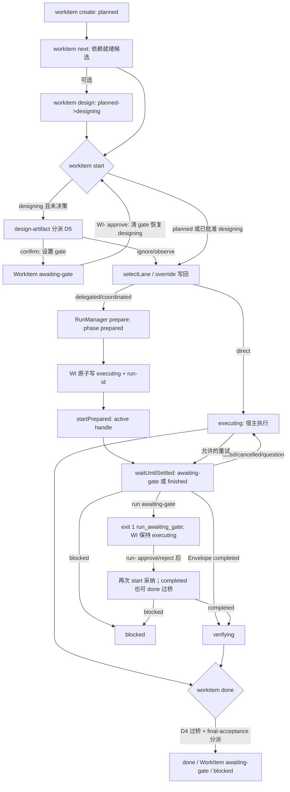

# workitem-lifecycle-core design

## 0. 术语约定

| 术语 | 定义 | 防冲突结论 |
|---|---|---|
| 状态机核 | `transition(item, to, ctx) -> WorkItem`：4.9 转移表的纯函数实现，非法转移抛 InvalidTransition | 新词，无冲突；表驱动，转移表 = 4.9 冻结不重抄 |
| selectLane | `selectLane(item, policy, signals) -> { lane, reason }`：4.9 冻结签名的规则表路由 | 4.9 已定义 |
| workitem 存储 | `.rolekit/work-items/<id>.yaml`，单写者 = CLI 进程（文件锁，4.8）| 4.8 已定义 |
| 盘点清单 | CodeStable 机制的留/砍/改三列结论（本 design §1a），ADR 003 设计类人工 gate 交付物 | roadmap 4.9 与条目 8 显式要求 |
| 自动过桥 | `workitem done` 对 executing 态的机械前置转移（executing→verifying），条件封闭 | 新词，无冲突（D4）|

WorkItem / WorkItemStatus / GateOrigin / 转移表 / goal 完成不变量 / done 命令分派 / LaneSignals 以 roadmap 4.9 冻结定义为准，不重抄。

## 1. 决策与约束

**需求摘要**：按 4.9 冻结契约实现 WorkItem + 状态机 + lane 路由 + `rolekit workitem` 命令（roadmap 条目 8）。为谁：RoleKit 取代 CodeStable 的生命周期层。ADR 002 要求“契约先验证再吸收生命周期”：本条的 **design admission** 已由上游 design-review passed 满足，但实现时机尚未成立，implementation 必须等 contract-schemas、pi-rpc-vertical-slice、verifier-gate-engine 严格 done。成功标准（roadmap 冻结）：create→next→start（委派一次真实 run）→done 全程命令化；非法转移被拒 exit 1。design 阶段交付物：CodeStable 机制盘点清单（留/砍/改三列，owner 过目，§1a）。明确不做：coordinated lane 的多角色编排执行（roadmap“明确不做”并行多 writer；本条 coordinated 仅产出 lane 标签与 reason，执行面等价 delegated，记观察项）；brainstorm / audit / feedback 类 CodeStable 根的模型化（盘点清单砍列）；WorkItem schema 修改（仅消费 contract-schemas 冻结设计，不能把 draft 当成已实现）；迁移转换逻辑（归 migrate-tool，本条只提供目标模型与状态机）；knowledge 条目读写（归 knowledge-layer）；通用 executing 级 WorkItem gate 升级（本条只处理 run 自身 awaiting-gate 的可恢复返回，`question` 暂留 executing，完整升级归 hardening）；design 产物重新送审（推翻已 approve 的 design，D5 一次性条件）；D2a 标注“显式延后”的转移边 CLI 承载（dropped / blocked 恢复 / verifying 重跑）。

**复杂度档位**：核心基础设施档——状态机穷举单测（8 状态 × 8 目标全组合 + gate 条件约束 + goal 不变量）；命令语义逐一冻结。

### 1a. CodeStable 机制盘点清单（roadmap 4.9 要求，owner 批量确认时单列过目）

事实来源：本仓库 `.codestable/` 实际使用形态 + cs 技能族协议（只读参考）。

范围说明：WorkItem kind 封闭集以 4.9 冻结为准（含 `research`——RoleKit 原生新增 kind，无 CodeStable 对应机制，不在本盘点映射内；research-module 消费）。

**留（吸收进 RoleKit，语义保持）**：

| # | CodeStable 机制 | RoleKit 承接 |
|---|---|---|
| 留1 | feature / issue / refactor 生命周期实体 | WorkItem kind 三值直映（4.9）|
| 留2 | goal/roadmap 的目标容器与依赖集 | kind=goal + depends_on + goal 完成不变量（4.9）|
| 留3 | ADR Nygard 四节 | KnowledgeEntry type=adr（4.10，归 knowledge-layer）|
| 留4 | attention 短规则 / compound 沉淀 | KnowledgeEntry type=rule / learning|note（4.10，归 knowledge-layer）|
| 留5 | design 产物人工审查 gate | design-artifact trigger（ADR 003 白名单第三类，D5 接入）|
| 留6 | 最终验收人工确认 | final-acceptance trigger（白名单第四类，4.9 done 分派）|

**砍（不进 RoleKit 模型）**：

| # | CodeStable 机制 | 砍除理由 |
|---|---|---|
| 砍1 | brainstorms / audits / feedback / explore 独立生命周期根 | 非执行实体；沉淀走 KnowledgeEntry，讨论产物是普通文档 |
| 砍2 | 每阶段独立报告模板（design-review/code-review/QA/acceptance 四套 md 协议）| 证据统一为 run 产物 + verification + gate_log；人读报告不再是状态机前置 |
| 砍3 | 阶段间默认人工确认（stage gate 全人工）| ADR 003 自动流转替代，人工点收窄为白名单四类 |
| 砍4 | quick/standard/goal 三档 lane 的人工判断协议 | selectLane 规则表机械路由（4.9），人工覆盖走 lane_overrides 审计 |
| 砍5 | gates/ reference/ 运行时目录与 runtime-sync 脚本 | RoleKit 的运行时面是 CLI + schema，无需文档运行时 |

**改（吸收但重构形态）**：

| # | CodeStable 机制 | RoleKit 形态 |
|---|---|---|
| 改1 | design 阶段（designing 目录态）| designing 状态 + 离开时 design-artifact gate 分派（D5）——阶段从目录约定变为状态机事实 |
| 改2 | checklist steps/checks | TaskContract 的 deliverables/acceptance + verification 命令（契约化，不再是并行文档）|
| 改3 | 状态词表（draft/active/in-progress...）| WorkItemStatus 八态封闭集（迁移映射表已冻结，归 migrate-tool）|
| 改4 | 知识回写点约定 | KnowledgeEntry 挂 WorkItem 生命周期（4.10 目录 + 状态，归 knowledge-layer；本条只留 runs[] 关联先例）|

**关键决策**：

- D1 分层与单一 gate 语义源（round 1 FDR-001 修订）：状态机核 + selectLane 进 `packages/core`（纯函数，无 IO——transition 只做状态变化；`attachRun` 负责首次转 executing 或 executing retry 字段更新；`adoptRunResult` 负责 CAS 后幂等采纳；gate/goal/action 不变量均穷举）；存储与锁进 `packages/cli`（workitem store：YAML 读写 + 文件锁）。**PolicyEngine 上移 `packages/core/src/gate/policy-engine.ts` 并作为 core 公共纯函数导出**：runner gate pipeline 与本条 WorkItem reducer 共同消费同一 `evaluate(hits, policy) -> PolicyEvaluation`；本条对单个流程 hit 只读取 `overall`，不再折叠优先级。不允许 core→runner 逆向依赖，也不允许 CLI 复制 trigger/action 表。该包边界修订同步写入 verifier-gate-engine design 并按实质变化完整复审；epic 批量确认时将“GatePolicy core 定义、PolicyEngine core 计算、runner 执行检测/集成”列入 roadmap 4.6 澄清补丁。
- D2 命令语义冻结（`workitem create|list|next|design|start|done` 六子命令——`design` 为 4.5 清单的新增项，随 D3 补丁同批合入 roadmap update）：
  - `create --kind <k> --title <t> [--depends-on <ids>]`：分配 id（`WI-YYYYMMDD-NNN`，当日序号扫描存量分配），status=planned，写 YAML。每个 depends_on 必须指向已存在 WorkItem，未知 id exit 1 `dependency_not_found`；新 id 尚未写入，禁止自依赖。第一版无依赖编辑命令，因此 CLI 新建路径不会形成新环；migrate-tool 导入任意图时另做全图 DAG 校验。
  - `list [--status <s>] [--kind <k>]`：过滤输出；显式 `--json` 时用 D2b wrapper。
  - `next`：机械选择规则冻结——候选 = status=planned 且 depends_on 每项均 done 或 dropped（含 dropped 依赖时结果附 warning 字段）；排序 = created 升序；输出首个候选；无候选 exit 1 + 稳定码 `no_ready_item`。
  - `design <id>`：planned→designing 唯一 CLI 承载，无其他副作用；非 planned 起点抛 InvalidTransition，CLI exit1 `invalid_transition`。e2e 进入 designing 一律经此命令（禁止 fixture 手改 yaml 造态）。
  - `start <id> [--task <task.yaml>] [--estimated-files N] [--cross-module] [--migration] [--context-loaded] [--lane <lane>]`：
    - (a) 起点 planned/designing（designing 起点先走 D5 design-artifact 分派）+ **恢复/重试起点 executing**。executing 且最新 run `running|awaiting-gate` 不重启；finished+completed 只采纳到 verifying；finished+blocked **不建新 run，deferred adopt 为 WI blocked 并返回 run_blocked**（覆盖原 start 已因 awaiting 退出的 reject/block）；finished+failed|cancelled|question 仅在修订 `--task` 且其 `task.id` 等于最新 run 冻结 task_id 时显式 retry=true；缺 task→retry_task_required，id 不同→retry_task_mismatch；首次及initial prepare恢复用retry=false；显式retry及其同digest prepare/link crash重放保持retry=true，由reservation返回同handle。上述已有 run 的纯等待/采纳不依赖当前 profile/policy 文件。direct 且无 run 的 executing 表示宿主正在工作，再次 start 为 `invalid_transition`。
    - (b) 首次 start 运行 selectLane（signals 由 flags 提供，缺省 `{estimated_files:0, cross_module:false, migration:false, context_already_loaded:false}`）并写回 lane/lane_reason；规则 v1 不读取 policy（D7）。`--lane <lane>` 为人工覆盖入口：首次从规则结果覆盖；重试从当前 lane 覆盖。覆盖均追加 `{by:'cli', from, to, reason:'manual', ts}`。已有 run 的重试禁止覆盖为 direct（exit 1 `invalid_lane_override`，避免绕过 run 证据）；delegated↔coordinated 可覆盖，并按 D8 在新 run 镜像 observe 审计。
    - (c) **以最终 lane 校验参数**：只有 D5/done 流程 gate 或将创建新 run（首次/显式 retry）的路径调用 runner 共用 `loadGatePolicy(projectRoot)` 读取 `.rolekit/policies/gates.yaml`（缺失用 4.6 内置默认，非法 exit1 `policy_invalid`），D5/done 与 run 使用同一规则。direct 不要求 task；delegated/coordinated 调用 `loadRunInput(taskPath,{policy})` 复用刚加载的同一 policy，并解析 task/profile/executorProfile/adapter，`task_invalid|profile_not_found|executor_profile_not_found|policy_invalid|detect_policy_invalid|unknown_adapter|knowledge_invalid|lock_held|knowledge_io_failed` 时 WorkItem/run 零变化（new-run start 在任何 WI/run 写前原样透传 exit1 且 WI checksum 不变）；executing 已有 run 的 status/wait/collect/deferred-adopt 只依赖 run-id 和冻结快照，先于 loaders。coordinated 第一版执行面等价 delegated。委派使用 D2d prepare→link→start saga，并调用上游冻结的 `waitUntilSettled(runId)`；该 API 明确在 awaiting-gate 或 finished 首次出现时返回。`awaiting-gate` → WorkItem 保持 executing，exit 1 `run_awaiting_gate`，`--json` 至少返回 `{error, run_id, next_action:'rolekit gate list <run-id>'}`；决策后 approve/completed 可由 `done` D4 或再次 `start` 采纳；reject/block 只能再次 `start` deferred-adopt 为 WI blocked。finished 后必须调用 RunManager `collect(runId)`/读取已验证 `result.json`，不得从 ManagedRunStatus 臆造终态；再以 pi-rpc D13 为唯一分支键：`completed`→verifying；`failed`（任何 reason，含 executor-failed/scope/mechanical/integration/timeout/lost）→executing/run_failed；`cancelled`→executing/run_cancelled；`question`（executor/escalation）→executing/run_question；`blocked`（executor blocked 或非-scope policy block/human reject）→WorkItem blocked/run_blocked。`lost` 不是 status，只能表现为 `failed` + reason=`lost`。上述业务码均 exit 1。**任何路径进入 verifying 都不等于完成 final-acceptance**，调用方仍须执行 `workitem done`；start 采纳 completed 与 done 从 executing 自动过桥在进入 verifying 后语义等价。
    - (d) start 持久化 saga（不长持锁）：
      0. **已有 run 优先且无 loaders**：短锁读取 WI revision/latestRunId 后按 ManagedRunStatus.phase 分派；preparing（理论不可被 link）→run_state_inconsistent；prepared|starting→先 D8 ensureAuditEvent override mirror 再 startPrepared；active|finalizing|cancelling|resuming→wait/status/collect；gate-pending→返回 awaiting；terminal→collect/adopt。仅 terminal failed|cancelled|question 且给修订 task 才转入 retry 新-run 流程。所有返回后的 WI 写都走 (e) CAS。
      1. **新 run/retry**：锁外只 loadGatePolicy；短锁重读后计算 D5+最终 lane/override。D5 confirm/block 立即原子写并返回；direct 原子写 executing/lane/log/override 后返回；delegated/coordinated 对 ignore/observe 仅缓存 effect（loader失败须 WI 零变），记录 expectedRevision 后释放。
      2. 锁外按最终 lane 调 loadRunInput；retry 同时校验 task.id；再 prepare（initial=false；retry及同digest crash重放=true）。
      3. 再获 WI 锁：first 用 transition+attachRun，retry 只用 attachRun（无 self-loop）；expectedRevision/起点不变则把 lane、缓存的 D5 observe、override、run-id 一次写入。若已含同 run-id 幂等继续；其他变化确认自身未含 run-id 后 abortPrepared，成功→workitem_changed，失败→prepared_abort_failed，WI 均不改。
      4. link 后记录 linkedRevision；若有历史 override，持 run lock 调 ensureAuditEvent(runId,event, WI id+override ts) 后才startPrepared；镜像写失败返回run_audit_failed并保持prepared，重入补写。控制码若已生成 terminal result 则 collect/D13，不留悬空 WI；随后 waitUntilSettled。
      5. 返回后按 (e) `{linkedRevision,latestRunId}` CAS adopt。prepare/link/mirror/start/wait 任一 crash：同 reservation/phase 重入上述唯一分派；不增 attempt、不重复 process/event。禁止持 WI 锁等待 executor。
    - (e) adopt CAS 真值表：latestRunId 不同→workitem_changed；revision 相同且 status=executing→按 D13 首次采纳；revision 已变但同 run 已使 WI 到目标/更后继状态（completed 对应 verifying|awaiting-gate|done|blocked，blocked 对应 blocked，失败类仍 executing）→`no_op:true`且不回退；同 run 但变化不在这些证据闭包→workitem_changed。start 与 done 并发的 fixture 必须证明 completed 后 awaiting-gate/done 不被 start 覆写。run_blocked 等业务 exit 语义在首次与 no-op 采纳一致。
  - `done <id>`：起点 verifying → 按 4.9 分派表执行；起点 executing → D4 过桥后分派；其余 exit 1 `invalid_transition`。
- D2b CLI JSON 出口：create/design/start/done 成功→`{item:WorkItem,run_id?:string,no_op?:boolean}`；list→`{items:WorkItem[]}`；next→`{item:WorkItem,warnings:string[]}`；gate 维持 D3 分 shape；所有业务错误→`{error:<stable_code>,id?,detail?,run_id?,next_action?}`，用法错误同 shape 但 exit2。非 `--json` 才输出人读文本；不存在“默认隐式 JSON”——只有显式 `--json` 才启用机读出口。
- D2a 转移承载表（4.9 每条合法转移的命令面闭合，实现/延后逐条标注）：
  | 4.9 合法转移 | 承载 |
  |---|---|
  | planned→designing | `workitem design`（本条实现）|
  | planned→executing / designing→executing | `workitem start`（本条实现）|
  | executing→verifying | `start` 内自动（run completed）或 `done` 自动过桥 D4（本条实现）|
  | verifying→done | `workitem done`（本条实现）|
  | designing→awaiting-gate / verifying→awaiting-gate | D5 / done 分派 confirm（本条实现）|
  | awaiting-gate→origin | `gate approve`（D3，本条实现）|
  | awaiting-gate→blocked | `gate reject`（D3，本条实现）|
  | designing/verifying→blocked（block action）| 分派 block（本条实现）|
  | executing→awaiting-gate(origin=executing) | **v1 WorkItem CLI 不承载，显式延后**——run 级 `awaiting-gate` 保留在 run 状态，`workitem start` 可恢复返回但 WorkItem 保持 executing；状态机核仍覆盖该合法边，完整升级归 hardening |
  | executing→blocked | `workitem start` 消费 Envelope `blocked` 时承载（本条实现）|
  | verifying→executing（验证失败重跑）| **v1 CLI 不承载，显式延后**；仅状态机核单测覆盖，不允许手改 YAML 伪造 e2e |
  | planned/designing/awaiting-gate/blocked→dropped | **v1 CLI 不承载，显式延后**；状态机核单测覆盖，migrate-tool 直接构造目标状态时仍须过 schema/语义校验 |
  | blocked→planned/designing/executing（人工解阻）| **v1 CLI 不承载，显式延后**；仅状态机核单测覆盖。design-artifact/final-acceptance reject 或 run blocked 因此是 v1 操作死路，必须新建 WorkItem 继续；QA 不得手改 YAML 复原，恢复命令列入 hardening |
- D3 workitem 级 awaiting-gate 的决策入口：复用 `rolekit gate list|approve|reject` 命令组（verifier-gate-engine D5 引入）——**id 参数广义化**。4.5 补丁字面冻结如下（与 verifier-gate-engine 的 gate 命令组补丁、gate-record schema 补丁**同一批**在 epic 批量确认时合入 roadmap update）：
  ```
  rolekit gate list|approve|reject <id> [--reason]
    # id 前缀路由：run-  -> run gate（verifier-gate-engine 语义不变）
    #             WI-   -> workitem gate（approve -> 恢复 origin，final-acceptance 特例 -> done；
    #                       reject -> blocked；gate_log 追加 decision，幂等口径同 run gate：
    #                       resolved 重复决策 no-op exit 0）
    #             其他前缀 -> exit 2（用法错误）
  rolekit workitem create|list|next|design|start|done <...>   # design 为新增子命令（D2）
  ```
  WorkItem gate 字段副作用冻结：confirm 进入 awaiting-gate 时原子设置 `gate={trigger, origin}`；4.9 gate_log 没有 `human-required` 枚举，pending 期以 gate 字段作为唯一当前态，不伪造日志 decision。approve/reject 分别恢复 origin（final-acceptance 特例到 done）/转 blocked，追加 `approved`/`rejected` 并清 gate；observe 追加 `auto-pass`、gate=null；ignore 不记日志、gate=null；block 转 blocked、追加 `blocked`、gate=null。任何非 awaiting-gate 状态写盘前都断言 gate=null。错误表：精确大写 `WI-` 才路由；存在 WI 但非 awaiting 且没有可识别的最新 resolved gate → exit 1 `no_pending_gate`；未知 WI → exit 1 `workitem_not_found`；artifact 的 status/gate 条件已坏 → exit 1 `invalid_workitem`; 非 `run-`/`WI-` 前缀（含小写 `wi-`）→ exit 2 `invalid_gate_target`。`gate list WI-x --json` 固定返回 `{id,status,gate}`；approve/reject 返回 `{id,status,decision,no_op}`。这与 run handler 的 `{id,state,phase,pending}` 有意按前缀分 shape，宿主必须先看 id 前缀，不做伪统一。刚 resolved 且尚未产生新 pending 时同决策 no-op exit0，相反决策为 gate_decision_conflict/exit1。合入手续：verifier-gate-engine D5 同步 `<id>` router；两条目的实现开工门禁 = 补丁已合入 roadmap。
- D4 自动过桥（executing→verifying 的机械条件，封闭）：`done` 对 executing 态先检查。delegated/coordinated 要求 `runs[]` 非空、全部 run 均非 running/awaiting-gate、最新 ResultEnvelope.status=`completed`；满足则先转 verifying，再在**同一 WorkItem 原子替换**中执行 final-acceptance reducer（这覆盖 start 因 run awaiting 返回、后经 run gate approve 完成的收口）。不满足 exit 1 `runs_incomplete`；最新 awaiting 时 detail 返回 run-id。direct 只允许首次 start 且 `runs[]` 为空，直接过桥。`start` 采纳 completed 只落 verifying，随后 `done` 与本过桥路径执行完全相同的 final-acceptance；单测断言两条入口的最终 reducer 结果等价。
- D5 design-artifact 触发点接入（verifier-gate-engine 明确留给本条）：`start` 对 designing 起点，先按 GatePolicy 的 design-artifact action 分派——ignore/observe 照 4.9 语义（observe 记 gate_log）后继续 start 流程；confirm → 转 awaiting-gate(origin=designing)；block → blocked。planned 起点不触发（无 design 产物可审）。**一次性条件（防重入，封闭）**：D5 分派前先查 gate_log——若已存在 `trigger='design-artifact'` 且 `decision in ('approved','auto-pass')` 的条目，跳过分派直接继续 start 流程。据此 confirm 放行路径 = approve 恢复 designing（gate_log 已记 approved）→ 重跑 `start` → D5 因 gate_log 命中跳过 → selectLane 继续；不会二次触发人工 gate。设计产物的重新送审（推翻已 approve 的 design）v1 不支持，列入明确不做（需要时走后续 roadmap update）。
- D6 文件锁与原子写：`.rolekit/work-items/.lock`（含 pid + ts），每个写命令获锁-写-放锁；create 必须在同一次全局锁内扫描日期序号→分配 id→校验 depends_on→写入，禁止锁外预分配。获锁 = `fs.open(path, 'wx')` 原子创建；创建失败 → 读锁文件判 stale（pid 对应进程不存在）→ stale 则删除后**重试一次**原子创建，仍失败或非 stale → exit 1 `lock_held`。持锁后把候选 YAML 写到同目录临时文件，先跑 schema/语义校验，再以同卷 rename 原子替换目标；校验或 rename 失败不触碰旧文件并清理临时文件。读命令（list/next）不获锁，只读取已原子替换完成的文件。
- D7 lane 规则表阈值冻结（4.9 规则表的量化落地）：`migration || cross_module` → coordinated；否则 `estimated_files <= 3 && context_already_loaded` → direct；否则 → delegated。reason 字符串 = 命中规则的机械描述（如 `"cross_module=true -> coordinated"`），写回 lane_reason。roadmap 冻结签名中的 `policy` 在 v1 **有意不消费**，只为接口兼容保留；单测必须证明相同 item/signals 在不同 policy 下结果一致，禁止把 gate 策略偷进 lane 路由。
- D8 状态转移与 lane override 审计落点：WorkItem 不新增事件文件；lane_overrides 是 canonical 记录。已有历史 run 的 override 永不修改旧 run；只允许 delegated↔coordinated，link后/startPrepared前调用RunManager.ensureAuditEvent幂等追加 `gate:'lane-override', action:'observe', decision:'auto-pass'`，evidence 指向最新 override（去重键 = WI id + override ts）。该事件是**审计镜像，不是 GatePolicy trigger 命中，不调用 PolicyEngine**。首次start无历史run不镜像；delegated路径的override与lane只在link原子写，loader/prepare失败WI零变化。该澄清列入 roadmap 4.9 patch。
- D9 ADR 003 白名单接入表：(1) delegated/coordinated 的 scope/dependency/migration/API/delete 由 run verifier gate；**direct 无 run，v1 不提供 class-(1) 机械 gate，由宿主承担且产品不得宣称同等保护；direct executing 放弃也无 dropped CLI，只能新建 WorkItem**；(2) semantic ambiguity 在本条 v1 只表现为 `run_question` + 修订 TaskContract 后重试，**不升 WorkItem awaiting-gate**，完整人工 gate/回答审计归 hardening；(3) design-artifact 由 D5 接入；(4) final-acceptance 由 D4/done 接入。因此本条只完成 WorkItem 层白名单 (3)(4)，不得宣称四类均已 WorkItem 化。

**基线风险**：仓库当前仍是 greenfield。implementation admission 的严格前置为 contract-schemas、pi-rpc-vertical-slice、verifier-gate-engine 全部 done，且 batch patch 完整合入：§3 模块归属；4.5 `workitem design` + `gate <id>`；4.6 core PolicyEngine / runner gate pipeline；4.8 run-state/gates/snapshot 文件；4.9 D4 自动过桥、start prepare/双返回/五状态、D7 阈值、lane override 新 run 镜像与 executing WorkItem gate 延后。当前仅 design admission 合规。

**Top 3 风险与缓解**：
1. PolicyEngine 与 WorkItem reducer 的依赖方向若漂移会形成 core→runner 或双份 action 表 → D1 上移 core，verifier 与本条复用同一导出，两个 design 完整复审
2. WorkItem 与 run 无法组成单文件事务，prepare/link/start 任一崩溃都可能留下中间态 → D2(d) 短锁 saga + 幂等 prepare/startPrepared + S6 每 checkpoint 故障注入恢复
3. Windows 文件锁/替换与 stale 清理竞态 → D6 保守 `lock_held` + 并发两进程、stale pid、覆盖写/失败保旧文件的 Windows 真机测试（Node 24 本机 rename 覆盖 spike 已通过，但仍以测试为准）

**非显然依赖**：contract-schemas 冻结的 WorkItem schema/validate；pi-rpc 的 run 命令面、ManagedRunStatus 与 ResultEnvelope 终态；verifier-gate-engine 的 core PolicyEngine、run awaiting-gate 恢复与 gate 命令组；GatePolicy 的 design-artifact / final-acceptance 默认档（4.6 均为 confirm）。四者在本 design 时仍是 design 契约，不是代码事实。

**关键假设**：4.9 的 gate 条件约束可由 contract-schemas 设计中的结构+语义校验承载；PolicyEngine 接受手工构造的流程 trigger hit 且无需检测器；runner 在非 detach 等待模式能观察 `awaiting-gate` 并返回 run-id。任一上游实现证伪即回 design 复审。

**必跑验证命令**：`npm test`（状态机穷举 + selectLane 规则表 + 锁竞争单测）、`node --test test/e2e/`（workitem 命令组全路径 + 非法转移 exit 1 + gate 分派，mock adapter）、`npx tsc --noEmit && npx biome check .`、真实委派 run 验收 + `rolekit validate`（work-item yaml 与 run 产物）；全部 Windows 本机。

**交付物清单**：`packages/core/src/workitem/`（状态机/reducer + selectLane）、复用 verifier 已交付的 core PolicyEngine/PolicyEvaluation、`packages/cli` 六子命令 + store、gate id router、RunManager prepare/startPrepared 与 run-state 契约（由 pi-rpc 上游修订交付）、三设计/审查兼容修订、故障注入 e2e、真实双 gate 验收链、盘点清单、完整 batch roadmap patch、items/compound 回写与 host-adapter 跟进。

**清洁度规则**：core 状态机/PolicyEngine/selectLane 无 IO；CLI 只做参数解析、存储/runner IO 编排与 JSON 出口，禁止复制转移表、goal 不变量、lane 规则或 trigger→action/action→状态副作用；禁止调试输出、注释掉代码、无用 import；TODO/FIXME 禁止落盘。

## 2. 名词与编排

### 2.1 名词层

**现状**：仓库没有实现代码；仅有 contract-schemas / pi-rpc-vertical-slice / verifier-gate-engine 的已审设计契约，分别规划 WorkItem schema/validate、run 命令面/ManagedRunStatus、PolicyEngine/run gate。`.rolekit/work-items/` 尚不存在。下述“变化”是依赖 done 后才允许落地的目标形态。

**变化**：

- `packages/core/src/gate/policy-engine.ts`（由 verifier-gate-engine 交付）：唯一 `evaluate(hits, policy) -> PolicyEvaluation` 纯函数，runner gate pipeline 与 WorkItem gate reducer 双消费
- `packages/core/src/workitem/state-machine.ts`：`transition` + `attachRun(item,run,mode:'first'|'retry')` + `adoptRunResult(item,runId,envelope)` + InvalidTransition；另提供 gate/done reducer，集中 action→status/gate/gate_log 副作用
- `packages/core/src/workitem/select-lane.ts`：`selectLane(item, policy, signals)`（D7 规则表；v1 policy 不参与结果）
- `packages/cli/src/workitem/`：命令组 + store（YAML、D6 锁、校验、原子替换）
- `packages/cli` gate 命令组：id 前缀路由扩展（WI- → workitem 处理器）；只编排 IO，不复制 core 决策表

接口示例（错误与幂等路径）：

```ts
// 非法转移：done 在 planned 态
transition(item /* planned */, 'done', ctx)  // -> InvalidTransition -> CLI invalid_transition/exit1

// goal 不变量：依赖未全 done
transition(goalItem, 'done', { deps: [{ status:'executing' }] })  // -> InvalidTransition

// 流程 trigger 只消费 core 的 overall，不在 CLI 重算优先级
const evaluation = evaluate([{ trigger: 'final-acceptance' }], policy)
applyGateAction(item, 'final-acceptance', evaluation.overall)

// 自动过桥不满足（D4）
rolekit workitem done WI-x  // executing 且最新 run failed -> exit 1 'runs_incomplete'

// 锁冲突（D6）
rolekit workitem create ...  // 另一 CLI 持锁 -> exit 1 'lock_held'；stale 锁（pid 已死）自动清理
```

**Interface 设计检查**：PolicyEngine 位于持有 GatePolicy 数据契约的 core，提供 per-hit decisions + overall 的高 leverage 纯函数；runner gate pipeline 与 WorkItem 流程是两个真实调用方，非假 seam。transition/gate reducer/selectLane 同为 core 纯函数，CLI 与 migrate-tool 消费同一状态合法性规则；依赖方向固定为 `cli/runner -> core`，不存在 `core -> runner`。gate 命令组扩展仅做 id 路由，run- 既有路径必须回归零变化；WorkItem schema 零改动。

### 2.2 编排层

**现状**：无运行时代码；上游 design 已冻结 run 的 `running|awaiting-gate|finished` 状态与跨进程 gate 恢复契约，但尚未实现。无 workitem 编排。

**变化**：



**流程级约束**：可由本条 CLI 承载的状态转移只经 CLI（单写者，4.8）；显式延后边只做 core 单测，不提供手改 YAML 兜底。e2e 造态一律经 CLI；每次写入先校验候选再原子替换，失败保留旧文件。gate action 统一由 core PolicyEngine 裁定、状态副作用统一由 core reducer 执行；CLI 不散落 if/else 表。WorkItem awaiting-gate 只经 WI- gate 路由恢复；run awaiting-gate 只经 run- 路由恢复，二者 id 不可串用。start 禁 `--detach`，但等待必须在 awaiting-gate 或 finished 任一状态返回。exit 0/1/2 对齐 4.5：全部稳定业务码 exit 1，用法错误/未知 id 前缀 exit 2；`--json` stdout 只有单个 JSON。转移、gate_log、lane_overrides 的 ts 用 ISO8601。

### 2.3 挂载点清单

1. `rolekit workitem` 六子命令注册（packages/cli，含新增 `design`）— 新增（4.5 已预留"workitem-lifecycle-core 引入"；`design` 子命令随 D3 补丁合入 4.5 清单）
2. gate 命令组 id 前缀路由（WI- / run- / 其他 exit 2）— 修改（D3 补丁字面已冻结，与 verifier-gate-engine 的 4.5 补丁同批合入 roadmap update，epic 批量确认时；verifier-gate-engine design 文末同批追加兼容修订记录）
3. `.rolekit/work-items/` 目录约定生效（4.8 已冻结）— 新增
4. roadmap items.yaml 状态回写（含依赖边增补 verifier-gate-engine）— 修改

### 2.4 推进策略

1. 状态机核：transition 8×8 + attachRun(first/retry无self-loop) + adoptRunResult CAS真值表 + gate/goal/D4 reducer → 退出信号：矩阵、幂等后继态与字段不变量全绿
2. selectLane 规则表（D7 阈值）+ 单测（三 lane 各 ≥2 例、边界 3/4、policy 不影响结果）→ 退出信号：lane/reason 可机械断言且多 policy 等价
3. workitem store（D6 锁、候选校验、同目录原子替换）+ Windows 两进程 create 不撞号/竞争/stale/写失败保旧文件单测 → 退出信号：id唯一、锁与原子写矩阵全绿
4. 基础 CLI：create/list/next/design + store 接线 + invalid_transition/no_ready_item/exit 2 e2e → 退出信号：不用手改 YAML 即可造出 planned/designing，读写过滤与错误码全绿
5. WorkItem gate 与 done：WI- 前缀路由、D5 一次性条件、D4 过桥、final-acceptance 四 action、gate 字段清场与 run- 路由回归 e2e → 退出信号：所有分派/幂等/前缀隔离断言全绿，run- 既有语义零回归
6. start/run 集成：loaders+saga+双返回+D13+override+故障/并发 e2e → 退出信号：`workitem_changed` 时 abort reservation/WI checksum不变；awaiting→reject→再次 start 采纳 blocked；所有码/JSON、同 attempt 恢复、旧 run/镜像全绿
7. 真实验收链：create→next→start delegated→run confirm→run- approve；先断言 WI **仍 executing** 且最新 result completed，再 done→final confirm→WI- approve→done → 退出信号：中间/终态 YAML、run 产物、events/gate_log 全过 validate
8. 收口：按 §4 完整目录核对 roadmap §3/4.5/4.6/4.8/4.9 patch + host-adapter 跟进 + items/compound 回写 → 退出信号：每个 patch 条目有 diff，Goal Coverage Matrix 证据齐全

### 2.5 结构健康度与微重构

##### 评估
- 文件级——被改文件：CLI 入口路由 + gate 命令组路由，各 ≤2 处
- 目录级——core/workitem 与 cli/workitem 平行新增，分层清晰

##### 结论：不做

##### 超出范围的观察
- coordinated 真实编排与 direct 的 class-(1) 风险机械 gate/证据强化归后续 roadmap；本条仅记录 lane 数据，direct 保护弱于 delegated

## 3. 验收契约

关键场景清单：

1. 真实验收链：run- approve 后 WI 仍 executing+latest result completed；随后 done 过桥/final confirm/WI- approve→done，全部 YAML/run 产物过 validate
2. 非法转移穷举：8×8非法者均 InvalidTransition；executing retry 只经 attachRun 字段 reducer、不得伪造 self-loop；CLI 抽查≥3条，延后边仅 core 单测
3. gate 四 action 与字段副作用：ignore（gate=null、无日志）/ observe（gate=null、auto-pass）/ confirm（gate 非空、approve/reject 后清 null并记决策）/ block（blocked、gate=null、blocked 日志），design-artifact/final-acceptance 均覆盖
4. goal 完成不变量：依赖含非 done 且未 dropped 项 → done 拒绝；全 done 或 dropped → 放行
5. 自动过桥：delegated/coordinated 最新 completed → verifying 后分派；run running/awaiting/failed/cancelled/question → runs_incomplete；direct 且 runs 空 → 过桥
6. start saga：first/retry布尔与task_id绑定；attachRun无self-loop；link后CAS adopt；start/done竞态不回退；abort/deferred blocked/D13全绿
7. designing 起点：design-artifact confirm 设置 gate；WI- approve 清 gate 恢复 designing；重跑 start 因 approved 日志跳过二次 gate；observe 自动继续
8. next 机械选择：依赖就绪排序正确；dropped 依赖附 warning；无候选 no_ready_item exit 1（dropped CLI 本条不实现）
9. selectLane 与 override：三 lane/边界/reason + policy 不影响结果；最终 lane 决定 `--task`；首次 override 写 lane_overrides；有历史 run 时仅 delegated↔coordinated，旧 run 零 diff，新 run 有 observe 镜像
10. 锁/原子写：双进程create在同锁内分配不同id；并发写 lock_held；stale 锁清理；候选校验或 rename 失败时旧 YAML 不变；读命令不受已完成原子替换影响
11. gate id 隔离与幂等：WI- list/approve/reject JSON shape、workitem_not_found/no_pending_gate/invalid_workitem，run- 回归，大小写敏感未知前缀 exit 2；resolved 重复 no-op exit 0
12. PolicyEngine 单一事实源：core 唯一实现被 runner gate pipeline 与 WorkItem 双消费，静态依赖检查无 core→runner、无 CLI 复制 action 表
13. v1 延后能力：question 修订 task 重试；Envelope blocked（executor/non-scope gate reject）后须新建 WI；direct 无 class-(1) 机械保护；QA 不手改 YAML；WorkItem 层只落 ADR (3)(4)

明确不做的反向核对项：无 coordinated 多角色编排代码；无 WorkItem schema 变更；无迁移/knowledge 实现；无独立 WorkItem 事件文件；无旧 run 事件回写；无通用 executing→WorkItem awaiting-gate 或 blocked 恢复 CLI 路径。

### 3.x Acceptance Coverage Matrix

| Scenario | Covered By Step | Evidence Type | Command / Action | Core? |
|---|---|---|---|---|
| 真实验收链（run/WI 两级 confirm） | S7 | run artifacts + YAML + events + gate_log | 真实 Pi 委派 + 两次 gate approve | yes |
| 非法转移穷举（延后边仅 core 单测） | S1/S4 | test + command | `npm test` + e2e | yes |
| gate 四 action + gate 字段赋值/清场 | S1/S5 | test + command | `npm test` + e2e | yes |
| goal 完成不变量 | S1 | test | `npm test` | yes |
| 自动过桥与 runs_incomplete | S1/S5/S6 | test + command | 单测 + e2e | yes |
| loader+saga恢复+retry绑定+CAS adopt+D13+abort/deferred blocked | S6 | command + state diff | mock e2e/故障注入 | yes |
| designing 起点 D5 一次性条件 | S5 | command | WI- gate e2e | yes |
| next 机械选择 + no_ready_item | S4 | command | 基础 CLI e2e | yes |
| selectLane 三 lane/边界/policy 无关 | S2 | test | `npm test` | yes |
| `--lane` 写回 + 历史 run 审计/不可变 | S6 | command + diff | mock e2e + 旧 run checksum | yes |
| create锁内唯一id、stale、校验/rename失败保旧 | S3 | test | Windows 两进程测试 | yes |
| WI-/run- 路由、错误表与决策幂等 | S5 | command | e2e | yes |
| start 采纳→done / done 自动过桥等价 | S1/S5/S6 | test + command | reducer 单测 + e2e | yes |
| PolicyEngine 单一事实源与依赖方向 | S1/S8 | test + diff review | import graph + grep | yes |
| scope failed 可重试 vs non-scope blocked 死路/question 延后/direct 风险 | S5/S6/S8 | test + diff | mock e2e + 文档核对 | yes |
| 明确不做反向核对 | S8 | diff review | grep + core diff | no |

### 3.y DoD Contract

| ID | 要求 | 证据 | 阻塞级别 |
|---|---|---|---|
| DOD-DESIGN-001 | design 完整且盘点清单三列齐备 | design review | blocking |
| DOD-IMPL-001 | checklist steps 全完成且证据落盘 | checklist / evidence | blocking |
| DOD-REVIEW-001 | code review passed 无 unresolved blocking | review report | blocking |
| DOD-QA-001 | QA 覆盖真实验收链与穷举矩阵 | QA report | blocking |
| DOD-ACCEPT-001 | acceptance 回写（items + compound + 4.5 补丁核对）完成 | acceptance report | blocking |

Validation Commands:

| ID | 命令 | 目的 | 核心性 | 失败处理 |
|---|---|---|---|---|
| CMD-001 | `npm test` | 状态机穷举 + selectLane + 锁竞争单测 | core | fix-or-block |
| CMD-002 | `node --test test/e2e/` | 命令组全路径 e2e（mock） | core | fix-or-block |
| CMD-003 | `npx tsc --noEmit && npx biome check .` | 类型与 lint | core | fix-or-block |
| CMD-004 | `rolekit validate <artifact>` | work-item yaml 与验收 run 产物校验 | core | fix-or-block |

Required Artifacts: review / QA / acceptance 报告、真实验收链证据、prepared/active/finished 故障注入状态 diff、穷举矩阵/依赖方向输出、盘点清单、§3/4.5/4.6/4.8/4.9 batch patch、host-adapter 跟进与 compound 回写。

## 4. 与项目级架构文档的关系

- 名词：状态机核 / 自动过桥 / 盘点清单 → acceptance 时提炼进 `requirements/CONTEXT.md`
- Batch patch 可复制清单（任一漏项阻塞实现）：
  | Roadmap 位置 | 本条拟写入字面 |
  |---|---|
  | §3 core/cli | core增transition/attachRun/adoptRunResult/selectLane（PolicyEngine 由 verifier）；cli 增 workitem store/commands + WI gate handler |
  | 4.5 | `workitem create|list|next|design|start|done`；`gate <id>` 的 WI-/run- router 与 exit 0/1/2 |
  | 4.6 | WorkItem 流程 hit 复用 PolicyEvaluation；direct 无 run class-(1) 机械保护 |
  | 4.8 | work-items全局锁（create锁内分配id）/原子替换；runs/snapshots 直接引用 pi-rpc+verifier patch |
  | 4.9 | D4 自动过桥；prepare→link→start→wait saga；D13五态/deferred blocked adopt + linkedRevision CAS；阈值<=3；lane 新-run镜像；question/blocked恢复延后 |
  | Goal Matrix/items | lifecycle e2e 增 run approve中间态与reject→blocked mock证据；notes/依赖门禁同步 |
- host-adapter-skills 后续跟进：其可用命令表补 `workitem create|list|next|design|start|done` 与 `gate <id>` 的 WI- 路由；本条只登记，不越界修改 adapter
- 盘点清单（§1a 留/砍/改）是 CodeStable 替代路线的第一份实证结论 → compound + 供 migrate-tool design 消费；done 分派、双层 awaiting-gate 与原子写实证经验 → compound
