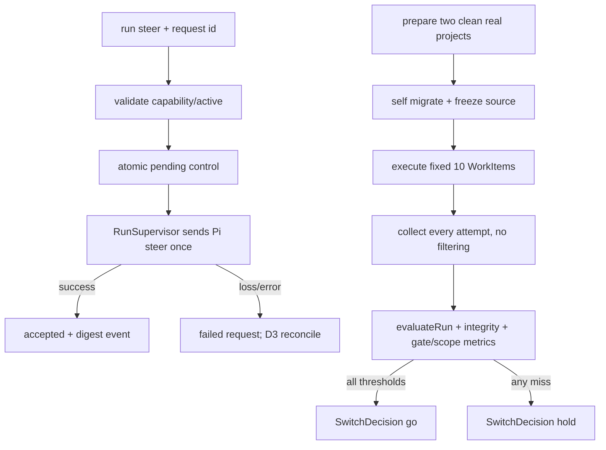

# hardening-dogfood-switchover design

## 0. 术语约定

| 术语 | 定义 | 防冲突结论 |
|---|---|---|
| SteeringRequest | 对 live executor 的一次持久化 steer 控制请求；以 request_id + message_sha256 幂等 | 不新增 RunEvent 变体；区别于普通 TaskContract 与 follow-up |
| Recovery Matrix | 对九个 RunPhase、caller/supervisor/executor 中断点和 WorkItem 后继动作的封闭表 | 复用 pi-rpc D11/D13；不承诺不安全的同 run 重新执行 |
| DogfoodCampaign | 两个真实项目快照、十个 WorkItem、其全部 run 与裁定产物组成的一次验收活动 | 不等同 evals seed；运行真实 executor 并允许真实 patch |
| DogfoodLedger | campaign 的机器 JSON 台账；逐 WorkItem/run 引用原始证据与 digest | 内部评测产物，不注册第 11 类公共 schema |
| CampaignEvaluation | evaluateCampaign 的唯一纯结果：audit/blockers + strict ledger/metrics + research/live evidence | ledger/metrics仅为其逐字投影；不直接写 SwitchDecision |
| LiveEvidenceReceipt | caller crash handoff / owner loss retry 的 raw 机读证明 | 只在 campaign raw；报告仅引用 digest |
| SwitchDecision | `go|hold` 的机械裁定；`go` 才允许本 feature acceptance 通过 | 报告不是实际切换；remote/deploy/cutover 仍非自动动作 |

TaskContract、ResultEnvelope、RunEvent、GateRecord、WorkItem、RunPhase 与 `evaluateRun` 沿用已审上游 design，不在本条复制第二套定义。

## 1. 决策与约束

**需求摘要**：收口 RoleKit v2：Pi steer 可用；中断、错误态、边界与审计语义封闭；以至少两个真实项目、至少十个真实 WorkItem 的完整台账证明 Envelope 100%、scope 违规 0、人工 gate 仅白名单；RoleKit 自身至少一个 roadmap item 完成自举；最后给出 CodeStable→RoleKit 切换决定。

**2026-07-29 owner 修订**：对齐 research-module 双 adapter——RK-06 live 主路径改为 `chatgpt-codex`（订阅 auth.json）；`openai-responses` 仍保留为第二实现/可选 live；二者互不静默降级；不得因缺 `OPENAI_API_KEY` 阻塞本条（缺订阅 auth 仍 blocking）。

**明确不做**：不实现 OS/network sandbox；不让 OpenAI Responses adapter 支持 steer；不在 active Pi owner 丢失后盲目重放同一 run；不做多机/remote executor；不把 dogfood fixture/no-op/重复文案任务计入十项；不自动删除或改写 canonical `.codestable`；不执行 remote push、publish、release、deploy 或 production cutover；不长期双写 `.codestable` 与 `.rolekit`。

**方案深度 pre-pass**：steer、恢复、审计与切换是长期正确性关键路径，使用真实 Pi RPC、真实进程故障与真实项目，不用 mock 替代主验收；mock 只覆盖确定性故障矩阵。active owner loss 选择“终态 failed/lost + 显式新 attempt”而非同 run reconnect，不是省事降级：Pi RPC 没有 exactly-once reconnect/工具调用 checkpoint，盲重放可能重复副作用；转正条件是未来 adapter 暴露可证明的 reconnect token、session ownership 与未决 tool-call checkpoint 后另立 feature。

**复杂度档位**：核心基础设施 + 切换门闩。所有公式、状态分支和失败出口机械化；Windows 为第一验收环境。

### 关键决策

- **D1 分层/唯一实现载体**：runner 新增独立 steering coordinator 与 recovery reconciler，RunManager 仍是唯一应用控制面，RunSupervisor 仍独占 live adapter/stdio；evals 扩 `auditRunIntegrity` / `evaluateCampaign`，且必须调用既有 `evaluateRun(runDir)` 无 meta 模式；CLI 只解析/格式化；dogfood harness 与 switch reporter 放 `dogfood/`/scripts，不把 campaign 语义塞进 core 或宿主 Skill。采用 **dogfood-as-implementation**：S1 canonical 白名单仅 D12 文档 + owner 已确认的 `dogfood/plan.yaml` 与 `dogfood/runtime/**` 配置/manifest，无 hardening code；RK-01..05 在 rolekit-self 产生全部 production code，campaign 完成后一次 promotion。RK-04 才交付 product `evaluateCampaign/audit:dogfood/check:switch`。RK-04 前由当前 CodeStable Goal driver 按本 design 的 T0 bootstrap protocol 直接调用既有 RoleKit CLI/git（不是项目脚本/第二实现），把每条命令/exit/digest 追加到 `<campaign-root>/.rolekit/dogfood/campaigns/<id>/bootstrap-log.jsonl`；RK-04 后 evaluator 必导入并验证该日志。不新增第11类公共 artifact schema（GateRecord 已是第10类）；仅按 D4/D12 给既有 WorkItem @1 gate_log 增一个条件可选 recovery_runs_count。
- **D2 Pi steer 协议**：PiRpcExecutor probe 从本条起声明 `steer`，spawn 后、首个 prompt 前显式发送 `set_steering_mode(one-at-a-time)`；该 RPC false/超时/坏响应即 ExecutorIncompatibleError，禁止发 prompt/start receipt，supervisor杀进程并按单一failed终态收口；steer 使用 Pi RPC `{"id":request_id,"type":"steer","message":text}`，只把 response `success:true` 定义为“accepted/queued”，不得宣称已执行。OpenAiResponsesExecutor 继续不声明 steer并返回 `unsupported_operation`；MockExecutor 提供可控实现。ExecutorAdapter 仍是五方法 seam，但 steer 签名由两参演进为 `steer(runId,message,control:{requestId:string})`；RunSupervisor 必须把 durable control 的同一 request_id 原样传入，Pi RPC `id`/Mock receipt 禁止另生第二套 id。
- **D2a CLI/应用面**：`rolekit run steer <run-id> --message <text> [--request-id <id>] [--json]`。RunManager 扩为 `steer(runId,text,options:{requestId?:string})`（caller 可省略、manager 生成后持久化；调用 adapter 时 control.requestId 必填）；先以 Unicode whitespace trim 得到 canonical message，空/含 NUL/UTF-8 >16 KiB 均拒绝，发送与 hash 都只用 canonical message；request id 匹配 `[A-Za-z0-9._-]{1,64}`。省略时取 `steer-` + `SHA-256(run_id + NUL + canonical_message)` 前 24 hex；相同 message 自动幂等，确需重复必须显式新 id。成功 JSON=`{id,state:<running|awaiting-gate|finished>,steer:{state:'accepted',request_id,no_op}}`，不覆盖 run state；等待 receipt 上限=max(0,min(30s, run剩余deadline))；若为0或caller等待到期，control仍保持durable pending且CLI只返回 `steer_wait_timeout`（exit1,retryable=true）；该码仅表示本次wait未见终态、同request id重调只续等且不重发，后续仍可accepted/failed，绝不写入SteeringControl.error_code。只有D3 barrier/supervisor真正终结pending时才可用 `steer_response_timeout`。业务失败 exit1，usage exit2。
- **D2b 持久化/竞态**：RunManager 在 per-run lock 下先查同 id：digest 不同=`steer_request_conflict`；accepted 即使 run 已终态也返回 no-op；pending 只等待同一 supervisor receipt，不二发；failed 原样返回且只有新 id 才可重试。仅无既有请求时再检查 adapter capability 与 `phase=active && transition_intent=null`/live owner，原子写 strict pending `control/steer/<request-id>.json={version:1,request_id,message,message_sha256,state:'pending',dispatch:'queued'|'inflight',requested_at}` 并唤醒 supervisor；terminal strict union 必须保留关联原像：accepted=`{version:1,request_id,message,message_sha256,state:'accepted',requested_at,resolved_at}`，failed=`{version:1,request_id,message,message_sha256,state:'failed',requested_at,resolved_at,error_code}`，三态未知字段拒绝，terminal 禁dispatch且写后不可变，全部timestamp ISO8601，error_code须在ErrorCatalog。supervisor 是唯一 sender，在 run lock 下先把 queued 原子置 inflight 后读取 request_id/message并调用 `adapter.steer(runId,message,{requestId})` 恰一次（Pi/Mock共用send计数fault断言），再把同文件原子替换为上述accepted/failed；pending 未 durable 前不可调用 adapter。三态均以RFC8785 UTF-8无BOM/尾换行原子写；golden逐字覆盖pending queued→inflight、accepted保留message、failed保留message+error及未知字段拒绝。Pi response `success:false`=`steer_rejected`且run继续；normal active下任何RPC throw/坏JSON/stdio异常=`executor_lost`，control终态failed后杀同identity process tree并令run failed/lost，绝不重发同id。success时在同一run lock生成唯一resolved_at，先以该值作digest event.ts幂等追加、再以同值把control置accepted，CLI 成功必须等两者齐；崩在两者间时 pending+inflight+accepted event 是唯一可恢复形，任一 steer/status/collect 只把 control 补 accepted，绝不重发；pending+inflight 且无 accepted event 只能由仍持 supervisor lifecycle lock 的原 sender收原 response，owner丢失则failed(executor_lost)，禁止新进程重发。新request在 `phase!==active || transition_intent!==null || !live_owner` 任一成立时统一零写返回 `run_not_steerable`（exit1），不得因phase仍active改用invalid_transition/internal；三条件各有CLI负例。owner/process 在 RPC response 前丢失时请求置 failed、run 按 D3 收口，不向新进程重放。plaintext 只在受 run 访问边界保护的 control 文件；events 仅追加 `message(role:'system', text:'[steer:accepted] request_id=... message_sha256=...')`，禁止正文泄漏。
- **D3 Recovery Matrix**：现有 preparing/prepared/starting/finalizing/cancelling/gate-pending/resuming/terminal 重入语义不变并补全 fault matrix。CLI/caller 崩溃但 supervisor+Pi 存活→CLI 仅以 `status|collect` 接管，其间可用应用面 `RunManager.waitUntilSettled`（非 `rolekit run wait` CLI 动词）等待终态；starting 尚无 started receipt→重建唯一 supervisor；active owner/Pi 丢失且D3a无已胜report/cancel intent→在 per-run lock 下先把有 accepted event 的 pending control 补 accepted、其余 pending 置 failed(`executor_lost`)，再尽力杀孤儿并恰一次写 `failed/reason=lost`、完整空 verification/Envelope/finished event；不得同 run 调 adapter.start。active user-cancel/timeout 按D3a winner表并先经barrier关闭pending steer；owner-loss走前述直接收口。恢复动作是 WorkItem 显式 retry 生成新 attempt；gate-pending/resuming 与 integration receipt checkpoint 继续原 run，禁止重复 verifier/integration。机器重启等价owner loss。owner-loss×deadline全序冻结：每次nonterminal reconcile在run lock下先读既有report/transition winner；已有report→finalize，已有cancel_intent→按其user-cancel|timeout继续；两者皆无时再以PID+OS start检查owner，owner已缺失则**禁止新建timeout intent**并固定lost（即使deadline已过），owner仍live且deadline已过才可按D3a CAS timeout。若timeout在owner仍live时已先commit、随后owner才死，则既有timeout继续；这两种顺序各自唯一。测试必须证明每 checkpoint 最多一个 executor、一个 result、一个 finished。active→finalizing|cancelling 使用 supervisor 独占 exit barrier；gate-pending 只可由已关闭steer的finalizing进入，故不得从active直跳。RunState 增条件字段 `transition_intent:null|{barrier_id:string,from:'active',to:'finalizing'|'cancelling',state:'pending'|'ready'|'committed',requested_at,steer_request_ids:string[],resolutions_sha256:string|null,target_commit_sha256:string|null,cancel_intent:null|{status:'cancelled'|'failed',reason:'user-cancel'|'timeout',requested_at:string},committed_at:string|null}`：barrier_id=`exit-`+SHA-256(run_id+NUL+requested_at)前24hex且重写时保持；非空时ids唯一并按request_id排序且精确快照创建barrier时全部pending；to=cancelling时cancel_intent必填且仅允许 `(cancelled,user-cancel)|(failed,timeout)`，to=finalizing时必须null；pending要求两sha与committed_at均null；ready的resolution array必须严格等于 `steer_request_ids.map(id=>{request_id:id,state:control.state,error_code:control.state==='accepted'?null:control.error_code,message_sha256:control.message_sha256})`，即同ids顺序、四键全有、accepted的error_code为JSON null；其 RFC8785 canonical 示例形态为 `[{"error_code":null,"message_sha256":"0000000000000000000000000000000000000000000000000000000000000000","request_id":"a","state":"accepted"}]`，resolutions_sha256=该UTF-8字节SHA-256且committed_at=null，且to=finalizing时target_commit_sha256=executor-report原始字节sha、to=cancelling时该字段=null；committed保留两digest并要求committed_at。barrier 在同一 run lock 先写 pending intent，此后拒绝新 steer；queued control置failed(run_not_steerable)。若to=cancelling，该CAS就是stop dispatch intent：RunSupervisor被唤醒后不得等待inflight steer，必须立即启动唯一允许与既有steer promise并发的abort-safe/idempotent `adapter.cancel`；Pi实现直接终止其owned child/process tree、Mock用可控latch，不发送第二条会被steer阻塞的RPC。cancel与原response竞速：stop确认前到达的原response仍按下文收口，adapter.cancel返回后还须以executor-control的PID+OS start time确认进程消失；promise未在下述barrier cap内settle或同identity进程仍存活，都立即process-tree kill+OS wait；同identity executor未停不得ready/phase commit，crash重入可据durable cancel intent幂等重试stop但不得spawn。stop确认时仍无response的inflight置failed(run_not_steerable)。两target的inflight都只允许仍持lifecycle lock的原sender处理原RPC一次，response handler每次取run lock并复核phase=active+同barrier_id的pending intent+control inflight；success先补唯一accepted event再置accepted；false/throw在cancelling winner下置failed(run_not_steerable)；非cancelling的Pi success:false置steer_rejected且run继续，任何RPC throw/坏JSON/stdio异常一律置executor_lost、按ProcessIdentity杀树并让run走D3 failed/lost；inflight已send，以上终态均禁止同id重发；barrier等inflight上限=max(0,min(30s,run剩余deadline))，到期置failed(steer_response_timeout)并继续既定exit winner，之后任何late response只丢弃且不写event；全ids terminal后，to=finalizing先提交immutable executor-report（已存在同digest则no-op）；to=cancelling还须上述same-identity executor stopped断言；满足各自条件才写ready；随后一次RunState原子替换改phase并置committed，to=cancelling同时只投影 `termination_intent={status:cancel_intent.status,reason:cancel_intent.reason}`；cancel_intent.requested_at仅留transition_intent，不扩上游termination schema。active executor report 路径必须先写pending intent再闭合controls；若故障遗留active+report+null intent，D11先合成finalizing pending intent再继续。transition_intent reconcile 永远优先于“见report补finalizing”，禁止report旁路barrier。超过run剩余deadline不得旁路进gate；仅按D3a在report未commit时以timeout争胜并沿同barrier闭合，report已commit则完成优先。重入真值表：active+pending时若accepted event已落只补control、不追加event；仍有live原sender则续收，否则把其余inflight置failed(executor_lost)，to=cancelling先幂等重试stop再进cancelling，to=finalizing且report已在则续ready/finalizing，to=finalizing且无report才清intent并按failed/lost收口；active+ready→只提交目标phase；目标phase+committed→核对所有ids terminal后no-op；非active+pending|ready、目标phase仍有pending或to/phase不符=`run_state_inconsistent`，不得猜修。离开该目标phase的下一次合法RunState原子迁移必须把旧committed intent清为null；非active绝不新写accepted event或补pending control为accepted。D11 fault矩阵必须逐点杀在 intent后/RPC前、RPC success后/event前、event后/control前、report commit后/ready前、ready后/phase前、phase commit后，并对cancelling另杀在CAS后/adapter.cancel前、cancel已发/stop确认前、stop确认后/ready前；均证明零重发、stop立即启动、目标phase零pending、每request至多一accepted。成功 JSON 的 awaiting-gate 仅可能是已accepted/no-op后状态漂移。
- **D3a exit winner/CAS 真值表**：严格沿用D13“termination intent与executor-report谁先durable commit谁胜”；`to=finalizing,state=pending` 只是barrier，不是report commit，termination commit定义为在run lock下首次写入 `to=cancelling,pending,cancel_intent`，report commit仍仅是immutable executor-report rename。termination胜者唯一操作序列固定为 `CAS cancelling/pending（phase仍active，禁止先写termination_intent）→同锁关闭queued并唤醒supervisor→立即并行adapter.cancel/必要时kill树与inflight原response收口→executor stopped + 全controls terminal→ready→一次RunState替换为phase=cancelling+投影 `termination_intent={status:cancel_intent.status,reason:cancel_intent.reason}`（不含requested_at）+committed`；旧D10“先phase=cancelling再cancel”废止。封闭分派：(1) active+null+无report：report回调先建finalizing pending；user-cancel/timeout可CAS建cancelling pending并获胜。(2) active+finalizing pending+无report：user-cancel/timeout可CAS**唯一一次**重写为cancelling pending，必须保留barrier_id/outer requested_at/steer ids与既有control状态、target sha保持null并写首个cancel_intent；report回调每次持run lock复核target，见重写即不得写report。(3) report回调只有在仍为finalizing pending且无cancel_intent时可原子写report；一旦report存在或finalizing ready，report已胜，user cancel=`run_not_cancellable`、deadline不得改写且完成优先。(4) cancelling pending|ready 后到的report只供adapter清理并丢弃payload，绝不提交executor-report；相同cancel_intent重入no-op/等待，不同intent（user-cancel vs timeout）由首个获胜且后者不得改写，显式caller得到run_not_cancellable。(5) active+null+已有report视为report先胜，合成finalizing pending；active+finalizing pending无report/无cancel且owner已缺失走lost并压过尚未commit的deadline，已有cancel_intent（含owner live时先commit的timeout）则继续cancel，已有report则继续finalize。(6) committed后按phase原规则，finalizing拒cancel、cancelling续同intent。所有CAS与report rename共用run lock；timeout只在report尚未commit时以 `(failed,timeout)` 参加上述同一竞态，禁止把ready/committed finalizing改成timeout。D11/D13 fault除D3六点外必须含 cancel-vs-report、timeout-vs-report、cancel-vs-timeout 三组双向barrier测试，并补 `owner dead+deadline past+无winner→lost` 与 `owner live时timeout先commit→随后owner dead→timeout`，断言唯一winner/result/finished及late callback零写。
- **D4 WorkItem 恢复闭环**：补 `workitem drop <id>` 与 `workitem resume <id> --to <planned|designing|executing>`。drop 只承载 4.9 已合法的 planned/designing/awaiting-gate/blocked→dropped；awaiting-gate drop 等价拒绝当前 pending，追加 `gate_log{trigger:gate.trigger,action:'confirm',decision:'rejected',ts}` 并清 gate；approve/reject 同样固定 action=confirm 并沿用 pending gate.trigger。resume 只承载 blocked→planned|designing|executing 与 verifying→executing，其他均 `invalid_transition`；成功时追加 `gate_log{trigger:'recovery-cycle',action:'observe',decision:'auto-pass',ts,recovery_runs_count:item.runs.length}` 作为 durable marker（不是 PolicyEngine hit/人工 gate）。WorkItem @1 的 gate_log 增加条件可选 `recovery_runs_count: nonnegative integer`：仅上述三元组时必填，其他条目禁止；runs 仍只追加。取最新 recovery marker；若 `WI.runs.length < recovery_runs_count` 则 `invalid_workitem`，相等时 marker_effective，变大即由 WI link 消费。prepare 后 link 前 runs 长度不变，故 unlinked reservation 绝不消费，marker 判定不查 reservation/started/finished/mtime。仅 `status∈{executing,verifying}` 且 marker_effective 时，`workitem done` 必零写返回 `recovery_in_progress`，禁止既有 completed Envelope 自动过桥吞掉重跑意图；本 feature 不提供“无新 run 仅重验收”旁路。新 run 原子 append 进 WI.runs 后由 runs.length 增量消费；prepare/link crash 时 marker 仍有效并可重入，此后 done 恢复既有 D4 语义。所有 `status=blocked` 的 WorkItem 业务出口统一给出 `next_action='rolekit workitem resume <WI-id> --to <target>'`，不再建议新建替身 WI。
- **D4a 问题/重做/迁移自举**：唯一 question 触发点是 `workitem start`（或未来显式 collect-and-adopt 的 WI 命令）里的 `RunManager.collect → adoptRunResult` CAS 分支；裸 `rolekit run collect` 只读 run、绝不写 WI：读取该 run 冻结 policy，构造唯一 hit `trigger:'ambiguous-requirement'` 调 core PolicyEngine，并在一次 WorkItem 原子替换中执行：confirm→`status=awaiting-gate,gate={trigger:'ambiguous-requirement',origin:'executing'}` 且 pending 期不写 decision log；observe→executing、gate=null并追加 `{trigger:'ambiguous-requirement',action:'observe',decision:'auto-pass',ts}`；ignore→executing、gate=null且不写 log；block→blocked、gate=null并追加 `{trigger:'ambiguous-requirement',action:'block',decision:'blocked',ts}`；后续 approve/reject 追加 `{trigger:'ambiguous-requirement',action:'confirm',decision:'approved'|'rejected',ts}`。`workitem_awaiting_gate.next_action='rolekit gate list <WI-id>'`；`run_question.next_action='rolekit workitem start <WI-id> --task <revised-task>'`；`run_blocked.next_action='rolekit workitem resume <WI-id> --to <target>'`；CLI 分别返回 `workitem_awaiting_gate|run_blocked|run_question` 与上述 next_action，不再先写 executing 后二次升级。所有非 blocked 路径之后先只解析/校验候选 TaskContract，定义 `task_digest=SHA-256(UTF8(RFC8785(完整 TaskContract 解析对象)))`；比较基线是 latest linked run 内不可变 `task.json` 的同算法 digest，禁止用含 profile/policy/adapter 的 runner input_digest。真值表：缺 task→`retry_task_required`；id≠baseline task.id→`retry_task_mismatch`；id相同且 digest相同→`question_unanswered`（在 loadRunInput/prepare/WI 写前零副作用）；id相同且 digest变化→再 loadRunInput 并 `prepare(retry=true)` 新 attempt。旧 result.unresolved + policy/gate_log + 新 task 是回答审计。failed/cancelled 保持既有同 task.id retry。
  - **question adopt CAS 闭包与出口顺序**：同 run 首次采纳按上表原子写并立即返回该次结果：confirm=`workitem_awaiting_gate`、block=`run_blocked`、observe|ignore=`run_question`；本次启动时使用的原 task 不得被当作回答。revision 已变化时，observe|ignore 证据闭包=`executing`，confirm=`awaiting-gate|executing|blocked`（pending、approve恢复、reject后继），block=`blocked`；命中只返回 `no_op:true` 而不回退，然后按当前状态继续：`awaiting-gate`→`workitem_awaiting_gate` 且不进 retry，`blocked`→`run_blocked` 且不进 retry，`executing + latest envelope=question`→**不得因 no-op 退出**，进入四格回答表。question 从“失败类仍 executing”一刀切中移除；`done` 不在闭包，必须有后继 completed run。
  - **recovery-cycle precedence**：existing-run 的 result 短路分派前，若 D4 marker 有效，则绕过 blocked deferred-adopt/completed→verifying；若当前 status=designing，既有 D5 design-artifact gate 仍先执行且未获批不得建 run；随后按本次 signals 重新 selectLane/应用显式 override。强制 `--task`，且 task.id 不得出现在该 WI 任一历史 run 的 task.json；以新 task `prepare(retry=false)` 建该 task 的 attempt1，再按原子写前的 runs 长度关联：`runs.length===0` 用 `attachRun(mode='first')`，`runs.length>0` 用 `attachRun(mode='retry')`；hardening 后 `attachRun(first)` 合同冻结为：planned|designing 先合法 transition→executing 再 append；`status=executing && runs=[]` 只 append 首 run/update、绝不做 executing→executing；其余拒绝。`attachRun(retry)` 仅允许 `executing && runs.length>0` append。两者均与 runner 的 `prepare(retry=false)`（新 task attempt-chain）解耦且不做 self-loop。缺 task=`recovery_task_required`、历史 id=`recovery_task_reused`。planned/designing 在 link 原子写中先合法转 executing 再 attach，executing 直接 attach；marker 后已有关联 run即回普通分派。
  - **migrated-unclaimed precedence**：`status=executing && lane=null && runs=[]` 在 existing-run 分派前视作唯一未 claim 自举态，走首次 selectLane→load→prepare(retry=false)→link/start；成功 link 后 lane 必非 null且不能再命中。`lane=direct,runs=[]` 仍表示宿主正在执行并拒绝 start。上述两优先分支是对 workitem D2(a)/D2(d)0 的显式替换，不靠实现猜测。
- **D5 错误面/边界**：建立单一 ErrorCatalog（code→exit 1/2、retryable、公开 detail policy），所有 RolekitError 必须注册；未知异常统一 `internal_error` + incident id，stdout JSON 不含 stack、绝对路径、env、token或原始 provider body。覆盖空/超长输入、path traversal、symlink/junction escape、坏 JSON/JSONL、截断 state、锁竞争/stale、重复 request/event、PID reuse、Windows rename/process-tree。既有稳定码不得改名；新增 `run_not_steerable|executor_lost|steer_request_conflict|steer_message_invalid|steer_rejected|steer_wait_timeout|steer_response_timeout|workitem_awaiting_gate|question_unanswered|recovery_task_required|recovery_task_reused|recovery_in_progress|dogfood_plan_invalid|dogfood_source_invalid|dogfood_dependency_pending|dogfood_audit_failed|switch_hold`。错误分工冻结：failed/cancelled/question 同 cycle 缺 task/错 id 仍用 `retry_task_required|retry_task_mismatch`（question 同 id 未改再用 question_unanswered）；D4 marker 新 cycle 缺 task/历史 id 才用 recovery_*；SteeringControl.failed仅允许 `run_not_steerable|executor_lost|steer_rejected|steer_response_timeout`，其中executor_lost注册exit1/retryable=true/无公开detail且不等同ResultEnvelope.reason='lost'；campaign evaluator只返结构结果，`dogfood_audit_failed|switch_hold` 仅由 D6e 对应 CLI 映射。
- **D5a run 审计**：`auditRunIntegrity(runDir)` 只读检查：(1) 五核心产物与已有 snapshots/control 文件可解析、schema/语义有效；(2) run/task/attempt/status 一致；(3) result 与 terminal state 相等、恰一 finished，started 至多一条且有 started receipt 时恰一条；(4) verification events 与 verification.results 一一对应；(5) gates records/event/pending resolution 一致；(6) candidate/patch/integration receipt 顺序与 completed 语义一致；(7) evidence 是 run 内相对 regular file、存在且不经 symlink escape；(8) steering strict union字段/dispatch/terminal原像合法、非active/terminal无pending，accepted有且仅有一条同resolved_at digest event、failed无accepted event，transition_intent/barrier id/D3a winner与phase/sorted resolutions digest一致；(9) JSONL 全行合法、事件 ts 非递减；(10) `result.scope_violations` 与 `verification.json.scope_violations` 数组精确相等（只查 D13 组装一致性，不重算 Envelope pass）。审计只报告 redacted path/code，不“修复”原始证据。
- **D6 campaign topology/公式**：canonical `dogfood/plan.yaml` 是 owner 已确认且含唯一 campaign_id 的计划；启动时原样复制并冻结到独立、remote-free 的 `<campaign-root>/plan.yaml`，其中 project map 固定为 `rolekit-self: projects/rolekit-self`、`ctxline: projects/ctxline`（POSIX 相对路径，禁止 absolute/`..`/symlink）。两个 git snapshot 分别位于 `<campaign-root>/projects/<key>/`；raw 控制/台账位于 `<campaign-root>/.rolekit/dogfood/campaigns/<id>/`，不嵌入任一被测 project；可提交摘要最终复制到 canonical `dogfood/reports/<id>/`。唯一入口=`evaluateCampaign({campaignRoot,campaignId,plan})`，且参数 campaignId 必须等于 plan.campaign_id 与 raw 目录名；absolute campaignRoot 只作进程参数、不落报告；ledger 的 run ref 固定 `projects/<key>/.rolekit/runs/<run-id>` 相对 campaign-root。运行全集固定为“十个WorkItem.run_refs”与两project自campaign.started_at起run/reservation index发现的run_ref之并集；每个run_ref在ledger恰一行，故被多WI引用、orphan、目录缺失/损坏也不得删。contract/envelope/integrity三率的唯一分母均为 `ledger.runs.length`；仅现存且可解析的terminal run调用既有 `evaluateRun(runDir)`/`auditRunIntegrity(runDir)`，任一false或null都不计passed且产生blocker。最终go另要求orphan/duplicate=0、三率1000000ppm、`sum(所有非null scope_violations_count)=0`且无scope null blocker。这里明确选择严格口径 B：live campaign 禁止任何 scope-failed attempt；scope detector 的拦截能力只由 campaign 外负例/e2e 证明。若 campaign 内出现一次非空 `scope_violations`，该 campaign 永久 `hold`；不得删 run 或另开 campaign 抹除，只有 owner 批准新的 roadmap/design 才能改变该结论。每 WI 至少一 run且 done；plan 固定 `lane:delegated`，driver 必带 `--lane delegated`，ledger 见 lane!=delegated 即 fail。evaluator 以 campaign.started_at + 两 project run index 对账：时间窗内每个 runDir/reservation 必须恰被一个计划 WI.runs 引用；orphan、重复/未知 run 均 fail。
- **D6a gate/反凑数门闩**：人工 gate 定义为 run GateRecord 或 WorkItem gate_log 中 action=confirm 且发生 human resolution；trigger 只允许 `new-dependency|migration|public-api-change|delete|ambiguous-requirement|design-artifact|final-acceptance`，其他 confirm 即 fail；与 ADR003 四类逐项对应为：`new-dependency|migration|public-api-change|delete`（类1，不可逆/越权；同类 scope-violation 固定 block 故不在七个 confirm trigger 中）、`ambiguous-requirement`（类2）、`design-artifact`（类3）、`final-acceptance`（类4）；其中 `migration` 只有冻结 policy 显式从默认 block 改为 confirm 时才可能计入，未改仍按 block；observe/ignore（含 recovery-cycle）不计人工。plan 固定 `patch_class`：RK-01..05/CTX-01=`code`、CTX-02=`test`（共7项），RK-06=`research`、RK-07/CTX-03=`review`；`code` 必有非 docs/test 的 source或script diff且相关测试通过，`test` 必有 test/smoke diff；至少6个 code|test 且 research|review|docs最多4个，至少使用 implementer/reviewer/researcher 三种 profile，objective digest 全唯一；fixture/no-op/仅改时间戳/把一个任务机械拆十份均 `dogfood_plan_invalid`。plan 的 `steer_assertions` **精确两条**且顺序固定 RK-03、RK-05：RK-03=`{item_key:'RK-03',nonce_sha256,proves_delivery:false}`，RK-05=`{item_key:'RK-05',nonce_sha256,proves_delivery:true,relative_file:'dogfood/steer-evidence/<campaign_id>/rk-05.txt',acceptance_argv:['node','dogfood/scripts/check-steer-delivery.mjs',relative_file,nonce_sha256]}`。plan只含hash；owner冻结plan时同时生成不入库的 strict RFC8785 UTF-8无BOM/尾换行 `SteerNonceSource={version:1,campaign_id,nonces:{'RK-03':string,'RK-05':string}}`，两nonce各匹配 `[A-Za-z0-9_-]{16,64}` 且不同，hash须逐项等于plan。S1以必填 `nonceSourcePath` 进程参数读取；resolved source须为不在canonical/campaign/projects内的非symlink regular file，先校验再create-exclusive复制为raw `steer-nonces.json`，其路径/原文不进日志/项目/prompt/提交报告；它不是凭据但按raw控制证据保护。controller 按 D9 唯一消息算法发送；steer-evidence 是 campaign-only diff，不计 patch_class 且 D7a aggregate promotion 必排除。
- **D6b DogfoodPlan 机读契约**：`version:1`、`campaign_id` 匹配 `[a-z0-9][a-z0-9-]{2,63}`；`projects` 必须精确为 D6 两个 key/path；`items` 必须精确含 RK-01..07、CTX-01..03 且每项为 `{key,project,profile,kind,patch_class,lane:'delegated',objective,task_ref,depends_on,workitem}`，`task_ref` 是 raw campaign dir 内 POSIX 相对 JSON，objective 非空且 digest 唯一。`profile∈{implementer,reviewer,researcher,qa}`、`kind∈{implementation,fix,research,review}`；project/profile/kind/patch_class 必须与 D8 表一致；每个 task_ref 的完整 TaskContract 也预校验：RK-06 固定 `kind=research,role=researcher,executor=chatgpt-codex,scope.writable=[],acceptance.commands=[{run:'git diff --quiet --exit-code -- .',expect_exit:0}]`（live 主路径；`openai-responses` 仍为保留第二实现，不得静默互降）；该 worktree-clean 命令满足既有 TaskContract 至少一条规则但不冒充四条产物断言，并复用 research 特化模板，其余九项固定 `executor=pi`。依赖固定：RK-01=[]；RK-02=[RK-01]；RK-03=[RK-02]；RK-04=[RK-03]；RK-05=[RK-04]；RK-06=[RK-05]；CTX-01=[RK-06]；CTX-02=[CTX-01]；CTX-03=[CTX-01,CTX-02]；RK-07=[其余九项]。顶层 `live_assertions` 必须精确为 `{caller_crash:{item_key:'RK-01'},owner_loss:{item_key:'RK-04',recovery_task_ref:'tasks/RK-04-owner-loss-recovery.json',deadline_grace_ms:1000,kill_margin_ms:60000}}`，在run创建前锁定场景、禁止事后挑样；两项都必须是Pi run。RK-04 item.task_ref 是loss variant，固定 `execution.timeout_minutes=3`；recovery_task_ref是完整TaskContract、与loss variant同task.id/executor=pi；loss固定timeout=3且constraints首项逐字为 `Before any write, run node -e "setTimeout(()=>{},300000)" and wait for it to return.`；recovery固定timeout=30并删除该首项，除此两处外字段逐字相同，故digest变化。controller必须用loss variant建attempt1，先等events出现唯一参数匹配该Node wait的tool_call并冻结event-line sha；随后仅终止外层workitem-start CandidateInvocation的CLI ProcessIdentity并OS-wait，确认supervisor与Pi仍live、lost start result已以terminated落盘，消除后台caller自行reconcile；仅当此后pre捕获及supervisor OS-wait终止都能在 `deadline_at-kill_margin_ms` 前完成且仍无report/transition winner时才执行D9 live序列，否则不杀owner、让该attempt按既有timeout正常收口，并create-exclusive写raw `live-evidence/owner-loss/window-missed.json={version:1,item_key:'RK-04',run_ref,reason:'window_missed',deadline_at,observed_at,state_sha256,start_intent_sha256,start_result_sha256}`，永久产 `owner_loss_window_missed` live-evidence blocker，禁止事后另挑attempt；成功杀owner后再等待deadline-past，lost后用recovery variant `prepare(retry=true)` 建同task链attempt2+正确predecessor完成RK-04；该额外ref也在WI/run零写前strict校验。除 RK-07 外 `workitem={mode:'create'}`；create 前按封闭映射生成 `workitem create`：Task kind `implementation→feature`、`fix→issue`、`research→research`、`review→feature`，title=`[<campaign_id>/<key>] ` + Unicode trim 后 objective，WorkItem.depends_on=已解析 plan 依赖中**同 project** 的 WI ids（跨 project 边只由 campaign controller 门控，绝不写入 project-local WorkItem）；不得另猜 kind/title。create 前 append resolution intent；重入先在对应 project 扫描 started_at 后 exact kind/title/depends_on，零项才 create、一项采纳、多项 `dogfood_audit_failed`，再 append receipt，避免 create/记录间崩溃复制 WI。RK-07 必须 `{mode:'migrated-roadmap',roadmap_slug:'rolekit-v2',item_slug:'hardening-dogfood-switchover'}`。`steer_assertions` 必须逐字段等于D6a的RK-03/RK-05 strict union（未知字段拒绝），校验plan仅含hash、nonceSource strict/两preimage/hash、固定relative_file展开campaign_id、固定argv与对应TaskContract.scope.writable精确包含该evidence文件；RK-04任务必须交付checker脚本，故RK-05执行前已可用。启动验证顺序固定为：严格 YAML/未知字段→version/campaign_id/project path containment→十 key/枚举/表映射/objective→DAG/task_ref→workitem mode/kind-title map→live assertions→steer assertions+nonce source（复制raw前只读校验）；任一失败在 WI/run 零写前报 `dogfood_plan_invalid`。随后 create 项创建 WI；RK-07 只从 self-migrate strict `mapping.json.entries` 唯一解析 D12 冻结的 `category:'roadmap-item' && source_locator:{roadmap_slug:'rolekit-v2',item_slug:'hardening-dogfood-switchover'}` 条目；无论 materialize/merge 均须有非空 `target_id`。冻结 `mapping_file_sha256=SHA-256(mapping.json原始字节)` 与 `mapping_entry_sha256=SHA-256(UTF8(RFC8785({category,source_key,source_locator,action,target_key:target_key??null,merge_into:merge_into??null})))`（刻意不含 apply 后分配的 target_id）；零/多项、target 不存在或任一 digest 不匹配均 fail，禁止 create 替身。resolution intent/receipt 只追加到 raw `resolution-log.jsonl`；全部解析后原子冻结 `resolved-plan.json={plan_sha256,items:[{key,project,workitem_id,mapping_source_key?,mapping_file_sha256?,mapping_entry_sha256?}]}`；RK-04 与终局 evaluator 必核对 plan/resolved-plan/WorkItem 双向一致。
- **D6c 永久 hold 机读闩**：campaign 初始化以 create-exclusive 写 raw `campaign-started.json={version:1,campaign_id,plan_sha256,steer_nonces_sha256,started_at,source_manifest_digests:{rolekit_source,ctxline_source,self_migration_target,self_runtime_overlay,ctxline_runtime_overlay}}`；同 id 已存在不得重置。每个 terminal run 在 WI adopt/done 前由当前 controller 校验 immutable result；首次见非空 scope_violations 时 create-exclusive 写 `scope-hold.json={version:1,campaign_id,reason:'scope_violation',first_run_ref,result_sha256,verification_sha256,detected_at}` 并记入 bootstrap/product audit log，后续 API 禁止删除/覆盖。T0 与 RK-04 后 harness 同规则。`evaluateCampaign` 既重算 resolved-plan 全部 run，也读取 started/hold：缺 started、plan/steer-nonces/source digest 不符、引用 run 缺失、发现 scope 但 hold 缺失均追加 audit blocker；hold 存在或重算出 scope 时追加 scope blocker；稳定码只按 D6e 由两个 CLI 映射。raw 的 identity/hold/run/seal evidence 为 write-once，演进 ledger 用带 digest 的新 revision，不覆写原证据；改 campaign_id/plan 只能经 owner 的 design 实质复审，不能自动 supersede hold。
- **D6d research 后置门闩**：全部 attempts 仍进入 D6 分母；另对 plan `kind=research`（本计划仅 RK-06）取 WorkItem 最终采纳的 completed run，必须在 `<campaign-root>/projects/rolekit-self` cwd 以平台安全 argv（不拼接用户文本）调用既有 `npm run check:research -- <resolved-runDir>`；每次把脱敏 stdout/stderr 与 `{key,run_ref,result_sha256,exit,stdout_sha256,stderr_sha256,pass}` 原子写 raw `research-checks/RK-06/`（同输入同digest no-op，异digest fail），报告固定记 `research_checks:[{key:'RK-06',run_ref:string|null,record_sha256:string|null,pass:boolean,reason:null|'no_completed_run'|'command_missing'|'credential_missing'|'command_failed'|'record_invalid'}]`（本计划 RK-06 live 下 credential_missing 仅指订阅 auth：ROLEKIT_CHATGPT_AUTH_FILE/~/.codex/auth.json 缺失；仅缺 OPENAI_API_KEY 不得置该 reason、不得阻塞 admission/SwitchDecision），pass=true时reason必须null且两ref/digest非null；失败按固定优先序取首个reason并保留可用ref/digest，仅实际调用exit0可pass=true。不得把 `verification.passed` 或 Envelope 完整误当四断言；不复制 citation/activity 公式。非 completed、缺命令/凭据或 exit!=0 时，`evaluateCampaign` 仍产出带 `research_checks.pass=false` 的审计报告，`audit:dogfood` 对外 exit1/code=`dogfood_audit_failed`；`check:switch` 消费/复算该结果后写 hold blocker（含 research key/run_ref 与已有 record digest），对外只返回 exit1/code=`switch_hold`，不得泄漏成 audit code。原始命令输出留 raw，提交报告只存相对 run_ref/digest。RK-06 在 RK-04 后执行，故 product harness 与最终 `evaluateCampaign/check:switch` 均强制复算该门闩。
- **D6e evaluator/CLI 出口真值表**：`evaluateCampaign` 对合法函数参数永不为 campaign domain failure 抛 `dogfood_audit_failed|switch_hold`，只返回 strict 内部 `CampaignEvaluation={version:1,stage:'final',audit:{status:'pass'|'fail',blockers:CampaignBlocker[]},ledger:DogfoodLedger,metrics:DogfoodMetrics,research_checks:ResearchCheck[],live_evidence:{caller_crash:{receipt_sha256:string|null,pass:boolean},owner_loss:{receipt_sha256:string|null,pass:boolean},steer:{assertions:[{item_key:'RK-03'|'RK-05',nonce_sha256:string,run_ref:string|null,pass:boolean}],pass:boolean}}}`。`CampaignBlocker={category:'identity'|'plan'|'source'|'ledger'|'orphan'|'integrity'|'scope'|'research'|'gate'|'metric'|'dependency'|'live-evidence'|'migration'|'review'|'promotion'|'docs',code:string(pattern='[a-z0-9]+(?:_[a-z0-9]+)*'),key:'RK-01'|'RK-02'|'RK-03'|'RK-04'|'RK-05'|'RK-06'|'RK-07'|'CTX-01'|'CTX-02'|'CTX-03'|null,run_ref:string|null,evidence_sha256:string(pattern='[0-9a-f]{64}')|null}`，未知字段/类别拒绝，code为稳定snake_case且不带自由detail，run_ref非null时须满足D6相对格式；identity/plan/source、ledger/orphan/integrity、scope、research、gate/metric/dependency/live-evidence 每项都必须 pass 或产生 blocker，因上游 blocker 无法检查则产生 `*_not_evaluated` blocker，禁止跳过。`audit.status=pass` 当且仅当所有 D6/D6a/D6c/D6d/D6f/D7a/D7c/D9 及 D9a audit子集的campaign审计条件通过。`check:switch` 只调用一次该 evaluator，再把 audit blockers 与 migration/review/promotion/docs 等 D10 独立证据 blockers 合并为最终 SwitchDecision；go 当且仅当 audit pass 且 D10 其余条件全过。CampaignEvaluation.audit.blockers 与最终 SwitchDecision.blockers 都按上述 category 声明顺序再按 `(key??'',run_ref??'',code,evidence_sha256??'')` 排序，同五元组只能一条（evaluator确定性去重），组合失败全部保留、不用优先码遮蔽。CLI 唯一映射：`audit:dogfood` 的 audit pass→exit0，否则 exit1/code=`dogfood_audit_failed`；`check:switch` 的最终 SwitchDecision go→exit0，否则仍写 hold JSON/MD并 exit1/code=`switch_hold`，无论 blocker 是缺 started、scope-hold、research fail 或其组合。只有 argv/ID/path 用法错误走 exit2 `usage_error`，未知异常走 D5 `internal_error`；bootstrap 的 plan/source/dependency 稳定码不属于 evaluator。负例矩阵至少含identity缺失、candidate generation/argv/ack不匹配、bootstrap_log_incomplete、run tmp使seal helper null、ledger损坏、仅scope、仅research、scope+research、identity+research-not-evaluated，以及 `audit.status=pass + promotion_digest_mismatch`；最后一例必须 audit:dogfood exit0、check:switch exit1/switch_hold且仅增加promotion blocker，其余各例断言两 CLI 各自唯一外码与完整 blocker 集。
- **D6f ledger/metrics canonical schema**：RK-04 内部唯一 `buildCampaignArtifacts(input,stage:'pre-review'|'final')` 返回与D6e同字段、仅stage discriminator不同的 strict CampaignSnapshot；public `evaluateCampaign(input)` 固定调用stage=final并返回其final subtype CampaignEvaluation，D9a只调用pre-review，同公式禁止另算。所有对象 strict/未知字段拒绝；`sha` 均指 lowercase 64hex。`DogfoodLedger={version:1,campaign_id,stage:'pre-review'|'final',plan_sha256:sha,resolved_plan_sha256:sha|null,campaign_started_sha256:sha|null,campaign_sealed_sha256:sha|null,steer_nonces_sha256:sha|null,workitems:LedgerWorkItem[],runs:LedgerRun[],gates:LedgerGate[],research_checks:ResearchCheck[],live_evidence:{caller_crash:{receipt_sha256:sha|null,pass:boolean},owner_loss:{receipt_sha256:sha|null,pass:boolean},steer:{assertions:[{item_key:'RK-03'|'RK-05',nonce_sha256:sha,run_ref:string|null,pass:boolean}],pass:boolean}}}`。`LedgerWorkItem={key:'RK-01'|'RK-02'|'RK-03'|'RK-04'|'RK-05'|'RK-06'|'RK-07'|'CTX-01'|'CTX-02'|'CTX-03',project:'rolekit-self'|'ctxline',workitem_id:string|null,status:null|'planned'|'designing'|'executing'|'verifying'|'awaiting-gate'|'blocked'|'done'|'dropped',lane:null|'delegated',profile:'implementer'|'reviewer'|'researcher'|'qa',patch_class:'code'|'test'|'research'|'review',workitem_sha256:sha|null,evidence_commit_sha256:sha|null,patch_sha256:sha|null,patch_qualifies:boolean|null,run_refs:string[]}`；pre-review精确九项（排除RK-07）、campaign_sealed_sha256=null且不产生seal blocker，candidate只要求g00..g06及其invocations，且只审这九项/D9a前置、不产生g07/RK-07缺失或promotion/docs blocker；final精确十项并执行D6e全部audit子集；audit pass要求campaign_sealed_sha256非null及g00..g07，诊断性final允许null/缺项但必须给seal/candidate blocker，均按D8表序。`LedgerRun={run_ref:string,key:LedgerWorkItem.key|null,attempt:integer|null,predecessor_run_ref:string|null,reservation_sha256:sha|null,candidate_build_receipt_sha256:sha|null,candidate_start_intent_sha256:sha|null,candidate_start_result_sha256:sha|null,run_content_sha256:sha|null,task_sha256:sha|null,result_sha256:sha|null,verification_sha256:sha|null,events_sha256:sha|null,status:null|'completed'|'blocked'|'question'|'failed'|'cancelled',contract_pass:boolean|null,envelope_pass:boolean|null,integrity_pass:boolean|null,scope_violations_count:integer|null}`；attempt非null时为>=1 safe integer、scope count非null时为非负safe integer，workitem.run_refs内唯一且均满足D6相对格式。candidate三sha从该run唯一start invocation pair与g00..g07 receipt重算；世代按intent.item_key核对，LedgerRun.key非null时还必须与intent相等；orphan/multi-ref仍保留intent key作candidate验证但ledger key按规则为null，只有pair/receipt损坏时三sha为null并产生candidate blocker。唯一pure helper `scanRunContent(runDir):{sha256:sha|null,errors:string[]}` 同时供ledger与seal调用：先要求目录存在、RunState terminal且result存在，再递归lstat；仅跳过根级 `.lock|.supervisor.lock`，遇任意symlink/junction/非regular、不可读项或 `POSIX-basename.endsWith('.tmp')` 立即记录稳定error并返回sha=null（禁止“先hash再忽略”）。无error时对其余全部regular files构造 `[{path,sha256}]`，path为runDir内POSIX相对路径、按UTF-8 byte升序，sha为原始字节hash，返回 `SHA-256(UTF8(RFC8785(manifest)))`；故task/prompt/events/result/verification/run-state/snapshots/gates/全部run内artifacts与control/steer均覆盖。引用缺目录/损坏同样返回null行+blocker。seal伪码固定为 `for (r of finalRunOrder) { s=scanRunContent(resolve(r.run_ref)); if (s.sha256===null||s.errors.length) refuseSeal; sealRunMap[r.run_ref]=s.sha256; }`，seal inputs写该map；seal后final ledger再调用同helper并逐项要求等于sealed map，不得另写第二套manifest公式。每个相对run_ref恰一行：单一WI引用者按item表序+attempt升序+run_ref排序；orphan或被多WI引用者置key=null并排最后按run_ref，`duplicate_refs` 计超出首个的引用次数；引用但目录缺失仍留null行。缺失/损坏字段用null且必须有相应blocker，禁止从数组删掉失败行。`LedgerGate={key:LedgerWorkItem.key,run_ref:string|null,source:'run'|'workitem',trigger:string,decision:'pending'|'approved'|'rejected',record_sha256:sha}` 按item序、source、run_ref空串、record sha排序，每个confirm gate实例恰一行（pending也保留）；human_confirm只计approved|rejected，pending计pending，invalid_confirm计trigger不在D6a白名单；`ResearchCheck` 沿用D6d strict字段并按key排序；live_evidence.steer.assertions精确两项并按RK-03/RK-05，nonce hash等于plan，失败时run_ref=null，单项pass仅D9全部对应谓词过，外层pass iff两项pass且run_ref非空互异。
- **D6f metrics/写盘与哈希**：`DogfoodMetrics={version:1,campaign_id,stage:'pre-review'|'final',workitems:{expected:integer,done:integer,delegated:integer},runs:{total:integer,orphan:integer,duplicate_refs:integer},contract:{passed:integer,total:integer,rate_ppm:integer},envelope:{passed:integer,total:integer,rate_ppm:integer},integrity:{passed:integer,total:integer,rate_ppm:integer},scope:{violations:integer,runs_with_violations:integer},gates:{human_confirm:integer,invalid_confirm:integer,pending:integer},patch_classes:{code:integer,test:integer,research:integer,review:integer,qualifying_code_test:integer},profiles:string[],research:{passed:integer,total:integer},live_evidence:{passed:integer,total:3}}`；全数为非负safe integer且只以同一ledger为输入。定义 `refCount(r)=sum(w.run_refs中严格等于r.run_ref的次数)`；逐字段纯函数固定为：`workitems.expected=ledger.workitems.length`、`done=count(w.status==='done')`、`delegated=count(w.lane==='delegated')`；`runs.total=ledger.runs.length`、`orphan=count(refCount(r)===0)`、`duplicate_refs=sum(max(0,refCount(r)-1))`。contract/envelope/integrity的total均=`runs.total`，passed按contract/envelope/integrity顺序分别=`[count(r.contract_pass===true),count(r.envelope_pass===true),count(r.integrity_pass===true)]`，false/null均不计且不缩分母，`rate_ppm=(total===0?0:floor(passed*1000000/total))`。`scope.violations=sum(r.scope_violations_count??0)`、`runs_with_violations=count((r.scope_violations_count??0)>0)`，但任一null另有not-evaluated blocker，不能靠??0放行。`gates.human_confirm=count(decision==='approved'||decision==='rejected')`、`pending=count(decision==='pending')`、`invalid_confirm=count(trigger不在D6a白名单)`；三者都遍历全部LedgerGate，故invalid且已resolution的行可同时计human_confirm。`patch_classes.<c>=count(w.patch_class===c)`，`qualifying_code_test=count((w.patch_class==='code'||w.patch_class==='test')&&w.patch_qualifies===true)`，status/null不改变分类分母；profiles为workitems实际profile去重后按 `implementer,qa,reviewer,researcher` 顺序。`research.total=ledger.research_checks.length`、`passed=count(pass===true)`；`live_evidence.total=3`、`passed=Number(caller_crash.pass)+Number(owner_loss.pass)+Number(steer.pass)`，steer外层合取只计1。final stage因schema精确十项必须 `expected=done=delegated=10`、patch classes精确 `code=6,test=1,research=1,review=2`、orphan=duplicate=0、三率=1000000、scope两值0且无null blocker、invalid/pending=0、qualifying_code_test>=6、research=1/1、live=3/3；pre-review对应九项的patch counts为 `code=6,test=1,research=1,review=1`。
  序列化唯一为 RFC8785 UTF-8、无BOM、无尾换行。raw revision 以 create-exclusive `evaluation-{stage}-<sha>.json|ledger-{stage}-<sha>.json|metrics-{stage}-<sha>.json` 保存；seal后固定 publish staging `<raw>/publish/{campaign-evaluation.json,ledger-summary.json,metrics.json,campaign-artifacts.json}`，前三者必须是对应final raw bytes逐字复制，D7a再在单次promotion中逐字复制到canonical `dogfood/reports/<id>/`。CampaignEvaluation.research_checks/live_evidence 必分别与 ledger 同名字段深等，CampaignEvaluation/ledger/metrics 必与三staging对象及promotion后canonical对象（若已存在）深等，故 `campaign_evaluation_sha256=SHA-256(RFC8785(CampaignEvaluation))`、`ledger_sha256=SHA-256(RFC8785(DogfoodLedger))`、`metrics_sha256=SHA-256(RFC8785(DogfoodMetrics))`，不存在“任意原始格式”分支。audit/check:switch 每次只构建一次 artifacts并总是先create-exclusive三份content-addressed raw；仅当D9a strict `campaign-sealed.json` 存在且inputs digest重算一致时，才逐文件temp+rename发布三staging，最后create-exclusive写commit receipt `campaign-artifacts.json={version:1,campaign_id,campaign_evaluation_sha256,ledger_sha256,metrics_sha256}`；seal前audit只返回/保留raw revision、不得占用publish/canonical名；seal后若receipt尚不存在，同digest重入可修复partial staging再提交；receipt已存在则三staging必须齐全同digest才no-op，缺失/异digest或receipt先于完整三文件均产生稳定 `campaign_artifact_conflict` blocker。audit消费raw/staging；promotion按receipt复制；check:switch同时逐字复核raw receipt、staging与canonical三文件。golden覆盖逐文件崩溃恢复、数组乱序、null损坏行计入total但不计passed的rate<1000000、0分母，以及done/delegated、refCount orphan/duplicate、scope null、gate交叉计数、四patch class/qualifying、profile/research/live每个赋值式、组合blocker与三sha复算。
- **D7 两个真实项目冻结**：
  1. `rolekit-self`：依赖 1-10 done 后的 canonical RoleKit 源树做 clean、remote-free 本地 git snapshot；先对 snapshot 内 `.codestable` 跑 migrate-tool fresh apply，再只读冻结 SourceManifest，补运行时 config/profile 后以 `.rolekit` 为唯一写入生命周期。campaign 期间 `.codestable` 零写。最终只导出 code/test/docs/config patch（排除 `.rolekit` raw、冻结 `.codestable`、node_modules/temp），必须可对 canonical 源树重放且 patch digest、目标 tree 与全测试等价。
  2. `ctxline`：真实 Rust 项目 commit `b991da6f8356fa08da7b60f46a0f06b0ddab3af3` 的 `git archive` 内容；初始化 clean、remote-free 本地 repo，绝不复制 `.git`/remote metadata。实现期来源由环境路径提供但报告不落绝对路径。
  prepare 统一拒绝脏 snapshot、remote、symlink escape、secret pattern、revision/tree digest 不符；只报 redacted path。任一来源不可用/漂移即 hold，不临时换“更容易”的项目。
- **D7b runtime overlay**：S1 冻结 strict JSON `dogfood/runtime/runtime-bundle.json={version:1,entries:[{project,source,target,source_sha256}]}` 与 config templates；未知字段拒绝，entries 按 project/target 排序且 target 唯一，project 只能/必须同时覆盖 rolekit-self、ctxline，sha256 为 64 lowercase hex。`overlaySourceRoot` 是 T0/product harness 必填进程参数，必须指向产生 B0 的 RoleKit canonical checkout；以 canonical source tree manifest digest 对等 campaign-started.rolekit_source，且 resolved root 不得等于/位于 campaignRoot、任一 project snapshot 或 ctxline archive root 内。绝对 root 只在进程内，不落 artifact/report；日志只记 root manifest digest。所有 source 均为 overlaySourceRoot 的 POSIX 相对路径，target 均为目标 project 根 POSIX 相对路径，均无前导 `/`、drive、`..`，执行映射固定为 `<overlaySourceRoot>/<source> → <campaign-root>/projects/<project>/<target>`。两个项目的共同 target 集精确为 `.rolekit/rolekit.yaml`、`.rolekit/policies/{gates,detect}.yaml`、`.rolekit/profiles/roles/{implementer,qa,reviewer,researcher}.yaml`、这些 role 引用的全部 fragments、`.rolekit/profiles/executors/pi.yaml`；rolekit-self 另且仅另含 `.rolekit/profiles/executors/chatgpt-codex.yaml` 与 `.rolekit/profiles/executors/openai-responses.yaml`（双 research adapter），ctxline 禁止这两项额外 executor。role/fragments 源于 canonical `profiles/`；两 research executor 分别源于 `profiles/executors/chatgpt-codex.yaml` 与 `profiles/executors/openai-responses.yaml`；Pi executor 源于上游 dogfood fixture `packages/runner/test/fixtures/project/.rolekit/profiles/executors/pi.yaml`；project-specific config/policy 源于 `dogfood/runtime/<project>/`。config 固定 enhanced verifier/Pi compatibility。RK-06 live 主路径 = `chatgpt-codex`：preflight 检查 `ROLEKIT_CHATGPT_AUTH_FILE` 或默认 `%USERPROFILE%\.codex\auth.json`（`auth_mode=chatgpt` + 可用 token），路径/存在性可记 digest，**禁止**把 token 写入 manifest/log/report/git；缺失/不可读按 research-module D1 blocking gate 停止，**不得**降级 Pi 或静默改走 `openai-responses`。`openai-responses` 仍复制进 overlay 并保留单测/可选 live；若选用它则另查进程 env `OPENAI_API_KEY`（不落盘），缺 key 仅令该选用路径失败。gate policy 强制 scope-violation=block且只用 D6a trigger；detect 分别冻结 RoleKit/ctxline 路径集。只复制 manifest 列出的 regular files，禁 symlink/absolute/`..`；target 不存在才创建，已存在同 digest=no-op、异 digest=fail。self 顺序必须 fresh migrate→全 migration validate/fidelity/no-op 与 target-manifest 冻结→再 overlay；overlay 不得覆盖 migration target-manifest 任一路径，后续分别核验 migration base digest 与 overlay digest。ctxline 不跑 migrate，overlay 不得冒充 migration 证据。bundle 校验顺序固定 strict JSON/version→两project覆盖→source/target containment→每project固定 config/policy/四role/Pi、rolekit-self额外双 research executor与 profile 解析出的全部 fragments 精确全覆盖无额外→source sha 预校验；错 root/漏项/额外项均 `dogfood_source_invalid`。两边逐文件 `rolekit validate`（适用 artifact）、loader dry-run/四 role compile 全绿，并对十个item task_ref+RK-04 recovery_task_ref共十一份合同做完整compile dry-run（RK-06 必解析到 self 的 `chatgpt-codex` profile，且 `openai-responses` profile 亦可 loader 解析）；每次copy以D7c overlay-copy intent/result记录，`input_sha256=SHA-256(UTF8(RFC8785({project,source,target,source_sha256})))`、output_sha256=目标raw bytes sha，不记绝对root；`.rolekit` 通过 local git exclude 永不 evidence commit。
- **D7a dogfood-as-implementation/T0 顺序**：S1 只在 canonical 写 D12 文档、冻结 plan 与 runtime bundle，Goal driver 先用已完成 migrate binary 在独立 temp fixture 跑 bound+unbound roadmap-item apply smoke，断言 category/locator/final target_id 与目标存在；不通过则 implementation admission 阻塞且不得创建 campaign。通过后才创建 D6 meta-root/两个 snapshots、复制 plan、以已完成前10项 binary 初始化并记录 B0；其 T0 白名单仅一次 self `rolekit migrate --from codestable` + migration validate/no-op、D7b manifest copy/loader dry-run，以及 `rolekit workitem/gate/run`、source/overlay manifest、evidence commit、candidate CLI build/receipt与candidate-invocation intent/result、D6a raw steer-nonces绑定、D9 canonical live-evidence packs 与 raw `bootstrap-log.jsonl`；所有 argv/exit/digest 写同一日志，不创建 harness 源码、不写 canonical production。任何 `abort_requested` 必先以同 input 调 prepare 触发上游回收；若返回新 prepared handle 立即 `abortPrepared`，直至 reservation+runDir 均不存在并记日志；清理失败暂停 campaign，per-WI/终局审计不豁免 orphan。每次 final-acceptance/`workitem done` 前，controller 必证明该 project 从 campaign.started_at 起的 run/reservation index 全部且仅被 resolved-plan 中 WI.runs 唯一引用；orphan/重复即不得 done，测试只能写独立 temp project root、不得落 campaign snapshot `.rolekit/runs`。每个 RoleKit/ctxline WI final done 后，当前 controller（RK-01..04=T0 Goal driver，RK-05起=唯一product harness）断言工作树只含该 WI 已验证 integration diff，以固定本地 identity 创建**仅 disposable snapshot**的 evidence commit并向 raw evidence log 记录 `{key,project,pre_head,commit,patch_sha256,recorded_at}`，使下一隔离 worktree 从新 HEAD 看见前序成果；唯一零 integration diff 项 RK-06 必执行 `git commit --allow-empty`，其单 parent=pre_head、`git diff --binary pre_head..commit` 为零字节且 `patch_sha256=e3b0c44298fc1c149afbf4c8996fb92427ae41e4649b934ca495991b7852b855`；audit 要求该新 commit 存在/可达/空且 receipt 必写，code|test 项空 diff 仍失败；`.rolekit` raw/冻结 `.codestable` 永不commit，无remote/push。以下CandidateBuild/Invocation均为campaign-internal raw evidence、不是第11类公共artifact。candidate世代不得用含糊的next-key：在campaign raw内固定 `<raw>/candidate-builds/g00..g07/{bundle/,bundle-manifest.json,receipt.json}`，bundle不进project/commit/promotion。strict `CandidateBuildReceipt={version:1,generation:integer(0..7),for_items:string[],source_head:string(pattern='[0-9a-f]{40,64}'),source_tree_sha256:sha,bundle_manifest_sha256:sha,entrypoints:{cli:{path:string,sha256:sha},supervisor:{path:string,sha256:sha}},build_argv_sha256:sha,stdout_sha256:sha,stderr_sha256:sha,built_at:ISO8601}`；path均为bundle内POSIX相对regular file且逐段非symlink，bundle manifest=`[{path,sha256}]`按UTF-8 byte排序并RFC8785；source_tree_sha256用同一公式枚举clean HEAD全部tracked regular files（禁symlink/submodule，忽略未tracked `.rolekit`），且构建前HEAD必须等于source_head。receipt/source tree/manifest/bundle每次消费都重hash。世代表与唯一允许映射固定为：g00(B0)→[RK-01]；g01(post-RK-01)→[RK-02]；g02(post-RK-02)→[RK-03]；g03(post-RK-03)→[RK-04全部attempt]；g04(post-RK-04)→[RK-05]；g05(post-RK-05)→[RK-06]；g06(post-RK-06 allow-empty commit)→[CTX-01,CTX-02,CTX-03]；g07(C-review-input commit)→[RK-07]。每世代在首个对应run前恰一build；同receipt重入no-op、异digest冲突；g03 source_head须可达RK-02/RK-03 evidence commits，g04由T0在RK-04 evidence commit后构建作product-harness交接，g05..g07由product harness构建。为避免要求尚未实现的candidate自写证据，所有会创建或接管run的candidate CLI调用（workitem-start/status/collect）均由当前campaign controller在spawn前后直接写raw `candidate-invocations/<operation-id>.{intent,result}.json`，不是第二套harness源码。strict intent=`{version:1,operation_id:UUIDv4,operation:'workitem-start-create'|'workitem-start-adopt'|'run-status'|'run-collect',item_key:LedgerWorkItem.key,project:'rolekit-self'|'ctxline',expected_run_ref:string|null,generation:integer,candidate_build_receipt_sha256:sha,bundle_manifest_sha256:sha,runtime_cwd:string,runtime_argv:string[],runtime_command_sha256:sha,entrypoint_arg_index:integer,entrypoint_sha256:sha,task_sha256:sha|null,created_at}`；result=`{version:1,operation_id,intent_sha256:sha,process:ProcessIdentity,supervisor:null|CandidateSupervisorBinding,exit:{kind:'exited'|'terminated',code:integer|null,signal:string|null},stdout_sha256:sha,stderr_sha256:sha,output_sha256:sha|null,run_refs:string[],finished_at}`；`CandidateSupervisorBinding={ack_sha256:sha,process:ProcessIdentity,runtime_argv:string[],runtime_command_sha256:sha,entrypoint_arg_index:integer,entrypoint_sha256:sha,captured_at:ISO8601}`。exit条件固定：exited要求code非null/signal=null，terminated要求OS-wait已确认且code/signal至少一项非null。runtime_cwd解析后必须逐字等于plan project map对应的campaign project root且逐段非symlink；intent须在 `spawn(shell=false)` 前create-exclusive；command sha=`SHA-256(UTF8(RFC8785(runtime_argv)))`，索引必须是runtime_argv范围内safe integer并指向解析后恰等于该世代 `bundle/<cli.path>` 的argv元素，spawn前重hash文件/receipt/manifest且逐段非symlink；spawn后立即按D9算法捕获ProcessIdentity，要求 `created_at<=process.start_time_utc<=finished_at` 且process.command_sha256=runtime_command_sha256；OS wait匹配同PID+start后result最后写并重算stdout/stderr；仅stdout是完整canonical CLI JSON时填其bytes sha，否则（如RK-01 caller被终止）output_sha256=null。start-create要求expected_run_ref=null/task_sha256非null且result须恰一**新**run_ref、supervisor非null；controller在ack后立即从OS捕获其exact argv，要求 `process.start_time_utc<=acked_at<=captured_at<=result.finished_at`，按intent同一safe-index/containment/no-symlink规则重算binding command/process/entrypoint并要求parsed ack sha/process逐项相同，entrypoint索引解析到同世代 `bundle/<supervisor.path>`；task_sha256用D4完整TaskContract RFC8785算法并匹配run task，之后该run必须恰被对应WI引用；start-adopt要求expected_run_ref非null/task_sha256=null、supervisor=null、只等待/采纳该linked run且零新reservation/run，result只含expected run；status|collect同样要求expected_run_ref非null、task_sha256=null、supervisor=null、output_sha256非null且result只含该run。每个ledger run（含failed/retry/orphan）必须被恰一start-create pair反向引用，并按item→generation表核对；缺pair、receipt/bundle坏、世代错或用B0/旧binary分别产生source类 `candidate_invocation_invalid|candidate_build_invalid|candidate_generation_mismatch` blocker。g03的RK-04 lost/recovery start-create与deadline-past reconcile三次调用必须全部绑定同一CLI entrypoint；candidate bundle的supervisor entrypoint及CLI除Node builtin外的静态import closure必须全部在manifest内，任何PATH/global package解析命中均使build receipt无效。仅raw intent及result.supervisor可保存runtime_cwd/native executable/entrypoint绝对路径且须过secret pattern；日志、receipt、提交报告只留digest。seal精确要求g00..g07 receipt按generation升序、全部invocation成对且每run绑定期望世代，报告只留digest。T0 Goal driver驱动RK-01..03及RK-04 loss/recovery两attempt并生成owner receipt；RK-04 retry实现并验证唯一product evaluator/harness且WI done后，product harness才接管RK-05及剩余campaign，且必须复算 T0 的全部 run/commits。RK-01..05 依序产生 production diff并重建 snapshot 内 CLI，canonical 此时零 production diff；RK-06 与 CTX 项随后执行。RK-07 完成并seal后先要求 audit/migration/review/docs 全部pre-promotion blockers为空（否则只写D10 raw hold且零canonical写），再从 B0..final HEAD 以 path allowlist 生成 production code/test/docs/config aggregate binary patch，并把sealed D6f raw publish四文件作为同一promotion plan的digest-checked copy ops；目标为canonical `dogfood/reports/<id>/`，不含尚未裁定的switch-decision。git patch排除 raw `.rolekit`/`.codestable`/`dogfood/campaign-input`/`dogfood/steer-evidence`/temp，先把patch+四copy ops冻结为promotion package，在canonical B0临时audit worktree重放并由CodeStable code review/QA引用campaign runs审查；任一blocker只写raw hold且不解seal/不改package。全绿后才以同一pre/post/backup/receipt **一次**应用到canonical，逐文件post digest、receipt与全测试必须相同；禁止在canonical/Snapshot两边重复实现。
- **D7c T0 bootstrap log**：`bootstrap-log.jsonl` 每行必须是RFC8785单行UTF-8并以单个LF结尾，strict `BootstrapRecord={version:1,seq:nonnegative-safe-int,prev_sha256:sha|null,phase:'intent'|'result'|'artifact',operation_id:UUIDv4,op:'source-freeze'|'campaign-start'|'nonce-bind'|'migrate-apply'|'migrate-validate'|'migrate-noop'|'overlay-copy'|'loader-dry-run'|'role-compile'|'task-compile'|'workitem-create'|'workitem-start'|'workitem-done'|'gate-resolve'|'run-status'|'run-collect'|'run-steer'|'abort-cleanup'|'git-evidence-commit'|'candidate-build'|'live-evidence'|'handoff',key:LedgerWorkItem.key|null,run_ref:string|null,candidate_generation:integer|null,argv_sha256:sha|null,input_sha256:sha|null,output_sha256:sha|null,exit:null|{kind:'exited'|'terminated',code:integer|null,signal:string|null},recorded_at:ISO8601}`。seq从0连续，首行prev=null、其余prev=前一行RFC8785 bytes连同终止LF的sha；命令必须先append intent（exit/output=null）再append同operation_id/op/identity字段的唯一result（exit对象/output非null），仅 `source-freeze|campaign-start|nonce-bind|live-evidence|handoff` 允许phase=artifact且无配对/argv/exit=null；其余op必须恰一intent+result且artifact非法，result exit union遵循D7a同一条件；每operation_id基数必须恰为单artifact或一intent+一result，其他重复/未知op/字段、悬空intent、断链均 `bootstrap_log_incomplete`；T0的workitem-start/run-status/run-collect记录必须 `input_sha256=CandidateInvocationIntent原始sha`、`output_sha256=CandidateInvocationResult原始sha`、argv sha等于该intent.command，双向无额外。RK-04 product evaluator必须验证必含闭集：rolekit B0与ctxline各一source-freeze（rolekit input sha绑定B0 HEAD+tree）且output sha逐项等于campaign-started source digests；campaign-start+nonce-bind各一；self migrate apply/validate/no-op各一成功；runtime bundle每entry一条overlay-copy、两project各一次loader dry-run与各四role compile、十一TaskContract compile全成功；实际RK-01..04全部workitem/gate/run调用与WI/run/control原件、candidate-invocation逐一双向对账；g00..g04各一candidate-build且digest等于receipt；RK-01..04各一evidence commit；caller/owner receipt各一live-evidence；seq偏序必须为source-freeze/nonce-bind→migrate/overlay/compile→campaign-start→g00→RK-01/g01→RK-02/g02→RK-03/g03→RK-04/owner/evidence/g04→handoff；最后唯一handoff的input_sha256=紧邻前一record（含LF）sha，output_sha256=`SHA-256(UTF8(RFC8785({g04_receipt_sha256,owner_receipt_sha256})))`。每个T0白名单命令/产物都必须有对应记录，记录也必须有原件，禁止只检查非空文件；RK-01 caller-crash start与RK-04 loss start允许terminated exit且须与CandidateInvocation/active run对账，owner reconcile外码/sha须与lost result一致，其余required成功项必须exit.kind=exited且code=0。验证失败必产生source类 `bootstrap_log_incomplete` blocker；handoff后该log只读，其原始bytes sha进入campaign seal。
- **D8 十项计划冻结**：

  | Key | Project / Profile / Task kind | 真实目标 | 机械验收 |
  |---|---|---|---|
  | RK-01 | rolekit / implementer / implementation | Pi steer transport、capability 与幂等 control | targeted tests + CLI e2e |
  | RK-02 | rolekit / implementer / implementation | 九 phase/owner-loss/retry recovery 修复与 fault matrix | fault tests 全绿、零 duplicate |
  | RK-03 | rolekit / implementer / implementation | WorkItem question/drop/resume/migrated claim 闭环 | state/CLI e2e |
  | RK-04 | rolekit / implementer / implementation | ErrorCatalog、run integrity 与 campaign evaluator | g03的3min/300s-wait、deadline前60s owner-loss attempt1 + 同id variant retry完成；正负audit fixtures+evals |
  | RK-05 | rolekit / implementer / implementation | 扩 `scripts/lint-adapters`/等价 source 的完整 flag 表与 command-map 生成，再归并 operator/cutover docs | 非docs脚本diff + lint zero-diff + docs assertions |
  | RK-06 | rolekit / researcher / research | 真实研究 run 核验当版 Pi steer/恢复限制并供 runbook 引用 | tracked-worktree clean command + report/activity 四断言（executor=chatgpt-codex） |
  | RK-07 | rolekit / reviewer / review | 迁移所得 roadmap WI 只读复核前9项冻结输入；只写 `rk-07.md` + `rk-07.json` | JSON verdict=pass且blocking_findings=[]、md非空、input digest相等；WI done |
  | CTX-01 | ctxline / implementer / implementation | 未知/位置参数 exit2+stderr usage+零stdout；help/version与其他参数冲突也拒绝 | cargo test + CLI smoke |
  | CTX-02 | ctxline / qa / fix | Windows pipe 总deadline从首次 poll 前启动、残缺chunk不得延长，2000ms时 incomplete stdin fallback；4MiB transcript cap不计尾部；CRLF+malformed JSONL计数确定 | fake-clock 1999/2000边界 + real smoke≤3s + 精确计数 |
  | CTX-03 | ctxline / reviewer / review | 独立审查 CTX patch，落非空 review artifact | artifact assertion + cargo fmt/test |

  plan 对十项均写 `lane: delegated` 与上述 `patch_class`；controller 不依赖 selectLane 缺省猜测。campaign controller 是唯一 dispatcher，禁止以 project-local `workitem next` 决定顺序；每次显式 start 前对全部同/跨 project depends_on 检查 done + evidence receipt/commit，未满足则零写返回 `dogfood_dependency_pending`。audit 还要求该 item 首个 reservation.created_at 晚于每个依赖的 evidence receipt.recorded_at；特别是 CTX-03 的 `baseline.head` 必须等于当时 ctxline HEAD，且 `git merge-base --is-ancestor` 同时证明包含 CTX-01/02 evidence commits，否则 `dogfood_audit_failed`，不得空审/审旧树。`RK-07` 必须绑定 migrate 输出中同一 roadmap item 的 WorkItem id，不新建同名替身；其前置行为依 D4a 的 migrated claim。CTX 产品行为改变仅限 owner 在本 epic 统一 design checkpoint 批准的上表；若审计发现目标已不成立，修改计划需本 design 实质复审。
- **D9 live interruption/steer 证据**：D6b预先指定RK-01 caller-crash、RK-04 owner-loss；后者刻意位于RK-02实现done并经RK-03 evidence commit重建candidate之后，消除自举世代循环。raw `<campaign-root>/.rolekit/dogfood/campaigns/<id>/live-evidence/{caller-crash,owner-loss}/receipt.json` 以 RFC8785 UTF-8无BOM/尾换行 create-exclusive 写 strict union（同字节digest no-op、异digest fail，未知字段拒绝），绝不写绝对路径/明文进程命令：caller=`{version:1,type:'caller-crash-handoff',item_key:'RK-01',run_ref,start_intent_sha256,start_result_sha256,adopt_intent_sha256,adopt_result_sha256,workitem_sha256,pre:{state_sha256,supervisor_snapshot_sha256,caller_process_sha256,captured_at},caller_exit:{receipt_sha256,observed_at},handoff:{command:'status'|'collect',invocation_intent_sha256,invocation_result_sha256,output_sha256,observed_at},terminal:{result_sha256,events_sha256,supervisor_snapshot_sha256,observed_at}}`；caller pack 文件名精确为 `receipt.json|pre-state.json|caller-process.json|pre-supervisor.json|terminal-supervisor.json|caller-exit.json|handoff-output.json`，每份各自 create-exclusive、绝不覆写，receipt 最后写。ProcessIdentity 原像固定 `{version:1,pid:number,start_time_utc:ISO8601,command_sha256:64hex}`（command_sha256=SHA-256(UTF8(RFC8785(argv字符串数组)))，PID+OS creation time防reuse）；caller-process.json 即该对象。上游 `artifacts/supervisor.json` ack 由D12冻结为 `{run_id,executor_control_token,instance_id,pid,start_time_utc,command_sha256,acked_at}`：ack 以RFC8785 UTF-8无BOM/尾换行原子写；instance_id 是 supervisor 取得 lifecycle lock 后由该进程生成的一次 UUIDv4，同一进程只写一次，replacement 必须新 id；pid/start/command 按 ProcessIdentity 同算法，ack 在该owner存活及其终态后不可覆写。supervisor snapshot=`{version:1,supervisor_ack_sha256:64hex,instance_id_sha256:64hex,process:ProcessIdentity}`，其中 ack sha=该文件原始字节hash、instance hash=SHA-256(UTF8(parsed instance_id))、process逐字段取parsed ack；其 file sha 入receipt。evaluator 解析原始ack与两snapshot逐项重算，要求两snapshot/ack/instance/process全等，禁止 harness 自造token只做相等比较。pre-state 是 active 时现有RunState canonical bytes的只读副本；caller-exit=`{version:1,caller_process_sha256,exit_kind:'terminated',exit_code:number|null,signal:string|null,observed_at}`；handoff-output 是既有CLI JSON canonical bytes。全部 UTF-8/RFC8785（events.jsonl/result原件除外），receipt hashes逐一对账，result/events仍只引用run原件。owner成功pack文件名精确为 `receipt.json|pre-state.json|pre-supervisor.json|pre-executor.json|owner-exit.json|orphan-exit.json|reconcile-output.json`，各自create-exclusive且receipt最后写；它与D6b单一 `window-missed.json` 互斥，二者并存或都缺均fail；失败时 `live_evidence.owner_loss={receipt_sha256:SHA-256(window-missed原始bytes),pass:false}`。D12令 executor-control started receipt 追加 `pid,start_time_utc,command_sha256`，pre-executor.json 是据此并向OS复核得到的 ProcessIdentity。owner receipt=`{version:1,type:'owner-loss-retry',item_key:'RK-04',workitem_id,lost_run_ref,recovery_run_ref,lost_start_intent_sha256,lost_start_result_sha256,recovery_start_intent_sha256,recovery_start_result_sha256,pre:{state_sha256,supervisor_snapshot_sha256,executor_process_sha256,wait_tool_call_event_sha256,deadline_at,candidate_build_receipt_sha256,bundle_manifest_sha256,cli_entrypoint_sha256,captured_at},owner_exit:{receipt_sha256,observed_at},reconcile:{command:'status'|'collect',invocation_intent_sha256,invocation_result_sha256,output_sha256,observed_at},orphan_exit:{receipt_sha256,observed_at},lost_result_sha256,recovery_result_sha256,workitem_sha256,recorded_at}`；pre文件必须在active捕获；evaluator须重hashcandidate receipt/bundle/CLI entrypoint及lost/recovery两start-create pair；从各intent的runtime_argv原像重算CLI command/entrypoint，result反向绑定对应run/task/output；再从CandidateSupervisorBinding原像重算supervisor command/entrypoint并与ack ProcessIdentity相等，证明source_head含RK-02/RK-03 evidence commits且两次start-create的CLI+supervisor均使用g03，lost binding process还须等于pre-supervisor；lost start-create result必须exit.kind=terminated/output=null、其CLI ProcessIdentity与supervisor/Pi均不同且OS-wait finished_at<pre.captured_at，recovery start result则exited/code=0。reconcile invocation intent/result也须逐字重算并绑定同一g03 CLI entrypoint、output/exit；supervisor ack仍仅承担owner ProcessIdentity，不再靠两个孤立digest猜candidate世代。owner-exit/orphan-exit 共用 strict `ProcessExit={version:1,process_sha256,exit_kind:'terminated',exit_code:number|null,signal:string|null,observed_at}`。driver仅在pre-state仍active、transition_intent=null、report不存在且wall clock `< deadline_at-kill_margin_ms` 时按pre-supervisor ProcessIdentity终止supervisor并OS wait；`owner_exit.observed_at` 也必须 `<= deadline_at-kill_margin_ms`，再证明pre-executor同一PID+start仍存活；任一前置不满足写诊断并以 `owner_loss_window_missed` 永久hold、不得换attempt。此后禁止调用任何RoleKit命令，使用pre-state冻结deadline_at等待至OS wall clock `>= deadline_at + deadline_grace_ms`并记录reconcile.observed_at，才用同一candidate entrypoint调用一次既有status|collect；reconciler须按executor-control终止该孤儿，driver OS wait后写orphan-exit，reconcile-output保存CLI canonical JSON。不得由driver先杀Pi冒充reconciler。caller与owner receipt均仅在各自WI final done后写，workitem_sha256=当时对应 `.rolekit/work-items/<id>.yaml` 原始字节SHA-256；done后禁止再改该WI，evaluator重hash最终文件。evaluator 的三项谓词固定：(a) caller start-create pair绑定g00/同run且result.process等于caller-process，handoff terminal后还须唯一g00 start-adopt pair只采纳该run、零新run并使最终WI done/workitem sha相符；pre snapshot=active、caller与supervisor ProcessIdentity不相等、OS wait证明caller在handoff前终止、pre/terminal supervisor instance hash相同、handoff invocation pair绑定g00/同run/output、terminal result/events hash相符，且 auditRunIntegrity 证明 started/executor/result/finished 无第二份；(b) owner pre snapshot/ack/pre-executor/candidate digests可重算，wait_tool_call event在captured_at前且参数逐字命中D6b命令，lost start-create caller已OS-wait终止且supervisor/Pi仍live，state=active、transition_intent=null、executor-report不存在，且 `captured_at < owner_exit.observed_at <= deadline_at-60000ms`；时序严格为捕获→仅supervisor OS-wait终止→同identity Pi仍存活→无RoleKit调用地等待 `reconcile.observed_at>=deadline_at+1000ms`→同candidate status|collect→Pi OS-wait终止→lost result；reconcile output绑定同run并证明failed/reason=lost且pending steer全关闭；recovery reservation必须 `created_by='retry' && predecessor_run_id===lost_run_ref && attempt===lost.attempt+1`、task.id同一且run_ref不同，lost/recovery start-create task digests分别匹配D6b两ref且三份invocation均绑定同一g03 CLI entrypoint，recovery result completed、WI最终done且原run无第二start；(c) nonce selector 真值表唯一：evaluator重hashcampaign-started绑定的raw SteerNonceSource并以对应preimage+plan assertion重建 expected message；RK-03=`rolekit-steer/v1 nonce=<nonce> action=continue`，先定义 `delivery_bytes=UTF8('rolekit-steer/v1') || 0x0A || UTF8('nonce='+nonce) || 0x0A`，RK-05=`rolekit-steer/v1 nonce=<nonce> action=write_exact relative_file=<relative_file> content_base64=<standard-base64(delivery_bytes)>`（消息整串UTF-8、无尾随空格）。以 item_key 扫该 WI 全部 attempts 的 control，只有 `message===expected_message && message_sha256===SHA-256(UTF8(expected_message)) && state=accepted` 才命中，nonce substring/只比nonce hash/failed或pending均不算；命中 control 还须唯一 digest event。每 assertion 必恰一命中且所在run `task.executor=pi && result.status=completed`，两run_ref不同并按RK-03/RK-05顺序写 `live_evidence.steer.assertions`（只含nonce hash，不含原文）；0项=`steer_selector_missing`、多项=`steer_selector_ambiguous`、非completed/Pi=`steer_run_ineligible`、同run=`steer_runs_not_distinct`。RK-05 delivery 还要求该nonce原文不出现在 task.json/prompt.md/context snapshots，baseline tree中relative_file不存在，accepted event先于executor-report，integration.patch/result.changed_files证明该run首次新增该文件；随后在其WI done/evidence commit后的 rolekit-self project root 执行：relative_file须 POSIX相对、无absolute/drive/`..`、逐段无symlink且最终为root内regular file，原始字节必须逐字等于delivery_bytes；logical acceptance_argv须逐字等于D6a，argv[1] checker须为root内非symlink regular file且其sha绑定RK-04 evidence commit/final promotion；evaluator先独立验内容，再以 `process.execPath` 替代首个逻辑 `node`、cwd=project root、shell=false、30s deadline、env仅透传存在的 `SystemRoot|SYSTEMROOT`，期望exit0。checker算法逐字冻结：logical argv长度必须4；脚本取 `args=process.argv.slice(2)` 且恰为 `[relative_file,nonce_sha256]`，复用同一containment/no-symlink helper读raw Buffer，以 `TextDecoder('utf-8',{fatal:true})` 解码，`lines=text.split('\n')` 必须 `length===3 && lines[2]==='' && lines[0]==='rolekit-steer/v1' && lines[1].startsWith('nonce=')`；`parsed_nonce=lines[1].slice(6)` 必须匹配nonce pattern，重建delivery_bytes并与raw Buffer逐字相等（故LF尾换行必有、CRLF/多空行拒绝），最后比较 `SHA-256(UTF8(parsed_nonce))===nonce_sha256`，全过exit0否则稳定非0；不用plan nonce原文；path/content/command失败分别为 `steer_delivery_path_invalid|steer_delivery_content_mismatch|steer_delivery_command_failed`。所有码均为 category=live-evidence 的稳定 CampaignBlocker.code；禁止事后挑attempt或用argv stdout冒充文件证明。任一 receipt/snapshot/hash/时序/谓词缺失产生 category=live-evidence blocker；提交报告只存 receipt sha。pre-await/resuming/integration checkpoint 的其余矩阵可由确定性 fault e2e证明，不要求拿真实工作冒险，但不得只测 happy path。
- **D9a RK-07/ledger 冻结流水线**：先运行 RK-01..06 + CTX-01..03 九项→枚举其全部 attempts 用D6f helper生成只读 `pre-review-ledger.json|pre-review-metrics.json|pre-review-evaluation.json` 与 source/run audit summaries→渲染脱敏、仅相对路径的 bundle 到 rolekit-self `dogfood/campaign-input/<campaign-id>/`，记录每文件 SHA-256并创建专用 local evidence commit C-review-input。RK-07 TaskContract `context.required_files` 精确列 bundle 文件，`scope.writable=['dogfood/reviews/rk-07.md','dogfood/reviews/rk-07.json']`、`scope.forbidden=['dogfood/campaign-input/**']`，故 isolated worktree 从 C-review-input 可见冻结输入且只能写 review；`rk-07.json={version:1,campaign_id,input_manifest_sha256,verdict:'pass'|'fail',blocking_findings:[{id,summary,evidence:string[]}]}` 为内部机读格式；result.changed_files 必含 md/json，campaign ledger 以 `baseline.head=C-review-input` + task.json digest + bundle manifest digest 绑定其读取输入（不把 project 路径伪装成 run-relative ResultEnvelope.evidence）。RK-07 不能改 plan/raw ledger/metrics/pre-review输入；`pre-review-evaluation.json` strict `stage='pre-review'` 且不得含 `verdict|switch_decision` 字段，三文件仅位于campaign-input、列入bundle before=after并由D7a promotion排除，任何 acceptance/check:switch 禁止读取为最终裁定；verifier与campaign audit 均断言 bundle digest before=after。RK-07 final gate后done→扫描两project自started_at起全部runDir+reservation并枚举attempt；十WI无active/gate之外，**每个**引用或orphan run都必须phase=terminal、result存在、reservation无abort_requested，supervisor lifecycle lock可取得且ack ProcessIdentity已不live，目录缺失/损坏也阻塞seal（terminal orphan可稳定seal但仍产生hold blocker）。任一不满足只产 `campaign_not_sealed` 诊断hold、禁止create seal。seal还必须调用D6f同一个 `scanRunContent` 对final顺序每run得到非null sha并冻结为seal run map；重hashg00..g07 receipt/实际bundle manifest/entrypoints、每run唯一start invocation期望世代、全部candidate-invocation intent/result对，且D7c bootstrap log完整。全过才create-exclusive写raw `campaign-sealed.json={version:1,campaign_id,inputs_sha256,sealed_at}`，其中inputs sha=SHA-256(UTF8(RFC8785({campaign_started_sha256,scope_hold_sha256:null|sha,resolved_plan_sha256,bootstrap_log_sha256,workitems:[按D8序的key+最终raw sha],runs:[按D6f最终顺序的{run_ref,reservation_sha256,candidate_build_receipt_sha256,candidate_start_intent_sha256,candidate_start_result_sha256,run_content_sha256}],research_record_sha256s:[排序],live_receipt_sha256s:[caller,owner_receipt_or_window_missed],candidate_builds:[按generation升序的{generation,receipt_sha256,bundle_manifest_sha256}],candidate_invocation_sha256s:[按operation-id且intent先result],evidence_commit_receipt_sha256s:[按D8序],bundle_manifest_sha256})))。seal后任何新run/reservation、任一run_content、candidate receipt/bundle/invocation、bootstrap-log、WI/raw证据变化均 `campaign_artifact_conflict` 且seal不可改；evaluation/report/promotion输出不计输入变化。随后生成最终ledger（含RK-07全部attempt）与D6f sealed publish staging→D7a单次promotion+全测试→最终`check:switch`。final script 是 SwitchDecision 唯一作者；RK-07 不是 metrics/report 作者。D9a 分层固定：evaluateCampaign/audit 只检查 C-review-input manifest/bundle before=after、RK-07 baseline/task/manifest绑定、run/ledger完整性；RK-07 JSON 的 verdict/blocking_findings 内容裁决、single promotion/docs 则仅由 D10 追加 category=review|promotion|docs blocker。故输入被改会 audit fail，输入不变但 reviewer verdict=fail 时 audit仍可pass而 switch=hold。任何 RK-07 失败 attempt 都进最终分母，campaign-input commit/paths 不计 patch_class且不进入 canonical aggregate patch。
- **D10 SwitchDecision**：唯一 reporter 以 RFC8785 UTF-8 生成 strict `switch-decision.json={version:1,campaign_id,verdict:'go'|'hold',blockers:CampaignBlocker[],campaign_evaluation_sha256,ledger_sha256,metrics_sha256}`（未知字段拒绝；三sha分别为 D6f RFC8785 CampaignEvaluation、DogfoodLedger、DogfoodMetrics canonical bytes 的lowercase SHA-256），并按同一对象确定性渲染 `.md`；sealed candidate 的三sha还必须逐字段等于D6f `campaign-artifacts.json` receipt，promotion后再与canonical三文件一致；未seal时追加 `campaign_not_sealed` blocker，三sha绑定本次content-addressed raw且不得伪造receipt/canonical。blockers复用D6e闭集/排序，go 当且仅当 blockers=[]，hold 当且仅当 blockers非空。seal+promotion验证通过后产物路径为canonical `dogfood/reports/<campaign-id>/switch-decision.{json,md}`；未seal/未promotion的诊断性hold只create-exclusive写raw `decisions/<campaign_evaluation_sha256>/switch-decision.{json,md}`，不得占canonical路径或用于acceptance。`go` 是合取：全部直接/传递依赖 done；upstream batch patch 无缺项；D6/D6a/D6c/D6d/D6e/D6f/D7a/D7c/D9/D9a全达标且campaign seal重算一致；RoleKit self migration mandatory/fidelity/source-readonly/no-op 全过；RK-07 done；canonical promotion digest/全命令绿；文档/adapter command map 同 CLI；RK-07 JSON 必须 `verdict='pass' && blocking_findings.length=0 && input_manifest_sha256` 匹配冻结 bundle。严格口径 B 下任一 campaign run 出现 scope violation 必永久 `hold`，SwitchDecision 必引用原 campaign id/digest且不得接受替代 campaign 隐去该事实。任一失败只能 `hold` 并列 blocker，`npm run check:switch` exit1 `switch_hold`；hold 报告可产出但 feature 不得 acceptance passed。
- **D10a 切换/回退边界**：go 报告给出“冻结 CodeStable 写→校验 migration receipt/manifests→启用 `.rolekit` host 入口→把 `.codestable` 移出 active root 作只读归档”的单写切换步骤。D7a 的单次 canonical **code/report promotion**（campaign 产物进仓库）≠ lifecycle **cutover**（停写 CodeStable / 启用 `.rolekit` 为唯一真相）；promotion 可在 go 后按本 feature 完成，实际 canonical cutover 只能在本 CodeStable epic/goal acceptance 完成后由 owner 单独授权；本 feature 不执行 cutover。切换后尚无 `.rolekit` 新写时可按快照回退；一旦产生新 WorkItem/run/knowledge，禁止直接恢复旧 `.codestable` 形成双真相，必须 hold + 人工 reconcile/new migration。
- **D11 docs/宿主收口**：host command-map 将已 done 命令从 planning 升 available：validate；task create/compile；run start/status/steer/cancel/collect；verify；gate list/approve/reject；workitem create/list/next/design/start/done/drop/resume；knowledge create/get/search/edit/set-status；migrate 完整 flags。生成三宿主产物并 lint zero-diff，Skill 仍只含触发/命令/产物/原样升级，不承载恢复或 gate 决策。用户/运维文档必须写 accepted≠executed、steer_wait_timeout仍pending且同id续等、lost→新 attempt、scope/network 诚实边界、raw campaign 隐私、cutover/rollback。
- **D12 不可拆 batch patch（可逐项 diff 字面）**：以下 10 项同批完成，任一旧句双权威或漏项阻塞实现/切换。
  1. **上游 commit point**：先逐项合入 pi-rpc D15、verifier D9（含 ADR003 Decision 修订）、workitem §4 batch + WorkItem gate_log recovery_runs_count、knowledge D8、migrate D4/D10/D14（roadmap-item locator+apply target_id 已是 migrate done 阻塞门禁）与相应 §2/§3/4.1/4.5/4.6/4.7/4.8/4.9/4.10/items/Matrix/host 修改；以各 design 字面做 checksum checklist，不允许只合最后状态。roadmap 4.1 与 contract-schemas D7.3 的“acceptance.commands 至少一条”保持不变；RK-06 用 D6b 冻结的 tracked-worktree clean command 满足该规则，四条 research 产物断言仍只由 D6d 后置门闩承担，未知 `checks` 键继续结构拒绝。
  2. **roadmap 4.3 steer 段整句替换**：
     ```text
     steer(runId: string, message: string, control: { requestId: string }): Promise<void>
       // control.requestId 必须等于 durable SteeringRequest id；hardening 后 PiRpcExecutor 在 capabilities 声明 steer；Pi RPC success 只表示 accepted/queued。
       // OpenAiResponsesExecutor 仍不声明并抛 ExecutorUnsupportedOperationError。
       // cancel 必须 idempotent/abort-safe；termination CAS后可由RunSupervisor与既有steer promise并发发起，Pi须out-of-band终止owned process而非排队第二条RPC。
     RunManager.steer(runId,text,options:{requestId?:string}) 是唯一应用入口；RunSupervisor 独占 live adapter/stdio并唯一发送。
     SteeringRequest 先 durable pending 后 send；same id+digest 幂等、异 digest 冲突；active owner loss 不重发同 run，先关闭 pending 再 failed/lost。
     首prompt前set_steering_mode失败即incompatible；pending control含queued|inflight dispatch；active退出经RunState.transition_intent pending→ready→committed barrier关闭queued；finalizing收一次inflight，cancelling则立即stop并与原response竞速；非active不得补造accepted event。
     ```
     同节错误表追加 `run_not_steerable|executor_lost|steer_request_conflict|steer_message_invalid|steer_rejected|steer_wait_timeout|steer_response_timeout`；pi-rpc “v1 unsupported/未来 reconnect capability 才接管”旧句替换为“steer 已落地；same-run reconnect 仍不支持，lost 经新 attempt”。
  3. **roadmap 4.5 命令块整段替换/追加**：
     ```text
     rolekit run start <task.json> [--detach] [--retry] [--json]
     rolekit run status <run-id> [--json]
     rolekit run steer <run-id> --message <text> [--request-id <id>] [--json]
     rolekit run cancel|collect <run-id> [--json]
     rolekit gate list|approve|reject <id> [--reason <text>] [--json]
     rolekit workitem create|list|next|design|start|done|drop|resume <...> [--json]
     rolekit knowledge create|get|search|edit|set-status <...> [--json]
     rolekit migrate --from <codestable|superpowers> [--source <path>] [--target <project-root>] [--decisions <yaml>] [--report-dir <path>] [--audit-only] [--json]
     ```
     追加：“steer success=`{id,state:<run-state>,steer:{state:'accepted',request_id,no_op}}`；accepted≠executed。drop=`workitem drop <id>`；resume=`workitem resume <id> --to <planned|designing|executing>`。exit 0/1/2 与 ErrorCatalog；所有宿主只消费该表。”
  4. **roadmap 4.8 布局/可变性追加**：
     ```text
     .rolekit/runs/<run-id>/control/steer/<request-id>.json   # pending(queued|inflight)→accepted|failed，受限可变
     .rolekit/runs/<run-id>/run-state.json                    # 增 transition_intent|null={barrier_id,from:active,to:finalizing|cancelling,state:pending|ready|committed,requested_at,steer_request_ids,resolutions_sha256,target_commit_sha256,cancel_intent,committed_at}
     <canonical>/dogfood/{plan.yaml,runtime/**}               # owner冻结plan与runtime overlay bundle
     <campaign-root>/plan.yaml                               # canonical plan冻结副本，含project相对map
     <campaign-root>/projects/{rolekit-self,ctxline}/         # 两个独立snapshot
     <campaign-root>/.rolekit/dogfood/campaigns/<id>/         # raw started/resolved/hold/ledger/metrics/research-checks/live-evidence/bootstrap-log
     <rolekit-self>/dogfood/campaign-input/<id>/              # RK-07脱敏输入local commit，promotion排除
     <canonical>/dogfood/reports/<id>/{campaign-evaluation.json,ledger-summary.json,metrics.json,campaign-artifacts.json,switch-decision.json,switch-decision.md}
     ```
     可变性全文追加：“steer control 是 run-state/gate resolution 之外第三个受限控制点；supervisor success 时先写 accepted digest event 再写 accepted control；coordinator 只可据既有 event 补 control，不得在 terminal 后补造 accepted event。terminal前必须关闭全部pending。run-state transition_intent仅active可由null→pending或按D3a一次finalizing→cancelling CAS重写，pending→ready，ready与目标phase同原子committed；离开目标phase时清null；termination_intent仅该cancelling phase commit时投影 `{status,reason}`，requested_at不复制，禁止提前写phase。raw campaign/bootstrap-log 不入 git；project map/run refs仅相对campaign-root，提交报告只含相对引用/digest。runtime strict bundle 以B0 canonical manifest绑定进程参数overlaySourceRoot，绝对根不落盘；两project精确复制config/policy/四role+fragments/Pi executor，rolekit-self另复制canonical `chatgpt-codex`+`openai-responses` 双 research executor；RK-06 live 主路径 `chatgpt-codex` 的 auth 文件只读进程路径/默认 `~/.codex/auth.json` 且 token 不落盘，缺失hold、不得降级Pi或静默改 openai-responses；可选 openai-responses 才读 `OPENAI_API_KEY`（不落盘）；self migration base 先验完并冻结，overlay 不覆盖其 manifest 路径，ctxline 不伪造 migration。”
  5. **roadmap 4.9 与 workitem D2(a)/D2(d)0 整句追加/替换**：
     ```text
     WorkItem.gate_log 元素类型整句替换为 `{trigger:string;action:'ignore'|'observe'|'confirm'|'block';decision:'auto-pass'|'approved'|'rejected'|'blocked';ts:ISO8601;recovery_runs_count?:number}`；recovery_runs_count 必须为非负整数，且仅 trigger=recovery-cycle/action=observe/decision=auto-pass 时必填，其他条目禁止；contract-schemas 的 WorkItem TypeBox 结构层允许该 optional `integer(minimum:0)`，semanticRules 强制条件必填/禁止，最低 fixtures=合法0、合法N、该三元组缺字段、其他三元组带字段、负值、非整数。
     workitem drop 承载 planned|designing|awaiting-gate|blocked→dropped；pending drop按当前gate追加action=confirm/decision=rejected并清gate。
     workitem resume 承载 blocked→planned|designing|executing 与 verifying→executing，并追加带recovery_runs_count=当前runs.length的recovery-cycle observe marker；该条件字段仅此marker允许。executing|verifying且runs.length等于最新marker count时，done先于过桥零写recovery_in_progress；append run后恢复，planned|designing等仍按旧invalid_transition。
     start 分派优先级：
       A. migrated-unclaimed（executing,lane=null,runs=[]）→首次 selectLane/load/prepare(retry=false)/link；
       B. 最新recovery marker的recovery_runs_count等于WI.runs.length时有效（count<WI.runs.length表示已link消费，count>WI.runs.length为invalid_workitem；不查reservation/started/finished/mtime）→保留design-artifact gate并重算lane；新task.id、prepare retry=false/attempt1；runs=[]用attachRun(first)，runs>0用attachRun(retry)；first 对planned|designing先转executing，对executing+runs=[]只append不自环；retry仅executing+runs>0；
       C. 其余按既有 existing-run truth table（blocked deferred-adopt；completed→verifying；failed|cancelled|question同task retry）。
     question 唯一触发点=collect→adopt CAS：trigger固定ambiguous-requirement；confirm写pending gate无log，observe/block分别写同trigger action与auto-pass/blocked且gate=null，ignore gate=null无log，approve/reject/drop-pending写action=confirm并保留trigger。next_action固定为WI gate list、revised-task start或blocked resume。回答digest=SHA-256(UTF8(RFC8785(完整TaskContract对象)))，基线=latest linked run不可变task.json；同id同digest在loader/prepare前question_unanswered。
     ```
     错误追加 `workitem_awaiting_gate|question_unanswered|recovery_task_required|recovery_task_reused|recovery_in_progress`；D2a/D9 中“question不升WI gate、drop/resume/blocked恢复延后、blocked必须新建WI”的旧句由本段取代。`recovery-cycle` 是 observe audit marker，不计人工 gate。
  6. **roadmap item 11 整段替换**：
     ```text
     hardening-dogfood-switchover — Pi steer durable request；九phase/lost→新attempt；WorkItem question/drop/resume/migrated claim；ErrorCatalog/run integrity；固定 rolekit-self+ctxline 两真实项目十WorkItem且全部lane=delegated。台账分母为WI refs与两index并集的全部run（含失败/取消/重试/orphan/multi-ref/null行）；CampaignEvaluation内嵌D6f strict DogfoodLedger/DogfoodMetrics，RFC8785投影与三sha可复算；每run调用evals evaluateRun无meta且contract/envelope pass，Envelope=100%；integrity=100%；Σ全部非null scope_violations_count=0且无scope null blocker（严格口径B：任一命中即永久hold、负例仅campaign外）；人工confirm仅七类白名单；预指定RK-01 caller-crash与RK-04 deadline-past owner-loss（g03 candidate、60s kill margin）的raw receipts须过live-evidence谓词，另有RK-03/RK-05两次nonce唯一accepted、其中RK-05机械证明delivery；十WI最终done且≥6 code/test patch、三profile。RK-06 task固定research/researcher/chatgpt-codex（live；openai-responses 保留第二实现、互不静默降级）且最终采纳completed run须过既有check:research四断言；RK-07必须是迁移所得本roadmap WI。最终SwitchDecision必须go，hold报告不算完成；actual cutover另获owner授权。
     ```
  7. **Goal Coverage Matrix hardening 行整句替换**：
     ```text
     | rolekit-self+ctxline固定10 WI全为delegated且done；全attempt Contract/Envelope/Integrity=100%，严格scope=0（任一命中永久hold），confirm仅白名单；2次steer、预指定caller/lost的live-evidence receipts与恢复、RK-06 check:research、自举迁移RK-07、SwitchDecision=go | hardening-dogfood-switchover | audit:dogfood + check:research + check:switch + Windows live campaign | plan+source manifests+all-run ledger/metrics+migration+switch report | yes |
     ```
     紧随追加：“Envelope 分项唯一调用 evals `evaluateRun(runDir)` 无 meta；integrity/scope/gate/WI 是独立聚合，audit 不重算 Envelope 公式。scope 采用全 campaign attempt 严格零命中，负例只在 campaign 外 fixture/e2e；命中后不得以替代 campaign 抹除。”
  8. **阶段性旧 design 可粘贴 supersede 记录**：历史验收证据不改，但其未来实现约束按下列全文追加：
     ```text
     pi-rpc D3 hardening supersede：`supervisor.json` ack追加D9 strict `{run_id,executor_control_token,instance_id,pid,start_time_utc,command_sha256,acked_at}`，executor-control started receipt也追加executor的pid/start_time_utc/command_sha256；instance_id由持lifecycle lock的进程生成UUIDv4且active后冻结，replacement新id；item2 的 Pi steer unsupported、RunManager.steer(runId,text) 与 steer 的扁平 `{id,state,no_op}` 仅是 item2 phase contract；cancel 仍保持 `{id,state,no_op}` 不变。item11 起应用面为 RunManager.steer(runId,text,options:{requestId?:string}) + D2b strict pending/accepted/failed control（terminal保留request/message/hash/timestamps，禁dispatch）；barrier resolutions按排序ids投影且accepted error_code=null；ExecutorAdapter.steer(runId,message,control:{requestId:string}) 由RunSupervisor唯一调用，Pi/Mock id必须等于control id；steer success JSON={id,state:<run-state>,steer:{state:'accepted',request_id,no_op}}，accepted不代表executed；active退出前由supervisor barrier拒新请求、关闭queued并只由原sender收一次inflight response；RunState 增 strict transition_intent pending→ready→与phase同原子committed，D11 RunState schema追加D3的条件 `transition_intent` union，reconcile表追加 active+pending/active+ready/target+committed/非法组合四行与六点fault；gate/finalizing/terminal不得留pending或补造accepted event；D7/D10/D13 active cancel/timeout与report严格按D3a durable-first CAS表，finalizing-pending无report可被首个termination重写、report存在/ready后完成优先，cancelling后report不得commit；same-run reconnect仍不支持。
     pi-rpc D7 active timeout整句替换：executor-report commit前到期不得直接CAS phase=cancelling；它只以 `cancel_intent={status:'failed',reason:'timeout',requested_at}` 按D3a争抢cancelling transition commit，获胜即立即stop/barrier后再phase commit；report已commit则完成优先；无winner时须先按ProcessIdentity查owner，owner已缺失即lost且不得新CAS timeout，只有owner live才可timeout，已commit timeout后owner再死则续timeout。starting等非active timeout分支沿用原D7。
     pi-rpc D10 active cancel/timeout整句替换：active时只在run lock CAS `transition_intent={to:'cancelling',state:'pending',cancel_intent}` 作为termination durable commit，phase保持active且termination_intent仍空；立刻唤醒supervisor并并行发abort-safe adapter.cancel/必要时按ProcessIdentity kill树，不等inflight steer；executor stopped且steer全terminal后才ready，并以一次state写入phase=cancelling、投影 `termination_intent={status:cancel_intent.status,reason:cancel_intent.reason}`、置committed；requested_at不复制。prepared/starting/awaiting等非active分支仍按原D10。
     pi-rpc D11 reconcile整句替换：先处理transition_intent，再处理executor-report/旧phase；active+cancelling intent幂等重试stop，active+finalizing pending按report是否commit决定finalize/lost，ready只提交目标phase，target+committed no-op，非法组合inconsistent；无winner时owner liveness先于deadline（dead→lost，live→可timeout），已有timeout则不被后续owner loss改写；绝不以“见report补finalizing”跨过pending barrier。
     pi-rpc D13 winner整句替换：active termination commit原像改为首次durable cancelling transition_intent.cancel_intent，report commit仍为executor-report rename，两者共用run lock且先commit者胜；finalizing pending本身不算report commit，故无report时可由首个cancel/timeout CAS重写；report存在/ready后完成优先，cancelling后report payload丢弃且不得commit；termination_intent只在cancelling phase commit投影cancel_intent的status/reason，requested_at永不进入该上游二字段对象。
     workitem D2(c)/D9(2)/D2(e) hardening supersede：question不再一律executing/run_question，也不再归“失败类仍executing”。WorkItem路径的collect→adopt CAS固定以ambiguous-requirement hit按PolicyEngine原子分派，gate与gate_log保留该trigger；首次采纳返回对应出口，重入闭包为 observe|ignore→executing、confirm→awaiting-gate|executing|blocked、block→blocked；no-op后 awaiting/blocked 立即退出，executing+question 继续回答四格，done不在闭包。D2(a)/D2(d)0 start在普通分派前增加migrated-unclaimed A与recovery-cycle B；attachRun(first) 新增 executing+runs=[] 仅append分支而不做状态自环，retry仍仅executing+runs>0。
     workitem D2a hardening supersede：planned|designing|awaiting-gate|blocked→dropped、blocked→planned|designing|executing、verifying→executing 的“v1 CLI不承载/显式延后”，以及 executing→awaiting-gate(question) 的“归hardening”，均是item8历史phase；item11起由D4/D4a的drop/resume/question命令与原子副作用承载；WorkItem @1 gate_log 增条件可选 recovery_runs_count（仅recovery-cycle observe/auto-pass必填），以runs append计数消费marker；旧延后字面废止。
     migrate D4/D10/D14 locator 同步（实现必须已由 migrate-tool 自身交付，非本 feature 临时补代码）：每个 roadmap item 的 mapping entry 必有精确 `category:'roadmap-item'`、原 item-slug `source_key` 与 `source_locator:{roadmap_slug,item_slug}`，locator 纳入 D6b RFC8785 entry projection digest（target_id不入投影、另校验，整文件另存sha256）；bound merge 与 unbound materialize 均必须写最终唯一 WorkItem `target_id`。self-migrate 金样必须能以 locator 唯一解析 hardening-dogfood-switchover；旧 D10 仅列 category/source_key 而未冻结 locator 的字面由本段补全。
     research D7/D8/流程约束/验收9 hardening supersede：所有 acceptance 下 `checks=[]` 的旧字面整句替换为 `commands=[{run:'git diff --quiet --exit-code -- .',expect_exit:0}]`；它只验证 tracked worktree clean 并满足 4.1 至少一条规则，不承担四条产物断言；scope verifier 仍覆盖含 untracked 的完整零写，四断言仅由 completed 后既有 check:research 承担。
     ```
     pi-rpc/workitem checklist 对 unsupported/延后项加“item2/item8历史 phase 证据；item11 后由上述 supersede”注释；research checklist/template 将 checks 口误改为上述非空 commands 并补 template compile + tracked-clean/tracked-dirty 命令 fixture，contract-schemas 空 commands 负例保持；不把旧预期用于 hardening 回归，research adapter unsupported 保持。roadmap 当前态只保留 hardening 后语义。
  9. **host-adapter D3/D6 整段替换**：可用区改为 D11 全命令，planning 区清空这些项；正选 flag 白名单冻结为：
     ```text
     global/所有命令: --json
     run start: --detach --retry
     run steer: --message --request-id
     gate approve|reject: --reason
     workitem create: --kind --title --depends-on
     workitem list: --status --kind
     workitem start: --task --estimated-files --cross-module --migration --context-loaded --lane
     workitem resume: --to
     knowledge create: --type --title --body-file --tag --status
     knowledge search: --type --status --tag
     knowledge edit: --title --tag --clear-tags --body-file
     knowledge set-status: --status
     migrate: --from --source --target --decisions --report-dir --audit-only
     ```
     `--message/--reason/--title` 的值不得被 lint 当命令；host D5 的“check:delegation 同样执行 `--json`/`--detach` 子集”整句替换为“check:delegation 调用 D3 单一完整 flag 表，D5 禁止再内联子集”；三宿主仍只含触发/命令/产物/原样升级，恢复真值表不进入 Skill。
  10. **items/架构/notes**：items `description` 整句替换为 item6 同义机器清单（固定两项目十WI且仅delegated、全attempt、evaluateRun无meta、Contract/Envelope/Integrity=100%、全attempt严格scope0、confirm白名单、RK-06 chatgpt-codex（保留openai-responses）+check:research、RK-07、SwitchDecision=go）；notes 整句替换为“直接消费 pi-rpc D3/D11/D13、workitem D2、evals evaluateRun、research check:research；dogfood-as-implementation；RoleKit self+ctxline固定十项+strict live-evidence；go-only；实现门禁=前10项done+D12全量”；§3 runner/cli/evals 承载追加 steering/recovery、drop/resume、campaign evaluator与kind=research最终run的既有check:research后置门闩；保持 DAG depends_on 原值（上述为传递依赖与直接契约消费说明，不伪造新的执行边）。

**基线风险**：implementation admission 要求全部前 10 个 item 严格 done（其中 migrate-tool 的 D4/D10/D14 locator+target_id golden/代码不得缺），temp binary smoke 通过，且 D12 全量 patch 已合入；当前 items description/notes 是候选预热，roadmap 旧 item/Matrix 仍是实施前权威，只有 D12 原子合入后新口径才生效，禁止混读。可执行纪律：S1/D12 合入前，实现/QA/acceptance 只读 `rolekit-v2-roadmap.md` 字面权威；`rolekit-v2-items.yaml` 的 hardening 候选描述在 D12 前视为 non-authoritative preview，不得与 roadmap 旧口径混用为验收依据。当前仓库仍 greenfield、无 git，design 通过不授权 dogfood 或初始化 canonical repo。campaign 使用 disposable clean snapshot，canonical 同步动作必须有 goal 实现授权。

**Top 3 风险与缓解**：
1. steer 重复发送或把 accepted 误报 executed → D2b durable request/idempotency，验收用最终产物证明影响，文档明确语义。
2. dogfood 被成功样本筛选/任务凑数 → D6 分母含全部 attempt + D6a 反凑数与固定十项。
3. 切换后双生命周期漂移 → D10 go 合取、D10a 单写切换和“有新写后禁止盲回退”。

**非显然依赖**：Pi RPC 0.82.x steer/set_steering_mode 语义与 xAI/其他模型账户；RK-06 live 依赖 ChatGPT 订阅 auth.json（`ROLEKIT_CHATGPT_AUTH_FILE`/`~/.codex/auth.json`）与 Codex Responses 端点；可选 `openai-responses` 另依赖 `OPENAI_API_KEY`；Rust 1.85+/Python（ctxline）；Windows process tree/git worktree；ctxline pinned commit；owner 对十项任务、plan nonce hashes/外部 SteerNonceSource 与实际 API/订阅消费的统一确认。

**关键假设**：ctxline pinned source 在实现时可读；Pi response success 可作为 queued receipt但不是 delivery receipt；RoleKit self snapshot 能从 migrate fresh target补齐运行时配置而不改迁移证据；若任一不成立，SwitchDecision=hold，不降低项目数/任务数/指标。

**必跑验证命令**：`npm test`、`npx tsc --noEmit`、`npx biome check .`、`node --test test/e2e/`、`npm run evals`、`npm run lint:adapters`、`npm run audit:dogfood -- --campaign-root <path> --campaign <id>`、`npm run check:switch -- --campaign-root <path> --campaign <id>`、`npm run check:research -- <RK-06-runDir>`；ctxline `cargo fmt --check && cargo test --locked && cargo build --release --locked && python scripts/smoke.py <binary>`；Windows 真机 Pi campaign。

**交付物清单**：steering/recovery/error/audit 代码与 tests；workitem/CLI/host 更新；dogfood plan+harness；raw campaign + digest 摘要；十 WI/全部 run与RK-06 research check输出/digest；self migration证据；ctxline patch/review；switch decision JSON/MD；operator/cutover docs；D12 patch/items。

**清洁度**：禁止 secret/absolute path/remote credential 进入提交报告；raw prompt/control/events 不入 git；禁止 pending steering、未闭合 gate、调试输出、TODO/FIXME、注释掉代码、无用 import；fault hooks 仅测试构建可达，生产 CLI 不暴露。

## 2. 名词与编排

### 2.1 名词层

**现状**：上游 design 已冻结 RunManager/RunSupervisor、九 phase、D13、PolicyEngine、WorkItem 与 evaluateRun；Pi steer 仍 unsupported，WorkItem question/部分合法恢复边延后，尚无 campaign/切换裁定。

**变化**：

```ts
type SteeringState = 'pending' | 'accepted' | 'failed'
type SwitchVerdict = 'go' | 'hold'

interface DogfoodEvaluator {
  auditRunIntegrity(runDir: string): Promise<RunIntegrityResult>
  evaluateCampaign(input: { campaignRoot: string; campaignId: string; plan: DogfoodPlan }): Promise<CampaignEvaluation>
}
```

SteeringRequest 是 runner 私有控制记录；DogfoodPlan/CampaignEvaluation/DogfoodLedger/SwitchDecision 是评测自持格式；ledger/metrics 是 CampaignEvaluation 内 strict 字段及其逐字确定性落盘投影，不是第二套公式或返回类型。公开 10 类 artifact schema 集合与 ResultEnvelope 不变；ExecutorAdapter 方法集合仍为五，只有 `steer` 签名按 D2/D12 演进为携带 requestId。

**Interface 检查**：RunManager 隐藏 durable queue/supervisor wakeup，caller 只见 accepted/no-op/error；Pi 细节仍局限 adapter；evaluateRun 仍为 Envelope 公式单一事实源，campaign evaluator 只做聚合与额外 integrity/gate/WI 检查。依赖固定 `cli -> runner -> core` 与 `dogfood scripts -> evals/cli`，无 core→runner。

### 2.2 编排层



顺序不变量：steer pending commit 先于 RPC send；accepted commit 先于 CLI success；campaign plan/source digest 先于首 run；ledger 枚举 WorkItem.runs 并反查 run dirs，不能手填删 run；switch report 最后生成且只消费冻结 ledger/metrics。

### 2.3 挂载点

1. RunManager/RunSupervisor/PiRpcExecutor steering control — 修改
2. WorkItem reducer/CLI 的 question/drop/resume/migrated claim — 修改
3. evals integrity/campaign evaluator + dogfood scripts/plan/reports — 新增
4. host command-map/三宿主生成物与 operator/cutover docs — 修改/新增
5. D12 roadmap/upstream/ADR/items batch patch — 修改

### 2.4 推进策略

1. D12/admission + T0 bootstrap → 退出信号：前10项done；plan/runtime bundle冻结；self migration验完后overlay、ctxline overlay，loader/compile全绿；canonical仅D12+dogfood配置、零hardening code
2. snapshot RK-01 steer → 退出信号：非空production patch；Pi/Mock、strict control RFC golden、幂等/冲突/timeout/loss、nested JSON与accepted evidence全绿；重建candidate CLI
3. snapshot RK-02/RK-03 recovery → 退出信号：各非空patch/evidence commit；九phase+D13 races、WorkItem闭环全绿；g03 receipt绑定含两者的source HEAD
4. snapshot RK-04 live+evaluator/error → 退出信号：3min/300s-wait loss variant以g03在deadline前60s杀owner且deadline+1s后lost，30min同id variant retry完成非空patch；owner 7-file齐；harness/integrity/checker全绿
5. snapshot RK-05/RK-06 + CTX-01..03 → 退出信号：command-map/docs可测diff、research四断言、ctxline参数/边界与CTX独立review全绿，live steer/caller-loss/lost-retry证据齐；九项全部done
6. 九项freeze/C-review-input → RK-07 → 退出信号：D6f pre-review ledger/metrics/evaluation（无switch verdict）冻结并commit；RK-07只写机读+人读review、输入零diff，绑定迁移WI并done
7. final ledger + 单次 canonical promotion + switch → 退出信号：最终分母含RK-07全部attempt；aggregate patch post-digest/全测试等价；command-map zero-diff；SwitchDecision=go
8. 回归/收口 → 退出信号：全命令 Windows 绿、raw evidence checksum 冻结、D12/items/Matrix/review/QA/acceptance产物齐

### 2.5 结构健康度与微重构

##### 评估
- 当前无实现代码可测胖文件；按已审目标结构，RunManager 将是最高风险文件。
- steering queue、integrity audit、campaign aggregation 必须各自成模块；只在 RunManager 留调用点，禁止继续堆协议细节。
- dogfood raw workspace/evidence 与可提交 plan/report 分目录，避免仓库根摊平。

##### 结论：不做预先微重构

实现 preflight 若上游 RunManager/CLI 路由已职责混杂，先提交“只搬不改行为”的独立 step 变更并跑全回归；不得借本设计预判具体文件拆法。

##### 超出范围的观察
- 具备 exactly-once checkpoint 后的 Pi same-run reconnect、OS sandbox、双源 live migration merge 均需独立 feature。

## 3. 验收契约

1. Pi probe含steer；strict control三态RFC golden与idempotency全绿，steer_wait_timeout保持pending并可后续accepted、transport throw则executor_lost/lost；RK-03/RK-05 exact selector唯一落在不同completed Pi run；RK-05 LF尾行、fatal UTF8、nonce slice/hash checker正负例证明delivery。
2. accepted仅queued；pending dispatch与terminal保留原像；resolution按sorted ids可复算；active exit六点+cancel stop三点fault及cancel/report、timeout/report、cancel/timeout双向race及owner-dead×expired-deadline两序均唯一winner；termination CAS后立即stop、phase仍active至闭合，非active零pending/补造event。
3. RK-01/RK-04各7-file strict receipts分别以可重算supervisor ack/ProcessIdentity证明caller handoff与owner process-tree lost；RK-04 g03 loss caller先终止、owner-exit<=deadline-60s、reconcile>=deadline+1s且三invocation同entrypoint→reservation predecessor精确的新attempt done；其余checkpoint按D3 fault收口；每run恰一result/finished/最多一executor。
4. question 以 ambiguous-requirement 在 adopt CAS 四动作分派，gate/log/action/next_action按D4a；回答 digest=完整TaskContract RFC8785 sha 对 latest task.json，同id未改在loader前拒绝；confirm reject/block为blocked。
5. drop/resume 合法边全通过，resume写有效recovery-cycle marker；marker优先创建历史未用task.id attempt1并在link后自然消费；非法 origin/target拒绝；design-block无run→resume executing 后，recovery_runs_count锁定link消费；含prepare成功/link前崩溃的done均recovery_in_progress，link未start后为既有runs_incomplete，complete后done成功；attachRun(first)不自环；migrated executing+lane null+runs空可 claim，direct空runs不可误claim。
6. ErrorCatalog 全覆盖且未知异常脱敏；路径/symlink/JSONL/lock/PID/超限矩阵不崩溃、不泄密。
7. auditRunIntegrity 对正常各终态 pass；每类损坏 fixture（事件、gate、verification、state、evidence、integration、steer）准确 fail。
8. 两项目 strict runtime overlay/loader 全绿，self独有canonical chatgpt-codex+openai-responses 双 research profile、ctxline错绑source root与漏/额外target负例均fail；RK-06完整TaskContract冻结为 chatgpt-codex 且最终completed run过既有check:research四断言；十个固定 WI 全部经 **delegated** run 且最终 done；RK-06 未 done 时强制调度 CTX-01 返回 dogfood_dependency_pending 且零写；RK-01..05只在snapshot实现并均有非空production diff；累计至少6 code/test patch、三profile、objective唯一。
9. D6f final ledger含WI refs+两index并集全部run；唯一scanRunContent与seal map可发现tmp/link/missing/control/result篡改；g00..g07、每run invocation与bootstrap hash chain可复算；metrics全部字段/ppm/live公式与排序可复算；三率100%、scope全分母严格0，raw/canonical bytes及三sha一致。
10. 所有人工 gate trigger 属 D6a 白名单且无 pending；observe 不误计人工。
11. rolekit-self migrate source manifest before/after相同、mandatory/fidelity/validate/no-op通过；`.codestable` campaign期间零写。
12. 前9项D6f pre-review三文件（无verdict/switch字段）先local commit；RK-07只写md+JSON；输入绑定且before=after，review内容只在D10裁决；迁移WI done后final ledger含全部attempt，再single promotion/switch。
13. ctxline revision/tree准确、无 remote metadata；CTX-01/02 patch过 Rust/Python验证，CTX-03独立 review artifact 非空。
14. adapter command-map 与真实 CLI/flags一致，三宿主重生成零 diff；文档覆盖 steer/recovery/security/cutover。
15. deterministic script是switch report唯一作者；CampaignEvaluation/ledger/metrics RFC8785 bytes与三sha、promotion proof均可重算且verdict必须go；任一阈值缺失只可hold/exit1。
16. 反向核对：无 same-run blind reconnect、OpenAI steer、sandbox宣称、样本筛选、raw secret入库、自动 canonical cutover、双生命周期写入。

### 3.x Acceptance Coverage Matrix

| Scenario | Covered By Step | Evidence Type | Command / Action | Core? |
|---|---|---|---|---|
| Pi steer strict control + barrier/D13 races + nonce delivery | S2/S6 | RFC golden/六点+三race/live file | CLI e2e + campaign checker | yes |
| caller-crash/owner-loss live receipts | S6 | 双7-file packs + ack/双OS-wait/reservation | audit:dogfood live-evidence predicates | yes |
| 九 phase/retry/WorkItem recovery | S3/S6 | fault state diff + run chain | e2e + live loss | yes |
| ErrorCatalog/边界/脱敏 | S4 | negative tests + stdout snapshot | npm test/e2e | yes |
| run integrity 可失败性 | S4 | positive/negative fixtures | npm test | yes |
| 2项目/10 WI/delegated-only/反凑数 | S5/S6 | plan+跨project ledger+patch digests | audit:dogfood | yes |
| candidate g00..g07 + T0 handoff可证 | S1-S6 | build receipts/invocation ProcessIdentity/hash-chain log | audit:dogfood + seal | yes |
| strict ledger/metrics + Envelope 100/全attemptscope0/gate白名单 | S6/S7 | D6f RFC8785 projections + golden | audit:dogfood | yes |
| RK-06 chatgpt-codex live（保留 openai-responses）+ research四断言 | S5/S6/S7 | runtime manifest + research_checks | check:research + audit:dogfood + check:switch | yes |
| self migrate + RK-07 | S5/S6/S7 | manifests/receipt/WI/runs | migrate+campaign audit | yes |
| ctxline真实 patch/review | S6 | source manifest + commands | cargo/python | yes |
| docs/host command parity | S7 | generated diff + docs assertions | lint:adapters | yes |
| SwitchDecision go/hold可失败 | S7/S8 | JSON/MD + negative fixture | check:switch | yes |
| D12 patch/无自动cutover | S1/S8 | diff review | checklist audit | yes |

### 3.y DoD Contract

| ID | 要求 | 证据 | 阻塞级别 |
|---|---|---|---|
| DOD-DESIGN-001 | design-review passed，十项/项目/切换公式获 epic 统一确认 | review + approval | blocking |
| DOD-IMPL-001 | checklist steps/checks 全完成且所有 raw evidence 冻结 | checklist + manifests | blocking |
| DOD-REVIEW-001 | code review 无 unresolved blocking，独立核验无筛样 | review report | blocking |
| DOD-QA-001 | fault/error/evals/campaign/ctxline/Windows 全矩阵绿 | QA report | blocking |
| DOD-ACCEPT-001 | SwitchDecision=go、RK-07 done、D12/items回写 | acceptance report | blocking |

Validation Commands:

| ID | 命令 | 目的 | 核心性 | 失败处理 |
|---|---|---|---|---|
| CMD-001 | `npm test` | steer/recovery/error/integrity 单测 | core | fix-or-block |
| CMD-002 | `node --test test/e2e/` | CLI/phase/fault e2e | core | fix-or-block |
| CMD-003 | `npx tsc --noEmit && npx biome check .` | 类型与 lint | core | fix-or-block |
| CMD-004 | `npm run evals` | 冻结 seed 回归 | core | fix-or-block |
| CMD-005 | `npm run lint:adapters` | command-map/生成物一致 | core | fix-or-block |
| CMD-006 | `npm run audit:dogfood -- --campaign-root <path> --campaign <id>` | 十 WI 全分母与指标 | core | fix-or-block |
| CMD-007 | `npm run check:switch -- --campaign-root <path> --campaign <id>` | go 合取裁定 | core | fix-or-block |
| CMD-008 | `cargo fmt --check && cargo test --locked && cargo build --release --locked` | ctxline patch | core | fix-or-block |
| CMD-009 | `python scripts/smoke.py <binary>` | ctxline跨平台 smoke | core | fix-or-block |
| CMD-010 | `npm run check:research -- <RK-06-runDir>` | 最终采纳研究 run 四断言 | core | fix-or-block |

Required Artifacts: D12 patch；steering/recovery/error/integrity测试；dogfood plan/source manifests/campaign seal/campaign evaluation/raw ledger/metrics；十 WI 与全部 run digests；RK-06 research check raw输出/digest；self migration bundle；ctxline patch/review；adapter parity；switch-decision JSON/MD；review/QA/acceptance。

## 4. 与项目级架构文档的关系

- acceptance 时把 SteeringRequest、Recovery Matrix、DogfoodCampaign/SwitchDecision 提炼进 CONTEXT/architecture 当前态。
- D12 是此前各 design batch patch 的最终汇合点；不得只应用 hardening 自身增量。
- ADR 002 不改方向：本条只产出可执行 go/hold 与单写切换/回退计划；实际 cutover 在 CodeStable goal 完成后另获授权。
- gate 默认档、Pi/Windows恢复实证与 raw evidence 脱敏坑在 acceptance 后写 compound/attention；本 design 阶段不提前宣称结论。
