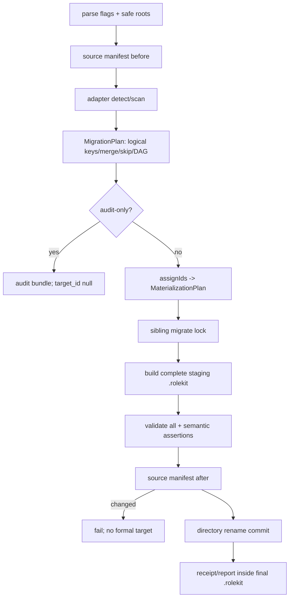

# migrate-tool design

## 0. 术语约定

| 术语 | 定义 | 防冲突结论 |
|---|---|---|
| SourceEntity | adapter 识别的语义聚合根；support file 归属聚合根，不按文件假造 entity | CodeStable 必迁实体与 Superpowers skill bundle 各自封闭 |
| MaterializationPlan | applyDate 下为 logical target_key 分配具体 WI/KN ID 的纯结果 | MigrationPlan 不含具体 ID；audit 永不分配 ID |
| SourceManifest | 相对路径/type/size/SHA-256 的全源清单及 canonical digest | before/after 字节相等是源只读证明，不含绝对路径/mtime |
| MigrationPlan | scan 后的 migrate/merge/skip/error 与 logical target DAG | 纯数据；audit/apply 共用 |
| MigrationBundle | report.json/report.md/source-manifest.json/mapping.json/semantic-diff.json/error-details.json | 内部机器 JSON + 人读报告，不扩公开 9 类 schema |
| StagingRoot | `<target>/.rolekit.migrate-<id>.tmp/` 完整候选 `.rolekit` 树 | 全量 validate 前不出现正式 `.rolekit` |

## 1. 决策与约束

**需求摘要**：实现 `rolekit migrate --from codestable|superpowers`。CodeStable 自迁移必须满足 roadmap item 10 的必迁类别、状态表、feature/item 合并、封闭 skip、语义保真、全量 validate 与源只读；obra Superpowers 样例包完成同等审计和转换。

**明确不做**：不修改/删除源；不迁 runs 历史；不把 brainstorm/audit/feedback/reference/gates 恢复成生命周期根；不把 Superpowers 子代理、worktree、Skill 调度或 branch 编排复制进 profile；不在线下载包；不向已有不同 `.rolekit` 做 live merge/覆盖；不新增 WorkItem/KnowledgeEntry/RoleProfile 字段；不执行源脚本。

**复杂度档位**：一次性高风险迁移工具。深度放在两个 source adapter、纯 plan 和 staging validator；CLI 薄。v1 只向 fresh target 提升，牺牲 live merge 以换取 Windows 上可证伪的全有/全无。

### 关键决策

- D1 分层：`packages/migrate` 提供 `auditMigration` / `applyMigration`，内部为 `SourceAdapter -> MigrationPlan -> materialize/validate/promote -> report`；`cli -> migrate -> core`，禁止 migrate 依赖 CLI store。core 只提供 schema/codec/prompt/profile 校验纯 seam，migrate 自行做 I/O。
- D2 CLI：`rolekit migrate --from <codestable|superpowers> [--source <path>] [--target <project-root>] [--decisions <yaml>] [--report-dir <path>] [--audit-only] [--json]`。无 `--audit-only` 即 apply，保持 roadmap 原命令；codestable source 默认 `<cwd>/.codestable`，superpowers 必须显式 `--source`；target 默认 cwd。所有输出路径必须在 source root 外，否则 `migration_path_overlap`。
- D2a 出口：`ReportPointer={base:'target'|'report-dir'|'staging',path:string}`。成功 `--json` 为 `{migration:{id,from,mode,status,source_manifest_sha256,target?,report:ReportPointer,counts,no_op}}`；report.path 必为 POSIX 相对路径：apply/no-op=`{base:'target',path:'.rolekit/migrations/<id>/report.json'}`，audit=`{base:'report-dir',path:'<id>/report.json'}`；target 在 audit 省略、apply/no-op 固定 `.rolekit`（相对 target root）。失败 `{error,migration_id?,report?:ReportPointer,detail?,issues?}`；plan-error按D9仅可省略或指既有audit，staging建成且report已写后 validation/promote 失败则固定 `{base:'staging',path:'.rolekit.migrate-<id>.tmp/migrations/<id>/report.json'}`，更早失败省略；禁止指向不存在的target。exit0 成功/no-op，exit1 业务失败，exit2 用法错误。稳定码：`migration_source_not_found|migration_source_unsafe|migration_path_overlap|migration_source_version_unsupported|migration_license_invalid|migration_status_missing|migration_status_unknown|migration_type_missing|migration_merge_conflict|migration_dependency_invalid|migration_skip_invalid|migration_target_exists|migration_lock_held|migration_source_changed|migration_validation_failed|migration_semantic_fidelity_failed|migration_staging_conflict|migration_promote_failed|migration_io_failed|usage_error`。
- D3 SourceManifest/safety：只枚举 regular file/directory，不跟随任何 symlink/junction；路径 realpath 必须留在 source；单文件 >8 MiB、非法 UTF-8 的语义文本、特殊文件均 fail。manifest 按 POSIX relative path 排序，以 RFC8785 canonical JSON 算 digest，不含绝对路径/mtime。源脚本/二进制只 hash，永不执行。scan 前与 promote 前各算一次，任何差异→`migration_source_changed`。
- D4 CodeStable entity universe：
  | 源 | 目标/处置 | 语义主键 |
  |---|---|---|
  | `features/*` / `issues/*` / `refactors/*` | WorkItem kind 直映 | 目录名；目录内 design/review/checklist 为 support |
  | `goals/*` | WorkItem kind=goal | 目录名 |
  | roadmap 主文档 | WorkItem kind=goal | roadmap slug |
  | roadmap item | mapping `category='roadmap-item'`；bound→merge feature、unbound→kind=feature WorkItem；全部进入 roadmap goal depends_on | source_key=item slug；source_locator={roadmap_slug,item_slug} |
  | `requirements/adrs/*.md` | KnowledgeEntry type=adr | 源相对路径 |
  | `compound/*.md` | doc_type `learning|pitfall|trick`→learning，其余已知 doc_type→note | 源相对路径 |
  | `attention.md` | 每个非空 bullet/单段规则→type=rule；标题层级进 tags | `attention:<heading>:<ordinal>` |
  | brainstorm/audit/feedback、非 ADR requirements | 普通文档 evidence-only，不恢复生命周期；报告逐文件列 provenance | 相对路径 |
  | reference/gates/runtime-manifest/阶段报告 | framework/support evidence，归所属 aggregate 或 package inventory | 相对路径 |
  | `.gitkeep` | 非entity；仅 report.discarded(reason=empty-placeholder)，不进 mapping/skipped | 相对路径 |
  | 已识别类别中零字节或去frontmatter+标题后无正文的 semantic 文档 | 继承该类别并 skip empty-placeholder | 原类别 source_key |
  每个识别出的 semantic entity 必有且仅有一个 mapping action；非 skip/error 项必有且仅有 target 或 merge target，skip/error 按闭表记账；adapter mandatory 闭表中的类别无 entity 时，mandatory_by_category 仍输出 discovered=0 行，人读 report.md 渲染为 `not_present`；它不是 mapping action/机器枚举，不伪造 skip。未知 semantic root→硬失败而非 out-of-scope。feature/issue/refactor/goal 内的 design/review/checklist/QA/acceptance 等 support **不物化**到 target/migrations 副本；只参与阶段解析、aggregate source_digest 与 report provenance。RoleKit 正式过程证据不继承这些旧阶段文件，源仍是全文归档。本仓 self golden 在实现冻结点预期 mandatory discovered：feature=11,issue=0,refactor=0,goal=0,roadmap=1,roadmap-item=11,adr=6,compound=0,attention-rule=1；当前全部 10 个 `.gitkeep` 均只增加 discarded，不得生成 entity。
- D5 WorkItem 状态：只使用 roadmap 冻结表，精确值为 `draft→planned`；`planned|planning→planned`；`design|designing→designing`；`in-progress|active|implementing→executing`；`review|qa|verify→verifying`；`done|completed|accepted→done`；`dropped|cancelled→dropped`；`paused|blocked→blocked`；其他→`migration_status_unknown`，缺失→`migration_status_missing`，不加别名、不猜。authority：bound roadmap item lifecycle status > goal state/roadmap 主文档 frontmatter.status > unbound aggregate 的最高已提交阶段（acceptance→accepted、QA/review→verify、implementation evidence→implementing、design→design）；roadmap 主文档只读 frontmatter.status，缺失=`migration_status_missing`，本仓 active 依精确表映为 executing；document 自身 `draft|approved` 只表文档审批，不覆盖 bound lifecycle。“最高已提交阶段”只扫描 aggregate 目录直接子级且 entity key匹配的机读产物：doc_type后缀 `-acceptance` 且 status=passed|accepted→accepted；`-qa|-code-review|-design-review` 且 status=passed→verify；`-implementation` 且 status=completed 或 checklist 至少一项且全部 status=done→implementing；`-design|-report` 存在→design；以上全无→`migration_status_missing`，禁止按任意文件名/mtime猜。报告列出全部候选与选中来源。
- D5a WorkItem 构造：kind/status/depends_on 按映射；目录 aggregate（feature/issue/refactor/goal）的 base title 精确等于目录 source_key，roadmap goal title 精确等于 roadmap slug，均不从 prose/H1/frontmatter 猜。mapping category 封闭为 `feature|issue|refactor|goal|roadmap|roadmap-item|adr|compound|attention-rule|superpowers-profile|superpowers-note`；source_key 公式：前四类=目录 basename，roadmap=roadmap slug，roadmap-item=item slug（另带 locator），adr|compound=POSIX 源相对路径，attention-rule=`attention:<trimmed-H2>:<1-based-rule-ordinal>`，两类 Superpowers=skill slug。定义 `E(s)` 为 UTF-8 字节 percent-encode（仅 `[A-Za-z0-9._-]` 原样，其他字节用大写 `%HH`）；WI logical key 精确为目录 aggregate `wi:<feature|issue|refactor|goal>:<E(source_key)>`、roadmap goal `wi:roadmap:<E(roadmap_slug)>`、unbound item `wi:roadmap-item:<E(roadmap_slug)>:<E(item_slug)>`；Knowledge=`kn:<E(category)>:<E(source_key)>`，RoleProfile=`rp:<E(profile_name)>`，前缀隔离命名空间。bound item 的 merge_into 必须全等于 `wi:feature:<E(item.feature)>`，且该 target 已存在；全 MaterializationPlan target_key 全局唯一，否则 `migration_merge_conflict`。`gate:null, gate_log:[], lane:null, lane_reason:null, lane_overrides:[], runs:[]`。WorkItem created authority：目录 aggregate 先取 source_key 的 leading `YYYY-MM-DD-`，否则仅扫描目录直接子级 regular `*.md`：YAML frontmatter 的 doc_type 必须以对应 `feature-|issue-|refactor-|goal-` 开头且同名 entity 字段等于 source_key；收集 strict created/date（同文件两者规范值须相等）并取最早值，任一已声明值非法或零候选均失败；roadmap goal/unbound item 只用 roadmap strict `created`；bound 保留 feature aggregate created。date-only 规范为 `T00:00:00.000Z`，RFC3339 规范到 UTC millisecond ISO；缺失/非法均 `migration_semantic_fidelity_failed`，禁止 mtime/atime/当前时间回退；updated 精确等于命令开始唯一捕获的 UTC millisecond `applyInstant`。MigrationPlan 不分配 ID；applyDate 是同一 applyInstant 的 `YYYYMMDD` 投影，禁止逐实体读 clock。`assignIds` 将 WI 与 KN target_key 分组，各自按 UTF-8 原始字节升序、各用独立 1-based 计数器生成 `WI-YYYYMMDD-NNN` / `KN-YYYYMMDD-NNN`；NNN 必须恰三位且任一组>999即 `migration_validation_failed`，RoleProfile不分配ID。全图依赖缺失/self/cycle 或 goal done 不变量失败统一 `migration_dependency_invalid`；`migration_validation_failed` 仅用于目标 schema/codec/manifest 或 assignIds容量等非依赖校验，不降级状态。
- D6 roadmap merge：`item.feature` 非空且目录存在时必须 merge 到该 feature WorkItem，item 不再产第二 WI；依赖并集并映射为 target IDs。绑定缺目录即 `migration_merge_conflict`；按全部 roadmap_slug/item_slug 扫描完成后分组；任一 feature 的 bound item 数>1 则整次迁移 `migration_merge_conflict`，detail 只列按 UTF-8 字节序排序的 locators；所有相关 item 以及被争用 feature aggregate 均进入 mapping.entries 且 action=error、target_key/target_id/merge_into 缺省、field_map=[]、assertions含同一merge-conflict false detail，report.errors 每个entity各一条；因此 roadmap-item 与 feature mandatory 行 failed 分别递增，feature 不再以 migrate 行出现，禁止依扫描顺序称“第二个”或选 title/status 胜者。roadmap goal depends_on 恰为其全部 item 的唯一 target IDs（含 dropped，完成不变量自行忽略）；bound merge 的最终 title 由 item authority 覆盖为 Unicode trim 后的完整 item.description；unbound item 同样以该 description 为 title、kind=feature；description 缺失/trim 后空即 `migration_semantic_fidelity_failed`，不回退 slug、summary 或 H1，也不从关键词猜 research。`resolveRoadmapDeps` 先以 `(roadmap_slug,item_slug)` 建唯一表；每个 `item.depends_on` 值只解析为同 roadmap 的 item_slug，缺失→`migration_dependency_invalid`。依赖目标改写：normal bound→`wi:feature:<E(feature)>`，normal unbound→`wi:roadmap-item:<E(roadmap)>:<E(item)>`；指向 skip→`migration_skip_invalid`，指向 error/缺 target→`migration_dependency_invalid`，改写后 self/cycle 同码。每个 item 的改写依赖先去重/UTF-8排序并并入其最终 target；roadmap goal 再依 item source order收集所有 normal item最终target、去重/UTF-8排序，故 goal/item 两层边都只引用最终 logical keys；随后才 assignIds。
- D7 Knowledge 映射：所有迁移 knowledge 用 apply 日稳定分配 `KN-YYYYMMDD-NNN`，不保留可能冲突的源 id；`source` 为 POSIX 相对路径。日期规范沿用 D5a；同一 frontmatter 同时有 created/date 时规范值必须相等。ADR title=trim(frontmatter.title)、created=created否则date；compound title=trim(frontmatter.title)、created=created否则date否则文件 basename leading YYYY-MM-DD；缺/空/非法均 `migration_semantic_fidelity_failed`。CodeStable project_epoch=全部 roadmap created/date 与 aggregate 目录 leading 日期的最早规范值（无候选则 fail）；attention rule title=`<trimmed-H2> #<ordinal>`、created=project_epoch，H2 只做 Unicode whitespace trim、不归一化，重复/空 H2 fail，ordinal 是每个 H2 内过滤空规则后的 1-based source order。Superpowers note title=`Superpowers: <skill-slug>`、created 固定 adapter epoch `2026-07-27T00:00:00.000Z`；这些值不从 mtime/当前时间/正文猜。ADR body 仅 LF 规范化，必须保留 Context/Decision/Consequences/Alternatives Considered；accepted/proposed→active（proposed 加 tag）、superseded/deprecated直映，未知/缺失 fail。compound doc_type trim 后空/缺→`migration_type_missing`；`learning|pitfall|trick`→learning，`explore|spike|question|research|note|knowledge`→note，其他非空值→`migration_semantic_fidelity_failed`；原 doc_type 必写 tag，compound status 固定 active；attention-rule status 固定 active，二者不消费任意源 document status。attention 只以真实 H2 为 section；H1 下 preamble、HTML comment 均忽略，H3/更深内容归最近 H2；tags 固定为 `['attention','h2:<trim-H2>',...当前段落的H3+祖先'h<level>:<trim-heading>']`，按层级/source order去重，heading 不进正文。section 有 Markdown list item 时每个顶层 item（含缩进续行折叠为空格）一条，非 list 散文不混入；无 list 时按空行 paragraph node 拆分，每段软换行折叠为空格；trim 后非空才成 rule，结果仍含空行则 fail。空 H2/H3 模板不成 entity；本仓库“报告语言”H2 恰生成 1 条，“项目碎片知识”及其空 H3 生成 0 条。所有产物走 knowledge core codec + `validateArtifact`。
- D8 skip 封闭：`empty-placeholder|owner-deprecated|duplicate`。empty 只适用于已识别 semantic 文档的零字节/去 frontmatter+标题后无正文；`.gitkeep` 按 D4 仅是 discarded inventory，不是 skip entity；owner-deprecated 只来自 `--decisions` 以 canonical entity ref 寻址的机读条目，dropped 状态本身仍迁 dropped；duplicate 仅同 category 且 projection SHA相同并指向唯一已迁 target：WI projection=RFC8785({kind,title,status,depends_on logical keys排序})；Knowledge=RFC8785({type,title,status,tags,created,source,body_sha256})；RoleProfile=RFC8785({name,capabilities,boundaries,deliverables,verification,prompt_fragments,fragment_sha256s})；其他类别禁止 duplicate。所有 skip 与依赖/merge_into 的交互只按 D8b（被引用target任何skip均失败、不重定向）；其他原因→`migration_skip_invalid`。merge 不是 skip。
- D8a decisions/fingerprint 输入：`--decisions` strict YAML 解析对象固定 `{version:1,entries:[{ref:{category,source_key,source_locator?},action:'skip',reason,approved_by,approved_at}]}`；ref 字段/locator 条件与 MappingEntry identity 完全相同，故可寻址路径型与 attention/roadmap/Superpowers 实体，禁止寻址 evidence/.gitkeep。未知字段/重复 canonical ref 拒绝；entity scan 后每个 ref 必须恰匹配一项，零/多匹配均 `migration_skip_invalid`，不得按整文件批量 skip；entries按 `(category,source_key,RFC8785(locator??null))` 排序，reason/approved_by trim后非空，approved_at规范UTC ISO；未传等价 `{version:1,entries:[]}`。`decisionsDigest=SHA-256(UTF8(RFC8785(规范对象)))` lowercase hex。
- D8b map pipeline（严格有序）：(1) entity识别，`.gitkeep`/evidence inventory先分流，semantic empty标skip；(2) 应用decisions owner-skip；(3) 对未skip roadmap items全量bind分组，multi-bind整迁error；(4) 构造targets并合并logical depends；(5) 在merge后projection上判duplicate；(6) 建反向引用表，任一被 depends_on 或 merge_into 引用的 target_key 无论 empty/owner/duplicate 都不得skip，禁止入边重定向，命中=`migration_skip_invalid`；(7) 做missing/self/cycle/goal invariant；(8) 按mapping键排序产出 MigrationPlan。任一步业务失败都形成 action=error/report error，后续步骤只为收集独立错误、不得物化。
- D9 apply 全有/全无：MigrationPlan 含任一 action=error 或未通过 skip/dependency 图校验时：audit-only 写完整 bundle 后 exit1；apply 在取锁/建staging前 exit1 且不新写任何磁盘报告；失败 JSON 的 issues 按 report.errors 同序给出完整脱敏诊断，公开 code=首项稳定码；仅当同 migration id/fingerprint 的既有 audit bundle 已验证存在时才带 `{base:'report-dir',path:'<id>/report.json'}` 指针，否则省略 report。绝不跳过 error。通过后，v1 target 的 `.rolekit` 必须不存在；若存在且 receipt 的 D10a 五项 identity 全等、migration id 相同、mapping/semantic/target manifest digests与当前regular files重算全等，才返回 no-op，否则 `migration_target_exists`。sibling `.rolekit-migrate.lock` 复用 wx+pid/ts、stale 仅清一次/重试一次；持锁后在同卷构建完整 StagingRoot。migrate 内部 `serializeMigratedWorkItem` 只承载初始迁移 WI：顶层键序固定 `schema,id,kind,title,status,gate,gate_log,lane,lane_reason,lane_overrides,depends_on,runs,created,updated`，字符串用 JSON 双引号转义，null/空数组用 flow literal，depends_on 先按 UTF-8 字节排序再用二空格 block sequence，禁 alias/tag/comment，LF 且恰一尾换行；重解析必须与对象 deep-equal 后再 `validateArtifact`；该语义/validate roundtrip 是与未来CLI writer的唯一跨writer合同，promote前后禁止调用CLI reformat。全量校验 WorkItems、Knowledge、RoleProfiles、fragment 路径、DAG/goal invariant/语义断言与 target manifest；重算 source manifest 相等后，以单次 directory rename 将 staging 提升为 `<target>/.rolekit`。rename 失败正式 target 仍不存在、staging 保留。receipt/report/target-manifest 在 rename 前已位于 staging；final 目录存在即 promotion commit。migrate 只创建映射子树与 migrations evidence，不凭空发明未冻结的 rolekit.yaml/policy；这些由 init/配置能力负责。任何 existing/live merge/backup 策略明确延后。
- D9a crash/idempotency：adapter_id 固定为 `codestable@1|codex-superpowers-5.1.3@1`；`fingerprint=SHA-256(UTF8(RFC8785({plan_version:1,from,adapter_id,source_manifest_sha256,decisions_sha256})))` lowercase hex，migration id=`mig-<from>-<fingerprint前24hex>`，receipt 必写 plan_version/adapter_id/full fingerprint；source manifest 与 empty decisions 原像分别按 D3/D8a；同 fingerprint 的 orphan staging 可校验后续建或清理重建；不同 fingerprint staging→`migration_staging_conflict`。崩前 rename 无正式树，崩后 rename 完整树+receipt；同源重跑 no-op。audit-only 只写 `<report-dir>/<id>/`（默认 `<target>/.rolekit-migration-audits/`），不建 staging/正式 `.rolekit`；写报告后也重算 source-after，相同报告 digest 重跑零 diff。
- D10 report/保真：MigrationBundle `mapping.entries` 中每个 MigrationPlan semantic entity 固定 `category,source_key,source_locator?,source_digest,action,target_key?,target_id?,merge_into?,skip_reason?,field_map,assertions`。source_digest 均为 lowercase SHA-256：目录 aggregate=`RFC8785([{path,sha256}])`（取 SourceManifest 中该根下全部regular files，path排序）；roadmap goal/ADR/compound/empty文档=原始文件字节；roadmap-item=`RFC8785(严格解析后的完整item对象)`；attention-rule=`RFC8785({attention_file_sha256,h2,ordinal,body})`；Superpowers skill=`RFC8785([{path,sha256}])`（该skill bundle全regular files，path排序）。CodeStable roadmap item 的 category 必须字面为 `roadmap-item`、source_key 为原 item slug、source_locator 必填且精确为 `{roadmap_slug:<原roadmap slug>,item_slug:<原item slug>}`，其他 category 禁止 source_locator；bound merge 与 unbound materialize 在 apply mapping 中都必须写最终唯一 WorkItem target_id，audit-only 仍为 null。缺/错 locator、apply roadmap-item 空 target_id 或 target 不存在均 `migration_semantic_fidelity_failed`；bound/unbound golden 各至少一例并校验 locator→target 唯一。`mapping.json` 顶层固定 `{version:1,entries:MappingEntry[]}`，未知字段拒绝，entries 按 `(category,source_key,RFC8785(source_locator??null))` 排序；MigrationBundle/receipt/target-manifest 的全部机器 JSON 均以 RFC8785 canonical JSON 的 UTF-8 无 BOM、无尾换行字节落盘，golden 锁原始 SHA-256，report.md 单独用 LF 人读格式。MappingEntry.field_map 固定为按 target_field 排序的 `{target_field,source_refs:string[]}` 数组（refs 为排序后的相对path+locator；migrate|merge非空、skip|error空）；assertions 固定为按 id 排序的 `{id,passed,detail_sha256}` 数组（sha为 semantic-diff 中对应 RFC8785 detail 对象的64 lowercase SHA-256，成功 apply 所有项true，禁止任意扩展键）。`report.provenance` 固定按 `(source_path,role,owner_source_key??'')` 排序的 `{source_path,source_sha256,owner_source_key:string|null,role:'support'|'evidence-only',stage_contribution:('intent'|'design'|'implementation'|'review'|'qa'|'acceptance')[]}`，stage数组按该枚举顺序去重；`report.discarded` 固定 `{source_path,heading:string|null,source_sha256,reason:'forbidden-block'|'unselected-markdown'|'host-agent-prompt'|'source-script'|'binary-asset'|'package-evidence'|'empty-placeholder'}` 并按 `(source_path,heading??'',reason)` 排序；两者未知字段拒绝且只存相对路径/hash，不进 mapping。roadmap-item 字段真值表：bound=`action:'merge',target_key` 缺省、`merge_into:<feature logical key>`；unbound=`action:'migrate',target_key:<item logical key>`、merge_into 缺省；两者 audit 均显式 `target_id:null`，apply 均为最终非空 id；optional 缺省字段不得写 null。MigrationPlan 只含 logical target_key/merge/skip/DAG、绝不含 `WI-|KN-` ID，audit-only 的 target_id 恒 null；仅 apply 在 materialize 前调用纯 `assignIds(plan,applyDate)->MaterializationPlan`，receipt 冻结具体 ID。D4 evidence-only roots 与 support files 均不进入 mapping.entries/MigrationPlan action；只进入 report.provenance，`counts.evidence` 精确等于 provenance records 数；mapping action 封闭为 `migrate|merge|skip|error`，禁止 evidence action。CodeStable support 仅记录相对路径/hash/stage contribution，不复制正文。counts 分 discovered/migrated/merged/skipped/evidence/discarded/failed 和 mandatory-by-category，且 `counts.discarded=report.discarded.length`。机械断言覆盖 kind/status/title/deps、绑定 item 唯一 target、goal dependency graph、ADR 四节/body hash、compound type/body hash、attention 单段、全量 schema validate。抽样固定为每个非空必迁类别首尾至少一项 + 全部 merge/skip/error，不随机；任一 canonical projection diff 非预期即 `migration_semantic_fidelity_failed`。
- D10a 机器 JSON envelopes（全部 strict/未知字段拒绝并按 D10 canonical 落盘）：`source-manifest={version:1,adapter_id,files:[{path,type:'file'|'directory',size,sha256:string|null}]}`（目录size=0/sha=null，按path UTF-8排序）；`target-manifest={version:1,files:[{path,size,sha256}]}`（只列regular files，排除自身与receipt，按path排序）；`semantic-diff={version:1,entries:[{category,source_key,target_id:string|null,details:[{id,passed,expected_sha256:string|null,actual_sha256:string|null,code}]}]}`（entry按mapping键、details按id）；`error-details={version:1,entries:[{detail_sha256,detail:{code,message_code,refs:string[]}}]}`，message_code 必须逐字等于同 detail 的稳定 error code（snake_case，不另建自由文案词表）；refs只含排序后的相对path/entity-ref且无敏感/绝对值，entries按detail_sha256排序、hash=RFC8785(detail) SHA-256；report.errors.detail_sha256与CLI issues均引用/复用该detail schema。audit bundle始终落该文件（可空）；apply-error无bundle时仅issues携带同detail对象。两条hash链严格分离：`MappingEntry.assertions[].detail_sha256` 仅指向 semantic-diff.details 的 `{id,passed,expected_sha256,actual_sha256,code}`；`report.errors[].detail_sha256`/CLI issues 仅指向 error-details 的 `{code,message_code,refs}`。error action 的 assertions 固定含一条 passed=false semantic detail，不得为空或改指 error-details。`report={version:1,migration_id,from,mode:'audit'|'apply',status:'succeeded'|'failed',adapter_id,plan_version,source_manifest_sha256,decisions_sha256,fingerprint,counts,provenance,discarded,errors:[{code,category:string|null,source_key:string|null,source_locator?,detail_sha256}]}`，locator条件同mapping，errors按 `(code,category??'',source_key??'',RFC8785(locator??null))`；counts=`{discovered,migrated,merged,skipped,evidence,discarded,failed,mandatory_by_category}`，其中前四+failed按mapping action计数、`discovered=migrated+merged+skipped+failed=mapping.entries.length`、后两等于对应report数组长度，mandatory_by_category 固定为按category排序的 `[{category,discovered,migrated,merged,skipped,failed}]`，每行 discovered=migrated+merged+skipped+failed；CodeStable 必须恰含 `feature|issue|refactor|goal|roadmap|roadmap-item|adr|compound|attention-rule` 九行，Superpowers 恰含 `superpowers-profile|superpowers-note` 两行，零实体也输出全0行；禁止缺行、对象map或第五种action。apply `receipt={version:1,migration_id,from,plan_version,adapter_id,fingerprint,source_manifest_sha256,decisions_sha256,mapping_sha256,semantic_diff_sha256,target_manifest_sha256,applied_at}`，applied_at=applyInstant；no-op 真值表唯一为：先以 receipt 的 plan_version/adapter_id/full fingerprint/source_manifest_sha256/decisions_sha256 五项判 identity（禁止未定义plan_digest），再要求 receipt 的 mapping/semantic_diff/target_manifest 三 digest 与按现网文件重算值全等；两组及推导出的 migration_id 全过才 no_op，否则 migration_target_exists。三份证据digest不进入fingerprint原像。任一映射语义变化必须 bump plan_version 或 adapter_id 并更新 golden。report.md 固定 `## Errors` 表，按 report.errors 同序渲染 code/category/key/locator/message_code，不渲染 hash原像外的自由诊断。
- D11 Superpowers source gate：已盘点 Codex plugin `superpowers@5.1.3`，14 个 `skills/*/SKILL.md`，MIT（Jesse Vincent/obra）。apply 只支持 mapping adapter `codex-superpowers-5.1.3@1`：manifest name/version、14 slug 集、必要 source files、LICENSE MIT 任一不符均 fail；audit 可报告 unsupported 但仍 exit1，不提供绕过 flag。CI vendored sample 必须来自该版本、保留14 bundles/plugin manifest/LICENSE与来源清单，不用缩水伪包替代同等审计。LICENSE 原文复制到 final `.rolekit/migrations/<id>/licenses/superpowers-MIT.txt`，每个 fragment 第一行固定 `<!-- source: superpowers@5.1.3; license: MIT; skill: <slug> -->`；每个 note body 第一行同注释且 tags 精确按序为 `[superpowers, source:superpowers, version:5.1.3, license:MIT, skill:<slug>]`。LICENSE+report仍是法律/审计事实源，profile YAML本身无 attribution 字段不得私扩 schema。
- D12 Superpowers 14 项映射（每 skill bundle 是一个 SourceEntity，companions 为 support；零 skip）：
  | skill | target | 机械边界 |
  |---|---|---|
  | brainstorming | profile `superpowers-brainstormer` | 澄清/方案权衡；剥离 Skill/HARD-GATE 调度 |
  | writing-plans | profile `superpowers-planner` | 可执行计划/TDD/YAGNI；剥离自动 handoff |
  | test-driven-development | profile `superpowers-tdd-implementer` | RED-GREEN-REFACTOR/反模式 |
  | systematic-debugging | profile `superpowers-debugger` | 根因四阶段；support 文档按静态 section map 提炼 |
  | verification-before-completion | profile `superpowers-verifier` | evidence-before-claims |
  | requesting-code-review | profile `superpowers-review-requester` | 审查输入/严重级别；不 dispatch agent |
  | receiving-code-review | profile `superpowers-review-responder` | 技术核实/不盲从 |
  | writing-skills | profile `superpowers-skill-author` | 可移植 skill authoring/testing；不带包维护脚本 |
  | using-superpowers | Knowledge note | 原文 bundle + RoleKit host-adapter 对应说明 |
  | dispatching-parallel-agents | Knowledge note | 原文 bundle + v1 不支持并行多 writer gap |
  | executing-plans | Knowledge note | 原文 bundle + WorkItem/run 对应说明 |
  | finishing-a-development-branch | Knowledge note | 原文 bundle + IntegrationManager/final gate 对应说明 |
  | subagent-driven-development | Knowledge note | 原文 bundle；不把 dispatch/reviewer prompt 链激活 |
  | using-git-worktrees | Knowledge note | 原文 bundle + runner WorktreeManager 对应说明 |
  8 profiles 一 skill 一 profile；6 notes 一 skill 一 note，不 merge/不 split。notes type=note/status=active，不注入 prompt；body 固定为 D11 attribution comment→LF 规范化 SKILL.md 正文→按POSIX path排序的UTF-8 companions/scripts逐个 inert fence→`## RoleKit 迁移说明`+下列唯一句，二进制仅 manifest evidence，任何内容永不执行。说明句冻结：using-superpowers=`宿主薄 adapter 只调用 RoleKit CLI，不激活源 Skill 调度。`；dispatching-parallel-agents=`RoleKit v1 不支持并行多 writer，本条仅保留证据。`；executing-plans=`源计划执行语义映射到 WorkItem 与 run，不激活源调度器。`；finishing-a-development-branch=`收尾语义映射到 IntegrationManager 与 final gate，不自动操作远端。`；subagent-driven-development=`RoleKit v1 不激活子代理 dispatch/reviewer prompt 链。`；using-git-worktrees=`隔离语义映射到 runner WorktreeManager，不复制源脚本。`。namespaced profile 不自动覆盖/引用标准 7 profiles。
- D12a 8 profile 冻结模板（`@preamble`=frontmatter 后至首个 H2；heading 名精确匹配；“固定字段”单元格按带空格分隔符 ` / ` 依次为 capabilities/boundaries/deliverables/verification 四个数组，数组内 `、` 分项，字面不得实现期改写）：
  | source→profile | 必选 SKILL H2 / companion H2 → fragment | 固定 capabilities / boundaries / deliverables / verification（每组均非空） | 整体 evidence-only/discard |
  |---|---|---|---|
  | brainstorming→superpowers-brainstormer | `SKILL.md:@preamble`; `SKILL.md:H2[Anti-Pattern: "This Is Too Simple To Need A Design"|Checklist|Key Principles]`→`core.md` | 澄清目标/约束/成功标准、比较方案、可审设计 / 不实现、不因简单跳过、不调Skill / design-spec / checklist可证伪+owner过目证据 | Process Flow/The Process/After the Design/Visual Companion；全部 companions/scripts |
  | writing-plans→superpowers-planner | `SKILL.md:H2[Overview|Scope Check|Bite-Sized Task Granularity|Task Structure|No Placeholders|Remember|Self-Review]`→`core.md` | design转原子计划、路径/验证明确 / 不实现、无占位 / implementation-plan / step独立+命令可执行 | File Structure/Plan Document Header/Execution Handoff；reviewer prompt/agents |
  | test-driven-development→superpowers-tdd-implementer | `SKILL.md:H2[Overview|The Iron Law|Red-Green-Refactor|Good Tests|Why Order Matters|Common Rationalizations|Red Flags - STOP and Start Over|Verification Checklist|When Stuck|Testing Anti-Patterns|Final Rule]`→`core.md`；`testing-anti-patterns.md:H2[Overview|The Iron Laws|Anti-Pattern 1: Testing Mock Behavior|Anti-Pattern 2: Test-Only Methods in Production|Anti-Pattern 3: Mocking Without Understanding|Anti-Pattern 4: Incomplete Mocks|Anti-Pattern 5: Integration Tests as Afterthought|Quick Reference|Red Flags|The Bottom Line]`→`anti-patterns.md` | RED-GREEN-REFACTOR、测试设计 / 未见RED不写prod、禁test-only hook / code+tests / RED证据+GREEN+全回归 | agents，其余 companion 段 |
  | systematic-debugging→superpowers-debugger | `SKILL.md:H2[Overview|The Iron Law|When to Use|The Four Phases|Red Flags - STOP and Follow Process|Common Rationalizations|Quick Reference|When Process Reveals "No Root Cause"|Supporting Techniques]`→`core.md`；`root-cause-tracing.md:H2[Overview|When to Use|The Tracing Process|Key Principle|Stack Trace Tips]`→`root-cause.md`；`defense-in-depth.md:H2[Overview|Why Multiple Layers|The Four Layers|Applying the Pattern|Key Insight]`→`defense.md`；`condition-based-waiting.md:H2[Overview|When to Use|Core Pattern|Quick Patterns|Common Mistakes|When Arbitrary Timeout IS Correct]`→`waiting.md` | 复现/根因/单假设/修复 / 不猜、不并投多修 / diagnosis+fix evidence / reproduction+hypothesis+regression | scripts/TS/CREATION-LOG/pressure tests/agents |
  | verification-before-completion→superpowers-verifier | `SKILL.md:H2[Overview|The Iron Law|The Gate Function|Common Failures|Red Flags - STOP|Rationalization Prevention|Key Patterns|When To Apply|The Bottom Line]`→`core.md` | fresh evidence / 不凭旧结果宣称 / verification-summary / 命令+exit+artifact | agents |
  | requesting-code-review→superpowers-review-requester | `SKILL.md:H2[When to Request Review|Red Flags]`→`core.md`；`code-reviewer.md` 整体 discarded(reason=host-agent-prompt；模板 headings 位于 fenced dispatch prompt，禁止解 fence/提炼) | 组装requirements/diff/范围、严重级别 / 不dispatch、不替review结论 / review-brief / 输入完整+范围可定位；最低字段四组非空，否则fail | How to Request/Example/Integration with Workflows；agents；code-reviewer fenced dispatch template |
  | receiving-code-review→superpowers-review-responder | `SKILL.md:H2[Overview|The Response Pattern|Forbidden Responses|Handling Unclear Feedback|Source-Specific Handling|YAGNI Check for "Professional" Features|Implementation Order|When To Push Back|Acknowledging Correct Feedback|Gracefully Correcting Your Pushback|Common Mistakes|The Bottom Line]`→`core.md` | 核实finding/按风险响应 / 不盲从、不表演同意 / response-plan或fix evidence / finding逐条证据 | GitHub Thread Replies/Real Examples/agents |
  | writing-skills→superpowers-skill-author | `SKILL.md:H2[Overview|What is a Skill?|TDD Mapping for Skills|When to Create a Skill|Skill Types|Directory Structure|SKILL.md Structure|Claude Search Optimization (CSO)|File Organization|The Iron Law (Same as TDD)|Testing All Skill Types|Common Rationalizations for Skipping Testing|RED-GREEN-REFACTOR for Skills|Anti-Patterns|Skill Creation Checklist (TDD Adapted)|Discovery Workflow|The Bottom Line]`→`core.md`；`anthropic-best-practices.md:H2[Core principles|Skill structure|Workflows and feedback loops|Content guidelines|Evaluation and iteration|Anti-patterns to avoid]`→`best-practices.md` | skill结构/触发描述/pressure eval / 未测试不发布、不含宿主调度 / skill bundle+eval / baseline fail+green+refactor | testing-with-subagents/persuasion/examples/scripts/dot/agents及其余best-practices段 |
- D12b 机械提炼算法：用 CommonMark AST 解析去 frontmatter 后的 Markdown；只把 fenced/indented code 与 HTML block **之外**的 ATX heading node 纳入索引，绝不解 fence 或按行正则识别伪 heading。按表中 `(relativeFile, exact heading level/text)` 找唯一 block（到下个同级/更高真实 heading，保留子 heading）；`@preamble` 只取首个真实 H2 前、code/HTML 外的段落。故 writing-skills fence 内示例 `## Overview` 不计，真实 H2 恰一；code-reviewer fenced template 整体不提炼。缺失/重复 required heading、固定字段任一空、提炼后 fragment 空均 `migration_semantic_fidelity_failed`。对提炼块按 paragraph/code-block 分割，含禁词 `superpowers:|Skill tool|TodoWrite|<HARD-GATE>|docs/superpowers|\bsubagents?\b|\bdispatch(ing)?\b|Task tool|implementer-prompt|spec-reviewer-prompt|git checkout|gh pr` 的 block 整块丢弃并仅在 report.discarded 记 source_path/heading/source_sha256/reason='forbidden-block'；其余原文只做 LF 规范化并按表顺序拼接，禁止自由改写。golden fixture 锁 8 profile YAML 和 fragment hashes。
- D12c profile/support 落盘：`.rolekit/profiles/roles/<profile-name>.yaml`；fragment 固定 `.rolekit/profiles/fragments/superpowers/<source-slug>/{core,...}.md`，`prompt_fragments` 只写相对 `profiles/` 的 `fragments/superpowers/<slug>/<file>.md`；不写 executors、不覆盖标准七名。`serializeMigratedRoleProfile` 键序固定 `schema,name,capabilities,boundaries,deliverables,verification,prompt_fragments`，数组元素严格沿 D12a 表内顺序、字符串JSON双引号、二空格block sequence、禁flow/alias/tag/comment、LF且恰一尾换行；重解析deep-equal+validate，golden锁raw sha。profile source bundle 中：表内 Markdown heading 才可提炼；未选 Markdown、`agents/*`、`*-prompt.md` 与 `code-reviewer.md`、scripts、JS/TS/SH/DOT/YAML/binary 仅各写一条 `report.discarded`，不进 provenance/mapping、不复制 target。只有实际贡献 fragment 或 note inert body 的源文件写 `report.provenance(role='support')`；note bundle 才允许 UTF-8 support 作为 inert fenced text。discard reason 固定映射：未选Markdown=`unselected-markdown`，agents/*、*-prompt.md与code-reviewer.md=`host-agent-prompt`，可执行/脚本源=`source-script`，binary=`binary-asset`，root manifest/README/CODE_OF_CONDUCT=`package-evidence`；禁词块沿用forbidden-block。
- D13 Superpowers profile evidence：每 profile 报告 source heading→capabilities/boundaries/deliverables/verification/fragment 的映射与 discarded host orchestration；8 profile 全过 `rolekit validate`、fragment resolve 和 compilePrompt fixture。14 skill source key 集与 14 target key 集双射；root manifest/README/CODE_OF_CONDUCT 记 package-evidence，assets 逐文件按binary-asset或unselected-markdown，不算 skip。
- D14 batch patch（以下为可粘贴字面，任一漏项阻塞实现）：
  1. **roadmap 4.5**：旧 migrate 行整句替换为：
     ```text
     rolekit migrate --from <codestable|superpowers> [--source <path>] [--target <project-root>] [--decisions <yaml>] [--report-dir <path>] [--audit-only] [--json]
     ```
     同节追加：“无 audit-only 即 apply；codestable source 默认 `<cwd>/.codestable`，superpowers 必须显式 source，target 默认 cwd。成功 JSON=`{migration:{id,from,mode,status,source_manifest_sha256,target?,report:{base,path},counts,no_op}}`；report/target 三态按D2a，均不落绝对路径；错误=`{error,migration_id?,report?:{base,path},detail?,issues?}`；exit 0/1/2。稳定码为 `migration_source_not_found|migration_source_unsafe|migration_path_overlap|migration_source_version_unsupported|migration_license_invalid|migration_status_missing|migration_status_unknown|migration_type_missing|migration_merge_conflict|migration_dependency_invalid|migration_skip_invalid|migration_target_exists|migration_lock_held|migration_source_changed|migration_validation_failed|migration_semantic_fidelity_failed|migration_staging_conflict|migration_promote_failed|migration_io_failed|usage_error`。”
  2. **roadmap 4.8**：布局块后追加：
     ```text
     <target>/.rolekit-migrate.lock                    # sibling单写锁，短暂
     <target>/.rolekit.migrate-<id>.tmp/               # 完整候选树，短暂
     <target>/.rolekit-migration-audits/<id>/          # audit-only报告，不是正式target
     .rolekit/migrations/<id>/
       report.json  report.md  source-manifest.json  mapping.json
       semantic-diff.json  error-details.json  target-manifest.json  receipt.json
       licenses/superpowers-MIT.txt                    # 仅superpowers
     ```
     约束全文：“v1 只向 fresh target 提升；不同 `.rolekit` 已存在即失败，同 receipt/fingerprint 重跑 no-op。候选内所有 schema/graph/fidelity 与 source-after 全过后，same-volume directory rename 是唯一 commit；失败正式 `.rolekit` 不出现。report.md 与第三方 license 是人读/法律证据，其他 migration 机器记录为 JSON；migrate 不生成未冻结的 rolekit.yaml/policy。”
  3. **roadmap 4.9**：追加全文：“migrate 构造 WorkItem 时，bound roadmap item lifecycle status 为首 authority；其余按 goal/roadmap 状态或 CodeStable 已提交阶段解析，document draft/approved 不冒充 lifecycle。状态只用 item10 精确表；未知=`migration_status_unknown`、缺失=`migration_status_missing`。新 WI 固定 gate=null、gate_log=[]、lane/lane_reason=null、lane_overrides/runs=[]；migrate 对 depends_on 做存在/self/cycle 与 goal done invariant 全图校验。MigrationPlan 只有 logical target_key，apply 的 MaterializationPlan 才按日分配 WI ID；audit target_id 恒 null。旧 design/review/checklist support 不复制进 target，只参与 stage/provenance；语义保真不承诺把 prose 写入无 body 的 WorkItem。”
  4. **roadmap 4.10**：将 id 注释中的“`KN-YYYYMMDD-NNN` 或迁移保留源 id”替换为“`KN-YYYYMMDD-NNN`；migrate 统一新分配，源 id/path 进 source/report，禁止碰撞猜测”。再追加全文：“migrate 的 compound 必须有 doc_type；learning/pitfall/trick→learning，explore/spike/question/research/note/knowledge→note，缺/空=`migration_type_missing`、其他值=`migration_semantic_fidelity_failed`。attention 仅真实H2起section，忽略H1 preamble/HTML comment、H3归最近H2；有list则逐顶层item、否则逐paragraph，续行折叠为空格，每条必须单段；空section不成entity。ADR/compound/attention 的 source 为 POSIX 相对路径并统一经 knowledge codec+validate；ADR/compound title取trim frontmatter.title、created取created/date/文件日期的冻结优先级，attention title=<H2> #<1-based ordinal>且created=project_epoch、tags按heading链冻结，重复H2失败；compound/attention status固定active；Superpowers note title/adapter epoch与六句迁移说明按migrate design冻结。”旧保留源 id 口径同时废止。
  5. **roadmap item10**：先把现有(1)整句替换为“(1) 防整类漏扫：adapter mandatory类别必须全行输出；每个识别出的 semantic entity 必须精确记为 migrate/merge/封闭skip/error，非skip/error项必须有唯一target或merge target，禁止静默消失或伪造全成功。”；再把现有(4)整句替换为“(4) skip 仅三类：已识别 semantic 文档零字节或去frontmatter+标题后无正文的 empty-placeholder、owner decisions 显式弃用、同类别 canonical projection duplicate；`.gitkeep` 非entity，只进 report.discarded(reason=empty-placeholder)，不计 skipped；每个 skip 必落理由与计数。”；确认旧“必迁类别零skip”与`.gitkeep / 空文档`句均零残留后，在修订后的(1)-(7)后追加：“(8) SourceManifest 在 scan 前/promote 前 byte-equal，path/symlink/size/UTF-8 安全门闩过；(9) apply 仅 fresh target，完整 staging 全量 validate 后目录 rename，故障零正式 target，identity+三digest全等才no-op；(10) support 不物化，skip 仅 empty-placeholder/owner-deprecated(decisions)/duplicate，merge 非 skip；(11) Superpowers adapter 仅 `codex-superpowers-5.1.3@1` + MIT，14 skill 恰映射 8 namespaced RoleProfiles + 6 active-but-non-injected Knowledge notes，root/support 全进 evidence/discarded 台账；(12) profiles 仅按冻结 heading/template 提炼，脚本/agent prompts 不复制，禁词 lint、profile validate/compile 全过；(13) deterministic semantic diff 覆盖每非空必迁类别首尾及全部 merge/skip/error，非声明差异失败；(14) mapping.json={version:1,entries}；每个 roadmap item 固定 category/source_key/source_locator，bound merge 与 unbound migrate 字段真值表唯一，apply 均有最终 target_id 且 locator 唯一解析目标；bound/unbound title 均为trim后的完整item.description；(15) WI/KN/Profile logical target_key 使用类型前缀+冻结percent编码，unbound key含roadmap slug，bound merge_into全等feature key且全局碰撞失败；(16) 全部机器JSON用RFC8785 UTF-8无BOM/尾换行并锁raw sha；(17) evidence-only/support只进provenance/counts.evidence不进mapping，created按冻结source日期优先级且禁mtime/current-time回退；(18) category/source_key闭表，attention ordinal/重复H2与KN title/created fixtures全绿；(19) assignIds分WI/KN字节排序三位计数，fingerprint含plan_version/adapter_id/full source+decisions sha且id取前24，空decisions原像固定；(20) MappingEntry field_map/assertions、report.provenance/discarded 均用封闭结构，discarded只进report；(21) 全量分组后feature的bound数>1即整迁merge_conflict且相关items与被争用feature均为mapping action=error且两mandatory行failed计数对应，Superpowers note body/说明句完全冻结；(22) .gitkeep仅report.discarded、semantic empty才skip，compound/attention status=active；迁移WI用固定YAML writer且updated=单次applyInstant；Superpowers discarded/provenance单落点、counts.discarded与attention tags均有精确不变量；(23) RoleProfile canonical YAML writer、全部bundle envelope/counts/receipt no-op、versioned fingerprint、attribution tags/comment、duplicate projection与dependency/validation错误边界均按migrate design冻结；(24) map八步顺序、被引用target禁止任何skip、error plan在lock前失败、no-op identity+三digest真值表、mandatory数组/CLI report-target三态与compound闭表全部冻结；(25) multi-bind相关items以mapping action=error记账；decisions用canonical entity ref且零/多匹配失败；adapter mandatory类别全行输出；per-entity source_digest算法与apply-error无磁盘报告/可选既有audit指针冻结；(26) item10(1)+items description消除零skip旧句；roadmap depends bound改写/错误表、multi-bind feature+items error行、error-details落盘与roadmap status字段/self expected counts均冻结；(27) self全部10个gitkeep、semantic-vs-error两条detail hash链、staging失败ReportPointer、message_code=error code与items description conditional no-op均冻结。”
  6. **Goal Matrix**：现有 CodeStable 行替换为：`| 本仓库 .codestable 自迁移：必迁entity唯一target/merge、封闭skip、状态/依赖/knowledge保真、fresh apply全validate、source checksum相同、重跑no-op | migrate-tool | rolekit migrate --from codestable --target <fresh> + validate:migrations | report+semantic diff+manifests+receipt | yes |`；紧随追加：`| Superpowers 5.1.3样例：MIT/version gate、14→8 profiles+6 notes、profile无编排残留且validate/compile全过、源只读 | migrate-tool | rolekit migrate --from superpowers --source <fixture> --target <fresh> | report+profile/note diff+license+manifests | yes |`。
  7. **host-adapter design D6/command-map 规划中**：D6 并列句整句替换为：“`run steer` 保持规划中并标注 capabilities 未声明；`workitem` 保持规划中并标注 owner=workitem-lifecycle-core；`rolekit migrate --from <codestable|superpowers> [--source <path>] [--target <project-root>] [--decisions <yaml>] [--report-dir <path>] [--audit-only] [--json]` 保持规划中并标注 owner=migrate-tool。三者均不进宿主生成物；未来各自升可用区时才扩对应 lint command/flag 白名单，当前禁止宿主调用；该替换只改这三个命令条目，knowledge及其他feature已登记planning/available条目逐字保留。”
  8. **items description/notes**：description 若仍含“必迁类别零skip”则整句替换为“mandatory类别全行，semantic entity 必有 migrate/merge/封闭skip/error 记账，禁止整类漏扫/静默成功”；若已是该新口径则做 checksum/assertion no-op，不用空替换冒充完成；同步 locator/canonical bundle 要点；notes 写入“fresh-target staging+rename；CodeStable support仅provenance；canonical mapping/key/ID与KN metadata冻结；roadmap-item含locator+apply target_id；Superpowers 5.1.3/MIT/14=8 profiles+6 notes；实现门禁=workitem+knowledge done及D14全量合入”。上述旧 migrate/ID/Matrix/host 句同批替换，禁止双权威。

**基线风险**：implementation 严格等 workitem-lifecycle-core + knowledge-layer done（传递依赖亦 done）且 D14 batch patch 全量合入。仓库仍 greenfield；验收必须输出到 temp fresh target，不能污染本仓库 root `.rolekit`。

**Top 3 风险与缓解**：
1. skip/merge 把遗漏伪装成功 → D4/D8 每 entity 一条记录、必迁类别计数不变量和 14→14 双射。
2. Windows 多文件迁移半写 → D9 fresh target 完整 staging + 单次目录 rename，不实现 live merge。
3. Superpowers 编排污染 profiles → D12 静态 mapping/version gate/禁词 lint；不可移植 6 项只进 note。

**非显然依赖**：WorkItem/Knowledge/Profile schema 和 knowledge codec；Superpowers 5.1.3 样例与 MIT；Windows same-volume rename。任一目标 schema 未 done 或样例版本变更均阻塞 apply，不猜兼容。

**关键假设**：首次遗产导入可使用 fresh target；existing different `.rolekit` 的增量合并不属 v1。一次命令只有一个 `--from`，故 CodeStable 与 Superpowers 不能在 v1 自动合到同一 target；两源分离 fresh target 是验收口径，双源合并留后续。CodeStable 被砍的普通文档仍留在只读源并进 provenance，但不伪造生命周期/knowledge target。8 profile + 6 note 映射作为 epic 统一确认的单列 owner 决策。

**必跑验证命令**：`npm test`、`npx tsc --noEmit`、`npx biome check .`、`node --test test/e2e/`；本仓库 CodeStable audit/apply fresh target；Superpowers 5.1.3 sample audit/apply；对所有 target 调 `rolekit validate`；before/after checksum 与重复 apply no-op。

**交付物清单**：migrate package/薄 CLI；两 source fixtures；CodeStable 自迁移 report+target；Superpowers 14映射/8 profiles/6 notes/license report；crash/source-change/security/semantic diff 证据；D14 patch/items。

**清洁度**：禁止执行源脚本、绝对路径入 receipt、调试输出、TODO/FIXME、注释掉代码、无用 import；fixture 不写 repo root；profile 禁词零命中。

## 2. 名词与编排

### 2.1 名词层

**现状**：目标态已有 9 schema、WorkItem/Knowledge 文件格式与 RoleProfile 编译 seam；没有 migrate package、SourceAdapter、plan/report/receipt 或 staging 协议。

**变化**：新增 `SourceAdapter`（detect/scan/map）、SourceEntity/MigrationPlan/MigrationBundle、CodeStable/Superpowers adapters 和 fresh-target promoter。公开应用面只有 audit/apply；内部 report schema 不注册为第 10 类公共 artifact。

```ts
interface SourceAdapter {
  readonly from: 'codestable' | 'superpowers'
  detect(root: string): Promise<DetectedSource>
  scan(root: string, manifest: SourceManifest): Promise<SourceEntity[]>
  map(entities: SourceEntity[], decisions: MigrationDecisions): MigrationPlan
}
```

**Interface 检查**：adapter 是两种真实布局的 local-substitutable seam；plan 为 pure deep module；promoter 只吃已验证完整树。migrate 不调用 workitem/knowledge CLI，不复制 schema semanticRules。

### 2.2 编排层



顺序不变量：source-before 在 scan 前；fresh target/lock 在 materialize 前；所有目标与报告先入 staging；schema+graph+fidelity+source-after 全过才 rename；rename 是唯一正式 commit。audit-only 不创建 staging/正式 target。

### 2.3 挂载点

1. `rolekit migrate` 命令 — 新增
2. `packages/migrate` 两 adapter/plan/promoter/report — 新增
3. fresh target `.rolekit/{work-items,knowledge,profiles,migrations}` — 新增
4. CodeStable/Superpowers fixtures 与 self-migration evidence — 新增
5. D14 roadmap/upstream/host/items patch — 修改

### 2.4 推进策略

1. source safety/manifest + adapter contract → 退出信号：path/symlink/size/UTF-8/version/license fixtures 与 before digest golden 全绿
2. CodeStable mapper → 退出信号：必迁类别、精确状态表、attention/ADR/compound 与 unknown/missing fail 全绿
3. roadmap/feature plan → 退出信号：bound merge 唯一 target、goal depends、DAG/cycle/goal invariant、封闭 skip 全绿
4. Superpowers 5.1.3 adapter → 退出信号：14 source 双射 8 profiles+6 notes、MIT attribution、profile禁词/validate/compile 全绿
5. staging promoter → 退出信号：invalid/source-change/crash 均无正式 `.rolekit`；成功目录 rename 后树齐套；重跑 no-op
6. CLI/report → 退出信号：audit-only/apply flags、JSON/exit/稳定码、report bundle/idempotent audit 全绿
7. 两条 roadmap 主验收 → 退出信号：本仓库 CodeStable self-migration 与 Superpowers sample fresh apply 全 target validate、semantic diff、source checksum 通过
8. harden/收口 → 退出信号：D14 dry-run diff 无旧契约丢失，Windows 故障矩阵与全命令绿

### 2.5 结构健康度与微重构

##### 评估
- 文件级：全新仓库，无胖文件现状；adapter/plan/promoter/report/safety 必须独立模块，禁止单个 migrate.ts 吞全部。
- 目录级：新 `packages/migrate` 为 roadmap 已冻结模块；fixtures 按 source adapter 分层，不摊平。
- compound 无需先搬的结构 convention。

##### 结论：不做

##### 超出范围的观察
- future live merge 需要跨 workitem/knowledge migration barrier 与 rollback receipt，是独立高风险 feature，不能偷塞进 v1。

## 3. 验收契约

1. 两adapter mandatory闭表每行必出；本仓9行exact discovered=11/0/0/0/1/11/6/0/1，10个gitkeep仅discarded；每entity action记账。
2. 状态表每个 source 值各 1 fixture；unknown/missing 均 exit1，不默认 planned。
3. 唯一bound与feature恰一WI；depends同roadmap解析并bound改写；multi-bind items+feature均error且两category failed等式成立；goal图正确。
4. ADR/compound/attention/Superpowers note 的 category/key/title/created/body/type/status/tags/source 正确；attention ordinal/重复H2与六句说明golden全绿；ADR 四节/body hash不变。
5. decisions canonical ref恰匹配一entity；三skip原因以外全拒；被引用target任何skip失败且不重定向；dropped迁dropped。
6. audit-only 只写外部 report bundle；source manifest 前后同 digest；正式 `.rolekit` 不存在。
7. invalid target、source concurrent change、symlink、超限、unknown Superpowers version/license、rename 故障均 exit1，正式 target 不存在。
8. successful apply final `.rolekit` 一次出现且bundle齐；no-op须五identity+三重算digest全过，篡改/不同source/decision/version均拒绝。
9. Superpowers 5.1.3 恰14 target；8 profile canonical YAML/raw sha与fragments首行attribution正确，6 note tags/body/说明正确；discarded单落点，LICENSE存在。
10. 两源所有 WorkItem/Knowledge/Profile 过 `rolekit validate`；profile fragments resolve/compile；source scripts 零执行。
11. per-entity source_digest算法golden与 deterministic sample 覆盖每非空mandatory类别首尾、全部merge/skip/error；field projection仅声明变化。
12. 全bundle含error-details envelope/counts/receipt-noop与RFC raw sha固定；assertion只链semantic detail、errors只链error detail；locator/key/multibind golden全绿。
13. assignIds 两计数器/UTF8排序/999边界与 migration fingerprint/empty-decisions fixture全绿。
14. created/updated严格按冻结时间源；迁移WI canonical YAML raw sha稳定；.gitkeep仅discarded、semantic empty才skip；provenance/discarded单落点且两counts精确，mapping无evidence action。
15. map八步、error-plan audit/apply出口、mandatory全行数组、CLI report/target三态与compound未知类型负例全绿。
16. apply-error不写报告且issues完整；匹配audit/staging已写报告/更早失败三种指针正确；message_code=code；decisions/source digest/error计数负例全绿。
17. error/semantic两类detail sha均可从各自文件重算；roadmap active→executing；D14旧零skip/intent-only零残留，items新句可checksum no-op。
18. 反向核对：无源修改、无 runs/live merge/schema delta、无 CodeStable旧生命周期根、无 Superpowers调度profile、无绝对路径/secret。

### 3.x Acceptance Coverage Matrix

| Scenario | Covered By Step | Evidence Type | Command / Action | Core? |
|---|---|---|---|---|
| mandatory全行/decisions-ref/skip/status/merge/DAG | S2/S3 | counts + mapping/error unit/e2e | codestable audit | yes |
| canonical mapping/嵌套report + key/ID/fingerprint + locator | S2/S3/S7 | raw sha + bound/unbound/collision/empty-decisions golden | audit/apply self migration | yes |
| ADR/compound/attention/Superpowers note metadata | S2/S4/S7 | title/created/key/body golden + validate | self/sample migration | yes |
| source read-only / path security | S1/S5/S7 | before-after manifest | fault fixtures | yes |
| staging all-or-none/no-op/tamper | S5 | identity+digest filesystem diff + crash matrix | Windows e2e | yes |
| map pipeline/source-digest/skip reference/error plan/CLI三态 | S2/S3/S6 | ordered fixture + JSON snapshots | audit/apply e2e | yes |
| Superpowers 14→8+6/license | S4/S7 | report + profiles/notes | sample apply | yes |
| orchestration stripped | S4 | forbidden grep + mapping report | e2e | yes |
| audit/apply CLI JSON/errors | S6 | command | CLI e2e | yes |
| target全量validate/semantic sample | S5/S7 | command + semantic diff | validate traversal | yes |
| D14 patch/无越界产物 | S8 | diff review | checklist audit | yes |

### 3.y DoD Contract

| ID | 要求 | 证据 | 阻塞级别 |
|---|---|---|---|
| DOD-DESIGN-001 | design-review passed | review report | blocking |
| DOD-IMPL-001 | checklist steps/checks 全完成 | checklist + evidence | blocking |
| DOD-REVIEW-001 | code review 无 unresolved blocking | review report | blocking |
| DOD-QA-001 | 两源主验收、Windows fault matrix、五条命令全绿 | QA report | blocking |
| DOD-ACCEPT-001 | D14 patch、source只读证据、items 回写完成 | acceptance report | blocking |

Validation Commands:

| ID | 命令 | 目的 | 核心性 | 失败处理 |
|---|---|---|---|---|
| CMD-001 | `npm test` | adapters/plan/status/merge/promotion | core | fix-or-block |
| CMD-002 | `npx tsc --noEmit` | 类型/依赖方向 | core | fix-or-block |
| CMD-003 | `npx biome check .` | lint/format | core | fix-or-block |
| CMD-004 | `node --test test/e2e/` | CLI/fault/self/sample | core | fix-or-block |
| CMD-005 | `npm run validate:migrations` | 遍历 target 并逐项调用 rolekit validate | core | fix-or-block |

Required Artifacts: 两源 audit/apply report、source/target manifests、mapping/semantic diff、fresh target receipt、14 skill矩阵/8 profiles/6 notes/MIT license、fault/zero-target/no-op证据、D14 patch。

## 4. 与项目级架构文档的关系

- SourceEntity/MigrationPlan/receipt 在 acceptance 时提炼进 CONTEXT；不新增 ADR，遵守 001/002/004/005。
- D14 必须与 knowledge D8、workitem迁移附注和 host planning 同批落盘；实现前抽检上游文本未丢。
- role-profiles 标准 7 profiles 不被覆盖；Superpowers namespaced profiles 仅在显式 task.role 选择时消费。
- hardening 接收 fresh migration 输出作 dogfood 输入；live merge 若需要另立 feature。
